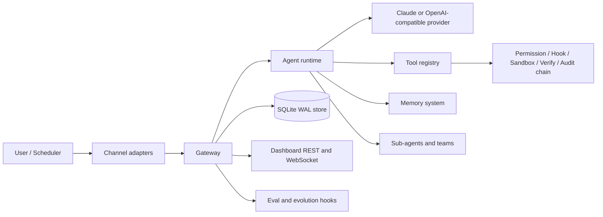

# IronClaw

IronClaw is a local-first AI agent runtime written in Go. It wires LLM providers, channels, tools, memory, sub-agents, scheduling, observability, and optional web dashboards behind one Gateway.

The current codebase is a Go 1.25.9 project with two Vite frontends:

- `web/`: embedded Preact dashboard served by the Go dashboard server.
- `web/studio/`: standalone Vue Studio prototype for visual pipeline and prompt work.

## Current Status

The current audit found no compilation, vet, short-test, frontend-build, or race-test failures.

See:

- [Code health report](CODE_HEALTH_REPORT.md)
- [Documentation index](docs/README.md)
- [System architecture](docs/01-system-architecture.md)
- [Gateway lifecycle](docs/03-gateway-feature-lifecycle.md)

## Architecture



## Main Modules

| Area | Packages | Responsibility |
|---|---|---|
| CLI | `cmd/ironclaw` | Cobra entry points: `start`, `tui`, `skill`, `memory`, `agent`, `insights`, `eval`, `mcp`, `training`. |
| Gateway | `internal/gateway` | Central composition root, feature registry, subsystem lifecycle, slash command dispatch. |
| Agent | `internal/agent`, `internal/dag` | LLM loop strategies, provider adapters, context compression, tool execution, sub-agent orchestration, task planning. |
| Tools | `internal/tool`, `internal/worktree` | Built-in tools, MCP adapters, worktree tools, permission and sandbox interceptor chain. |
| Memory | `internal/memory`, `internal/memorywire` | File memory, embeddings, lifecycle, AMP adapter, unified retrieval. |
| Channels | `internal/channel/*` | Telegram, Discord, TUI, approval prompts, reflection prompts, feedback, streaming output. |
| State | `internal/store`, `internal/session`, `internal/taskledger`, `internal/scheduler` | SQLite migrations, sessions/messages, task ledger, stale detection, scheduled tasks. |
| Observability | `internal/dashboard`, `internal/observability`, `internal/cogmetrics`, `internal/health`, `internal/ratelimit` | REST/WS dashboard, OpenTelemetry, Prometheus metrics, health checks, cognitive metrics. |
| Evolution and eval | `internal/evolution`, `internal/eval` | Preference learning, strategy optimization, skill draft synthesis, reproducible evaluation, training export. |
| Security | `internal/sandbox`, `internal/hook`, `internal/guardian`, `internal/logging` | Docker/host isolation, file/network policy, user hooks, safety checks, redaction. |

## Quick Start

```bash
cp configs/ironclaw.example.yaml configs/ironclaw.yaml
make build
./bin/ironclaw version
./bin/ironclaw tui -c configs/ironclaw.yaml
```

For a Go-only CI build:

```bash
make build-bin
make vet
make test-short
```

For full verification:

```bash
make test
cd web && npm ci && npm run build
cd ../web/studio && npm ci && npm run build
```

`make test` uses `CGO_ENABLED=1`, the `fts5` build tag, and the Go race detector.

## Configuration

The example configuration lives at `configs/ironclaw.example.yaml`. Runtime loading uses this order:

1. Built-in defaults from `internal/config`.
2. The explicit YAML passed with `-c`.
3. Project overlays: `.ironclaw/ironclaw.yaml`, then `.ironclaw/local.yaml`.
4. User directory injection from `~/.IronClaw`: `Soul.md`, `Memory.md`, `Agent.md`, MCP server files, skills, and agent specs.
5. Persisted runtime feature overrides from `~/.IronClaw/feature_state.json`, unless eval mode disables them.

Feature defaults are documented in [Gateway lifecycle](docs/03-gateway-feature-lifecycle.md). Most core runtime features are on by default; dashboard, standalone admin server, evolution, and model routing are opt-in.

## Developer Documentation

Start with [docs/README.md](docs/README.md). The docs are source-of-truth notes regenerated from the current code, not a preserved history of old plans. They cover:

- Current verification status and known limitations.
- Gateway and feature lifecycle.
- CLI, config hierarchy, and user directory.
- Agent runtime and sub-agent model.
- Tools, permissions, hooks, sandboxing, and MCP.
- Memory system.
- Channels, dashboard, observability, store, sessions, task ledger, scheduler.
- Evolution, eval harness, training export.
- Frontend apps and developer workflows.

## License

See [LICENSE](LICENSE).
