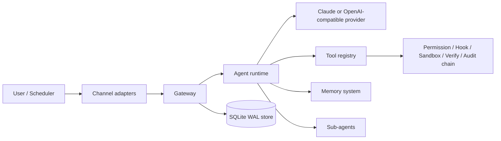

# IronClaw

IronClaw is a local-first AI agent runtime written in Go. It wires LLM providers, channels, tools, memory, sub-agents, scheduling, and observability behind one Gateway.

The codebase is a Go 1.25.11 project.

## Architecture



## Main Modules

| Area | Packages | Responsibility |
|---|---|---|
| CLI | `cmd/daimon` | Cobra entry points: `start`, `tui`, `skill`, `memory`, `mcp`. |
| Gateway | `internal/gateway` | Central composition root, feature registry, subsystem lifecycle, slash command dispatch. |
| Agent | `internal/agent` | LLM loop strategies, provider adapters, context compression, tool execution, sub-agent orchestration. |
| Tools | `internal/tool` | Built-in tools, MCP adapters, permission, hook, verification, and audit interceptor chain. |
| Memory | `internal/memory` | File memory, embeddings, lifecycle, unified retrieval. |
| Channels | `internal/channel/*` | Telegram, TUI, approval prompts, reflection prompts, feedback, streaming output. |
| State | `internal/store`, `internal/session`, `internal/channel/scheduler` | SQLite migrations, sessions/messages, task ledger tables, scheduled task channel. |
| Hooks | `internal/hook` | Built-in and user hook injection points. |
| Feature Flags | `internal/feature`, `internal/gateway/subsystem_feature.go` | Runtime feature registration, config overrides, and persisted feature state. |

## Quick Start

```bash
cp configs/daimon.example.yaml configs/daimon.yaml
make build
./bin/daimon version
./bin/daimon tui -c configs/daimon.yaml
```

For a Go-only CI build:

```bash
make build-bin
make vet
make test-short
```

For full verification:

```bash
make test
```

`make test` uses `CGO_ENABLED=1`, the `fts5` build tag, and the Go race detector.

## Configuration

The example configuration lives at `configs/daimon.example.yaml`. Runtime loading uses this order:

1. Built-in defaults from `internal/config`.
2. The config file: the explicit YAML passed with `-c`, or `~/.daimon/config.yaml` by default (`configs/daimon.yaml` with `--dev`).
3. User directory injection from `~/.daimon`: `Soul.md`, `Memory.md`, `Agent.md`, MCP server files, skills, and agent specs.
4. Persisted runtime feature overrides from `~/.daimon/feature_state.json`.

Most core runtime features are on by default; the standalone admin server is opt-in.

## License

See [LICENSE](LICENSE).
