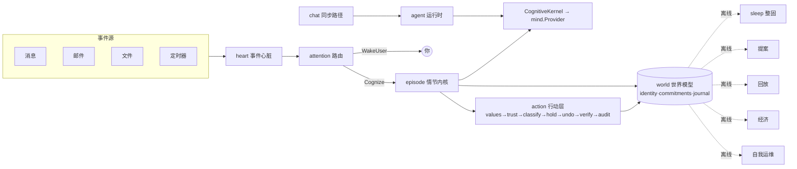

# Daimon

**铁打的爪，流水的脑** — 一个本地优先的主权个人代理（sovereign personal agent），用 Go 编写。

Daimon 从 IronClaw（一个 coding-agent 运行时）重铸而来。核心理念：**身份是不朽的，模型是可换的**。代理的本体——身份、信任、技能、价值、世界模型——活在你本地磁盘的状态里；驱动它的 LLM 只是可热插拔的认知引擎。换模型不丢身份，换模型无回归。

> 模块路径 `github.com/Forest-Isle/daimon` · Go 1.25.11 · 主二进制 `cmd/daimon`

## 它是什么

不是聊天机器人，是一个有连续记忆、会主动行动、对自己的行为负责的代理：

- **事件心脏**：消息/邮件/文件/定时器汇成统一事件流，先落库后路由，崩溃可恢复。
- **注意力路由**：硬白名单→规则→小模型→认知，决定忽略/反射/起情节/唤醒你。高风险事件永远唤醒，绝不下放给模型。
- **情节内核**：每次认知是一个有界 ReAct 情节，**必须交账**（产出结构化 Outcome 落账）。换模型只换这一层。
- **可逆行动层**：工具副作用按可逆性分级治理——可逆的自由跑，可补偿的延迟留撤回窗口，不可逆的永远人签。信任随成功累积升级、随纠正冻结。
- **睡眠整固**：离线把流水整固成承诺、把重复模式蒸馏成技能、把矛盾对账。
- **预期 / 经济 / 自我运维**：主动提案、核算自己的 ROI、自查健康度。

七条宪法不变量（状态在外 / 换脑无感 / 交账强制 / 可逆优先 / 认知是贵的 / 本地主权 / 不替模型思考）贯穿全系统，详见 [docs/architecture/00-overview.md](docs/architecture/00-overview.md)。

## 架构



聊天是同步直连路径，自治是 `heart→attention→episode` 异步路径，两者共用同一工具治理拦截链。完整端到端流程见 [docs/architecture/01-architecture.md](docs/architecture/01-architecture.md)。

## 文档

完整 as-built 架构文档在 **[docs/architecture/](docs/architecture/)**（中文，逐模块）：

| | |
|---|---|
| [00 总览](docs/architecture/00-overview.md) · [01 架构](docs/architecture/01-architecture.md) | 是什么、宪法、依赖方向、双路径 |
| [02 heart](docs/architecture/02-heart.md) · [03 attention](docs/architecture/03-attention.md) · [04 episode](docs/architecture/04-episode.md) · [05 mind](docs/architecture/05-mind.md) | 认知主路径 |
| [06 world](docs/architecture/06-world.md) · [07 values](docs/architecture/07-values.md) · [08 action](docs/architecture/08-action.md) | 状态与行动 |
| [09 sleep](docs/architecture/09-sleep.md) · [10 proposals](docs/architecture/10-proposals.md) · [11 replay](docs/architecture/11-replay.md) · [12 economy](docs/architecture/12-economy.md) · [13 selfops](docs/architecture/13-selfops.md) | 离线/元系统 |
| [14 gateway](docs/architecture/14-gateway.md) · [15 tools](docs/architecture/15-tools.md) · [16 channels+agent](docs/architecture/16-channels-agent.md) · [17 skills+workflow](docs/architecture/17-skills-workflow.md) · [18 支撑包](docs/architecture/18-supporting.md) | 基础设施 |
| [19 数据层](docs/architecture/19-data-layer.md) · [20 安全治理](docs/architecture/20-security-governance.md) · [21 CLI](docs/architecture/21-cli-reference.md) · [22 术语表](docs/architecture/22-glossary.md) | 参考 |

设计愿景/目标态见 `DAIMON_BLUEPRINT.md`（文档树是现状权威，蓝图是目标）。

## Quick Start

```bash
cp configs/daimon.example.yaml configs/daimon.yaml
make build
./bin/daimon version
./bin/daimon tui -c configs/daimon.yaml     # TUI 控制台
./bin/daimon start -c configs/daimon.yaml   # 常驻运行时（含 Telegram/心脏）
```

仅 Go 的 CI 构建：

```bash
make build-bin
make vet
make test-short
```

完整验证（CGO + `fts5` tag + race 检测）：

```bash
make test
```

常用运维子命令（详见 [CLI 参考](docs/architecture/21-cli-reference.md)）：

```bash
daimon replay --against candidate.yaml --canary   # 换脑金丝雀门控
daimon trust list                                 # 查看自治等级
daimon holds list / undo --episode <id>           # 撤回/撤销
daimon world revert identity.md                   # 回滚自我修改
daimon costs                                       # 成本/ROI 月报
```

## Configuration

示例配置在 `configs/daimon.example.yaml`。加载顺序：

1. `internal/config` 内置默认值。
2. 配置文件：`-c` 显式 YAML，或自动发现（`--dev` 用 `configs/daimon.yaml`）。
3. `~/.daimon` 用户目录注入：`identity.md`（身份）、`values.md`（价值）、`attention/rules.yaml`（路由规则）、`skills/`（技能）、MCP server 文件。
4. `~/.daimon/feature_state.json` 持久化特性开关。

凭据经 `${VAR}` 环境变量注入，不写进配置仓。多数核心特性默认开，`selfops` 默认关。`~/.daimon` 整目录 git 化——任何自我修改可单独 revert。磁盘布局详见 [数据层文档](docs/architecture/19-data-layer.md)。

## License

See [LICENSE](LICENSE).
