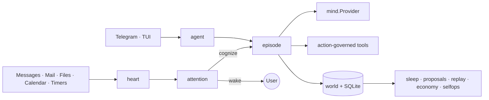

# Daimon

**A durable agent with a replaceable mind.** Daimon is a local-first, single-user runtime for sovereign personal agents, written in Go.

The agent's identity, values, skills, trust, world model, and audit history live on local disk. The LLM is a replaceable cognitive provider rather than the source of identity, so models can be changed and evaluated without discarding continuity.

> **Alpha (`0.1.0`)**: intended for single-user, local-first operation. Autonomous Heart, Sleep, and SelfOps paths are disabled by default, and an interrupted Episode cannot yet resume durably from its exact midpoint.

> Module: `github.com/Forest-Isle/daimon` · Go 1.25.11 · Binary: `cmd/daimon`

[中文说明](README_zh.md)

## What it does

- **Event-driven autonomy** — messages, timers, files, mail, and calendar events enter a persistent heart and attention router.
- **Accountable cognition** — each bounded episode ends with a structured outcome recorded in the world journal.
- **Governed actions** — value checks, trust levels, reversibility classes, hold windows, undo, verification, and audit surround tool side effects.
- **Durable local state** — SQLite plus `~/.daimon` store identity, commitments, memory, skills, receipts, and runtime history.
- **Offline improvement** — sleep jobs consolidate state, distill repeated workflows, generate proposals, and maintain the runtime.
- **Model regression gates** — replay and deterministic canary suites compare provider changes before promotion.

## Architecture


```mermaid
flowchart LR
    Sources[Messages · Mail · Files · Calendar · Timers] --> Heart[heart]
    Heart --> Attention[attention]
    Attention -->|cognize| Episode[episode]
    Attention -->|wake| User((User))
    Chat[Telegram · TUI] --> Agent[agent]
    Agent --> Episode
    Episode --> Mind[mind.Provider]
    Episode --> Tools[action-governed tools]
    Episode --> World[(world + SQLite)]
    World --> Sleep[sleep · proposals · replay · economy · selfops]
```

`internal/gateway` is the composition root. Interactive channels and autonomous events converge on the episode kernel and share the same tool-governance chain. See the [as-built architecture](docs/architecture/README.md) for package boundaries and end-to-end flows.

## Quick start

Requirements: Go 1.25.11, CGO, and a C compiler for SQLite FTS5.

### Build from source

```bash
cp configs/daimon.example.yaml configs/daimon.yaml
# Configure an LLM provider/API key in configs/daimon.yaml or via environment variables.

make build
./bin/daimon version
./bin/daimon tui -c configs/daimon.yaml
# Or run the persistent runtime:
./bin/daimon start -c configs/daimon.yaml
```

### Docker

Docker Compose expects a local config file and persists user-owned state in the `daimon-data` volume at `/home/daimon/.daimon`:

```bash
cp configs/daimon.example.yaml configs/daimon.yaml
# Set telegram.allowed_user_ids in configs/daimon.yaml, then export its referenced secrets.
export ANTHROPIC_API_KEY="..."
export TELEGRAM_BOT_TOKEN="..."
docker compose up --build
```

The container runs as the non-root `daimon` user. The admin surface remains disabled unless `server.enabled` is set to `true`; when enabling it in Docker, also pass `DAIMON_ADMIN_TOKEN` into the container and choose an address reachable under the intended Docker network policy.

### Release archives

GitHub releases publish native CGO archives for Linux and macOS on amd64 and arm64:

```text
daimon_linux_amd64.tar.gz
daimon_linux_arm64.tar.gz
daimon_darwin_amd64.tar.gz
daimon_darwin_arm64.tar.gz
```

Each archive contains `daimon`, `LICENSE`, and `README.md`; `checksums.txt` is published alongside them.

Verify the published archive for the current host (requires authenticated `gh`):

```bash
scripts/smoke-release.sh v0.1.0 Forest-Isle/daimon
```

The command downloads into a temporary directory, verifies the selected checksum,
rejects unsafe or unexpected tar members, and requires `daimon version` to report
the requested tag. It never starts Daimon or reads `~/.daimon`. A failure names the
stage (`host detection`, `release download`, `checksum validation`, `archive
inspection`, `archive extraction`, or `version validation`) and leaves no archive
behind.

Run the credential-free, network-free test suite separately:

```bash
make smoke-release-test
```

`DAIMON_SMOKE_TEST_UNAME`, `DAIMON_SMOKE_TEST_PATH`, and
`DAIMON_SMOKE_TEST_TMPDIR` exist only for the hermetic suite and are not supported
operator configuration.

Core verification:

```bash
make build-bin
make vet
make test-short
make test        # full CGO + fts5 + race suite
make eval-gate
```

## CLI

The binary provides `start`, `tui`, `skill`, `memory`, `mcp`, `replay`, `canary`, `proposals`, `costs`, `correct`, `undo`, `holds`, `world`, `attention`, `trust`, and `soul` commands.

```bash
daimon canary run --config candidate.yaml   # deterministic provider gate
daimon trust list                           # inspect autonomy levels
daimon holds list                           # inspect delayed actions
daimon undo list                            # inspect reversible receipts
daimon world history identity.md            # inspect self-edit history
daimon soul export                          # export portable identity state
```

Run `daimon <command> --help` for exact flags. The full command map is in the [CLI reference](docs/architecture/21-cli-reference.md).

## Configuration and state

The canonical configuration map is [configs/daimon.example.yaml](configs/daimon.example.yaml). Configuration is resolved from built-in defaults, an explicit `-c` file or auto-discovered file, environment-variable expansion, and persistent feature overrides.

User-owned state lives under `~/.daimon`, including identity and values documents, attention rules, skills, agent definitions, MCP configuration, feature state, and the SQLite database. Secrets should be injected through `${VAR}` references rather than committed to YAML. See the [data-layer guide](docs/architecture/19-data-layer.md) and [security model](SECURITY.md).

The optional admin HTTP surface is configured only under YAML `server`; it is not a runtime Feature Registry toggle. It is disabled by default and binds to `127.0.0.1:8080` by default. Enabling it requires `server.token: "${DAIMON_ADMIN_TOKEN}"` and the environment variable must resolve to a non-empty value; keep that token out of version control and send it as `Authorization: Bearer <token>` for `/api/*` routes. `GET /health` is intentionally unauthenticated; the current private route is read-only `GET /api/sessions`.

## Documentation

- [Architecture index](docs/architecture/README.md) — authoritative as-built documentation.
- [Architecture guide](docs/ARCHITECTURE_GUIDE.md) — guided onboarding and data-flow walkthrough.
- [Daimon blueprint](DAIMON_BLUEPRINT.md) — design intent and target-state invariants; the as-built docs take precedence for current behavior.
- [Contributing](CONTRIBUTING.md) — worktree workflow and verification matrix.
- [Soak runbook](docs/SOAK_RUNBOOK.md) — long-running operational validation.

## License

See [LICENSE](LICENSE).
