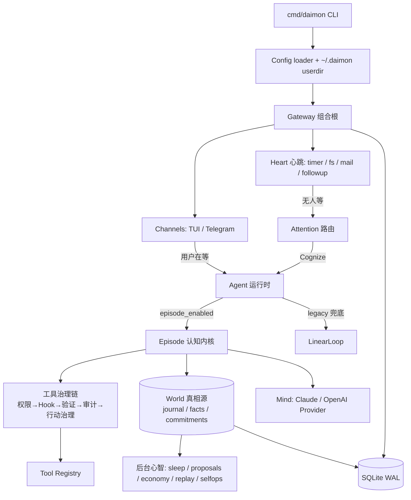

# Daimon 项目总览

> 仓库历史名 IronClaw，已更名 Daimon（module: `github.com/Forest-Isle/daimon`，主二进制 `cmd/daimon`）。

Daimon 是一个**本地优先、单用户的「常驻型主权 Agent 运行时」**。它不是单一聊天机器人：除了同步应答聊天，它还有一条**自治回路**——被定时器、文件变化、邮件等事件唤醒，自己决定要不要思考、把结论记进"世界模型"，并对自己花的钱、做的动作、能不能撤销负责。

CLI、消息通道、LLM Provider、工具、权限治理、记忆、子代理、心跳、注意力路由、认知内核、世界模型、睡眠维护、提案、成本核算都由 Gateway 统一接线、在同一套生命周期里组合。当前以 Go 1.25.11 为主。

> 想**全面通透地深入学习**本项目，请读 **[`docs/ARCHITECTURE_GUIDE.md`](docs/ARCHITECTURE_GUIDE.md)**（11 章导读，带全文件锚点）。设计意图的权威来源是 `DAIMON_BLUEPRINT.md`。本文是 5 分钟速览。

## 三个核心隐喻（理解全项目的钥匙）

1. **Gateway = 组合根**：所有子系统在一处显式接线，读懂 `internal/gateway/gateway.go` 就读懂了装配图。
2. **Episode kernel = 认知内核**：每次"思考"是一个 episode；无论来自聊天还是自治心跳，最终都走进同一个内核 `internal/episode/episode.go Runner.Execute`（带护栏的 ReAct 循环）。
3. **交账（Accountability）= 最高纪律**：每个 episode 必须以结构化 `Outcome` 收尾并落账到 world journal，绝不凭空消失。**world 是唯一真相源**——成本、动作、价值、撤销记录都围绕它。

## 运行时全景



## 两条入口（数据怎么流动）

- **聊天链（同步）**：`channel → gw.handleInbound → agent.HandleMessage → runKernel`。走认知内核；内核失败则回退 legacy `LinearLoop`。
- **自治链（heart，异步）**：`事件源 → eventDispatcher → attention.Route → {Ignore / Reflex / WakeUser / Cognize}`。`Cognize` 触发 `RunInternalEpisode`——无通道、Outcome 落 journal、不回复任何人。

两条入口**汇聚到同一个 episode 内核**，共享同一套工具治理与交账纪律。

## 核心模块

| 模块 | 包 | 作用 |
|---|---|---|
| Gateway | `internal/gateway` | 组合根：装配所有子系统、调度两条入口（`subsystem_*.go` 每子系统一文件）。 |
| Episode 内核 | `internal/episode` | 认知内核：ReAct 循环 + `episode_close` 交账契约 + Outcome 落账。 |
| Agent | `internal/agent` | LLM 会话处理、`LinearLoop`、工具执行管道、子代理、上下文压缩。 |
| Mind | `internal/mind` | 可换 LLM Provider 抽象（Claude/OpenAI）+ 熔断 + 缓存分段；agent 单向依赖它。 |
| Attention | `internal/attention` | 注意力路由：硬白名单 → 规则 → 小模型 → 默认 Cognize。 |
| Heart | `internal/heart` | 心跳：事件源（timer/fs/mail/followup）+ 事件存储 + 分发。 |
| Action | `internal/action` | 行动治理：value gate → trust → classify → hold → undo → verify。 |
| Tool | `internal/tool` | 工具实现 + 拦截器链（权限/Hook/用户 Hook/验证/审计/行动/活动）。 |
| World | `internal/world` | 世界模型（唯一真相源）：journal / facts / commitments + 检索。 |
| Values | `internal/values` | 用户价值模型（markdown 持久化）——自治动作的许可源。 |
| 后台心智 | `internal/sleep`、`proposals`、`economy`、`replay`、`selfops` | 睡眠维护、预判提案、成本/ROI、回归金丝雀、自我运维看门狗。 |
| Memory | `internal/memory` | 文件记忆、embedding、事实抽取、混合检索。 |
| Skill | `internal/skill` | 技能懒加载（`read_skill`）+ 草稿晋升。 |
| State | `internal/store`、`session`、`channel/scheduler` | SQLite 迁移、会话、任务账本、定时任务通道。 |
| Feature | `internal/feature`、`gateway/subsystem_feature.go` | 运行时功能注册、配置覆盖、持久化开关。 |

## 重要事实（避免踩坑）

- **单一执行策略 `LinearLoop`**，没有 `/mode` 命令或 `agent.mode` 配置；认知内核是其上的可选叠加（`agent.episode_enabled`，默认 on）。
- **大量 feature flag，默认大多关**；关闭时二进制行为与旧版逐字节等价。自治心跳 `agent.heart_enabled` 默认 off，是"常驻 agent"总开关。
- **工具直接在宿主机执行**（文件工具围栏在工作目录内，bash 在 macOS 可选 seatbelt 沙箱）；无 Docker/OS 级隔离、无网络策略、无遥测埋点。
- **子代理仅进程内**（goroutine）运行。

## 快速开始

```bash
cp configs/daimon.example.yaml configs/daimon.yaml   # 改 llm.api_key 或设环境变量
make build-bin                                         # 只构建 Go 二进制 → ./bin/daimon
./bin/daimon version
./bin/daimon tui -c configs/daimon.yaml               # TUI 模式（推荐先用它探索）
# 或：./bin/daimon start --dev                         # 完整 runtime（含 Telegram）
```

常用 CLI 子命令：`skill` / `memory` / `mcp` / `replay` / `correct` / `proposals` / `costs` / `undo` / `holds` / `world` / `attention` / `trust`。TUI 内只读巡检：`/episodes` `/trust` `/holds` `/proposals` `/replay` `/brief` `/feature` `/sleep` `/throttle` `/selfops`。

核心验证命令：

```bash
make vet
make test-short
make test     # 全量：CGO + fts5 tag + race 检测（最权威）
```

## 配置与用户目录

配置示例在 `configs/daimon.example.yaml`（权威配置地图）。加载顺序：

1. `internal/config` 内置默认值。
2. 配置文件：`-c` 指定的 YAML，默认 `~/.daimon/config.yaml`（`--dev` 时用 `configs/daimon.yaml`）；`${VAR}` 环境变量在加载时展开。
3. `~/.daimon` 用户目录注入：`Soul.md`、`Memory.md`、`Agent.md`、`mcp/*.yaml`、`skills/`、`agents/`。
4. 持久化功能开关 `~/.daimon/feature_state.json`。

默认开启的功能：`memory`、`skills`、`multi_agent`；默认关闭：`server`、`selfops`。运行时用 `/feature list` 查看、`/feature enable|disable` 开关。

## 深入阅读

- **[`docs/ARCHITECTURE_GUIDE.md`](docs/ARCHITECTURE_GUIDE.md)** — 11 章导读：心智模型 / 启动链 / 数据流 / 认知内核 / 工具治理 / 后台心智 / 概念词典 / 配置与存储 / 实操上手 / 学习检查清单。
- **`DAIMON_BLUEPRINT.md`** — 设计蓝图，代码注释里的 §4.x 章节号指向它。
- **`CLAUDE.md`** — 维护者速记（安全验证命令、编辑指引）。
