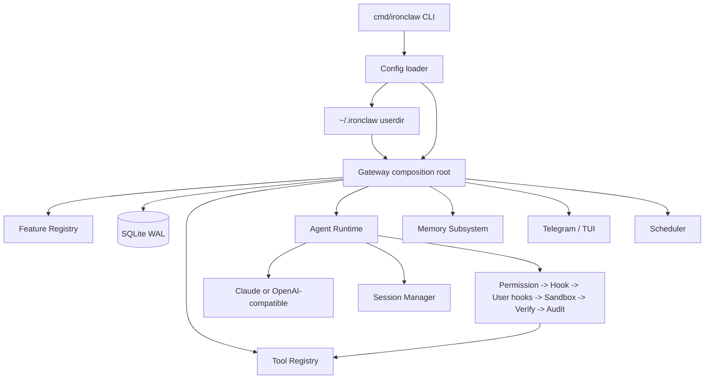

# IronClaw 项目总览

IronClaw 是一个本地优先的 AI Agent Runtime。它不是单一聊天机器人，而是一个由 Gateway 统一接线的运行时系统：CLI、消息通道、LLM Provider、工具、权限与沙箱、记忆、子代理、任务账本、调度器、可观测性都在同一套生命周期里组合。

当前项目以 Go 为主。

## 运行时全景



## 核心模块

| 模块 | 包 | 作用 |
|---|---|---|
| CLI | `cmd/ironclaw` | 提供 `start`、`tui`、`skill`、`memory`、`mcp` 命令。 |
| Gateway | `internal/gateway` | 项目组合根：初始化数据库、Feature Registry、工具、Agent、Memory、Skill、多 Agent、Scheduler 等。 |
| Agent | `internal/agent` | LLM provider、会话处理、Simple/Unified loop、上下文压缩、工具执行、子代理。 |
| Tool | `internal/tool`、`internal/worktree` | Bash、file、HTTP、code intel、memory、worktree、MCP 工具以及拦截器链。 |
| Memory | `internal/memory` | 文件记忆、embedding、事实抽取、生命周期、统一检索。 |
| Channel | `internal/channel/*` | Telegram、TUI 适配，审批、反思、反馈和工具流式输出能力。 |
| State | `internal/store`、`internal/session`、`internal/taskledger`、`internal/scheduler` | SQLite 迁移、会话、消息、任务账本、定时任务。 |
| Observability | `internal/observability` | OpenTelemetry 链路追踪与指标。 |
| Security | `internal/sandbox`、`internal/hook` | 文件/网络策略、Docker/host 沙箱、Hook 系统、安全审计。 |

## 快速开始

```bash
cp configs/ironclaw.example.yaml configs/ironclaw.yaml
make build
./bin/ironclaw version
./bin/ironclaw tui -c configs/ironclaw.yaml
```

只构建 Go 二进制：

```bash
make build-bin
```

核心验证命令：

```bash
make vet
make test-short
make test
```

## 配置与用户目录

配置示例在 `configs/ironclaw.example.yaml`。加载顺序是：

1. `internal/config` 内置默认值。
2. 配置文件：通过 `-c` 指定的 YAML，默认 `~/.ironclaw/config.yaml`（`--dev` 时用 `configs/ironclaw.yaml`）。
3. `~/.ironclaw` 用户目录注入：`Soul.md`、`Memory.md`、`Agent.md`、`mcp/*.yaml`、`skills/`、`agents/`。
4. 持久化功能开关 `~/.ironclaw/feature_state.json`，调用方可选择跳过。
