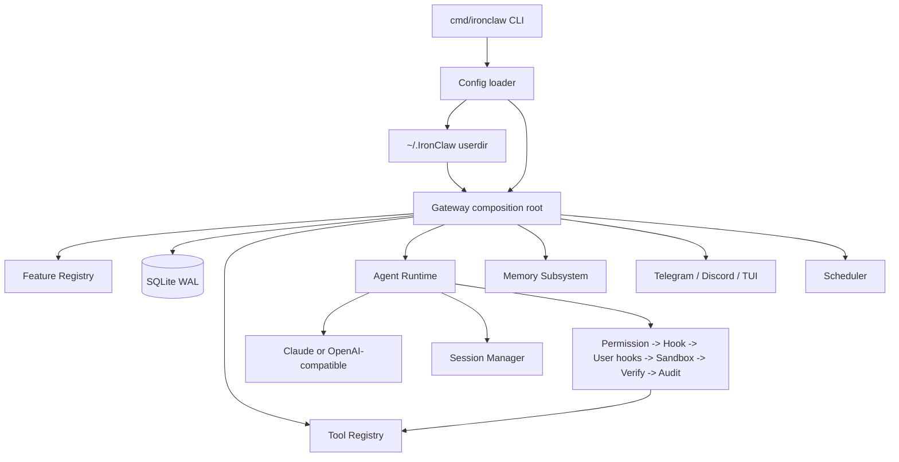

# IronClaw 项目总览

IronClaw 是一个本地优先的 AI Agent Runtime。它不是单一聊天机器人，而是一个由 Gateway 统一接线的运行时系统：CLI、消息通道、LLM Provider、工具、权限与沙箱、记忆、子代理、任务账本、调度器、可观测性、评测和自进化组件都在同一套生命周期里组合。

当前项目以 Go 为主，前端有一个 Vite 应用：


## 当前审计结论

本轮源码审计和验证完成后，未发现阻断构建、静态检查、短测试、前端构建或 race 测试的缺陷。

详见 [CODE_HEALTH_REPORT.md](CODE_HEALTH_REPORT.md) 和 [docs/00-current-state-and-verification.md](docs/00-current-state-and-verification.md)。

## 运行时全景



## 核心模块

| 模块 | 包 | 作用 |
|---|---|---|
| CLI | `cmd/ironclaw` | 提供 `start`、`tui`、`skill`、`memory`、`agent`、`insights`、`mcp` 命令。 |
| Gateway | `internal/gateway` | 项目组合根：初始化数据库、Feature Registry、工具、Agent、Memory、Skill、多 Agent、Scheduler 等。 |
| Agent | `internal/agent`、`internal/dag` | LLM provider、会话处理、Simple/Unified loop、上下文压缩、工具执行、子代理、团队协作、任务计划。 |
| Tool | `internal/tool`、`internal/worktree` | Bash、file、HTTP、browser、code intel、memory、plan_task、worktree、MCP 工具以及拦截器链。 |
| Memory | `internal/memory`、`internal/memorywire` | 文件记忆、embedding、事实抽取、生命周期、AMP 适配、统一检索。 |
| Channel | `internal/channel/*` | Telegram、Discord、TUI 适配，审批、反思、反馈和工具流式输出能力。 |
| State | `internal/store`、`internal/session`、`internal/taskledger`、`internal/scheduler` | SQLite 迁移、会话、消息、工具日志、任务账本、团队任务、定时任务。 |
| Observability | `internal/observability`、`internal/health`、`internal/ratelimit` | OpenTelemetry、健康检查、限流。 |
| Security | `internal/sandbox`、`internal/hook`、`internal/guardian`、`internal/logging` | 文件/网络策略、Docker/host 沙箱、Hook 系统、安全审计和日志脱敏。 |

## 快速开始

```bash
cp configs/ironclaw.example.yaml configs/ironclaw.yaml
make build
./bin/ironclaw version
./bin/ironclaw tui -c configs/ironclaw.yaml
```

只构建 Go 二进制：

```bash
make build-bin
```

核心验证命令：

```bash
make vet
make test-short
make test
```

## 配置与用户目录

配置示例在 `configs/ironclaw.example.yaml`。加载顺序是：

1. `internal/config` 内置默认值。
2. 通过 `-c` 指定的 YAML。
3. 当前工作目录下 `.ironclaw/ironclaw.yaml`。
4. 当前工作目录下 `.ironclaw/local.yaml`。
5. `~/.IronClaw` 用户目录注入：`Soul.md`、`Memory.md`、`Agent.md`、`mcp/*.yaml`、`skills/`、`agents/`。
6. 持久化功能开关 `~/.IronClaw/feature_state.json`，调用方可选择跳过。

## 文档入口

新的文档树从源码重写，不沿用旧计划和过时模块名。入口是 [docs/README.md](docs/README.md)，建议按编号阅读：

- 当前状态与验证。
- 系统架构。
- CLI、配置与用户目录。
- Gateway 与 Feature Registry。
- Agent 运行时。
- 工具、权限、Hook、沙箱。
- Memory 系统。
- 通道与可观测性。
- Store、Session、Task Ledger、Scheduler。
- 前端应用。
- 开发流程与包清单。
