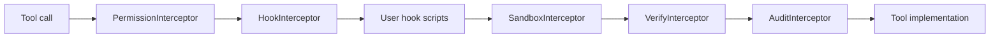

# Security

IronClaw can execute tools, read and write files, call HTTP endpoints, run external MCP servers, and delegate work to sub-agents. Treat every runtime deployment as a privileged local agent and configure approvals, sandboxing, and network policy intentionally.

## Security Model

Tool execution flows through this chain when Gateway initializes all security components:

The chain is configured in `internal/gateway/init_tools.go`.

## Permissions

Permission rules live under `permissions` in YAML config. Actions are:

- `none`: allow silently.
- `notify`: allow and notify/log.
- `approve`: require user approval.
- `deny`: block.

Legacy aliases are accepted: `allow` maps to `none`, and `ask` maps to `approve`.

Rules are evaluated top-to-bottom. If no rule matches, destructive tool capabilities force approval; otherwise the configured default action applies.

## Sandbox

Sandbox behavior is controlled by `sandbox` config:

- File policy can restrict allowed directories and read-only directories.
- Network policy supports blacklist and whitelist modes.
- Bash can run on host or through a Docker session backend.
- HTTP redirects are checked against the network policy when sandbox network policy is active.

The `sandbox` feature defaults to enabled in the Feature Registry but auto-detects Docker availability. The example config sets `sandbox.enabled: false`, which overrides the feature default.

## Secrets

- Prefer environment expansion with `${VAR}` in YAML rather than hard-coded tokens.
- MCP server responses are passed through redaction before returning to the agent.
- Do not commit local `configs/ironclaw.yaml`, `.ironclaw/local.yaml`, database files, tool result caches, or generated trajectory exports containing private prompts.

## Reporting

For private vulnerability reports, use the repository maintainer contact configured in the GitHub project or open a private advisory if available. Include:

- Affected commit or version.
- Configuration required to trigger the issue.
- Minimal reproduction.
- Whether the issue needs external network, Docker, MCP, dashboard token, or channel credentials.

## Maintainer Checklist

- New tools must declare capabilities through `Capabilities()` when side effects, network, or parallel safety matter.
- New routes must be covered by dashboard token auth if they expose private runtime data.
- New config fields that affect security must be included in `configs/ironclaw.example.yaml`.
- Gateway wiring changes must preserve interceptor order unless intentionally redesigned and documented.
