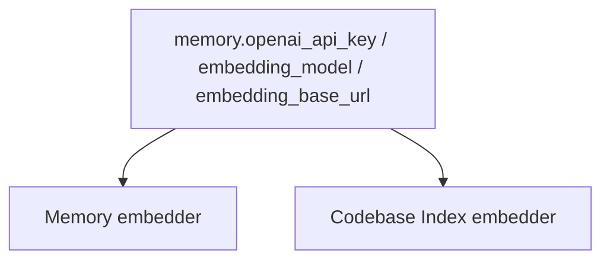

# 00. Current State and Verification

## Scope

This audit covered the current IronClaw source tree after deleting stale public/project documentation and before writing the new docs. It inspected:

- 38 Go packages from `go list ./...`.
- 496 Go source files in `cmd/` and `internal/`.
- 42 first-party frontend Vue/TS/CSS files outside `node_modules`.
- 20 SQLite migrations in `internal/store/migrations`.
- `configs/ironclaw.example.yaml`, `Makefile`, `go.mod`, and `web/studio/package.json`.

The audit did not delete operational/spec Markdown assets such as `.codex/skills/**/SKILL.md`, `.agent/skills/**/SKILL.md`, `.agent/workflows/*.md`, `internal/skill/builtin/**/SKILL.md`, or `openspec/**`. Those files are part of runtime agent skills or spec workflow history, not the project documentation set being rewritten.

## Verification Commands

Commands already completed during this work:

```bash
make build-bin
make vet
make test-short
make test
cd web/studio && npm ci && npm run build
```

Expected details:

- `make build-bin` builds `./cmd/ironclaw` with `CGO_ENABLED=1` and `-tags fts5`.
- `make vet` runs `go vet ./...`.
- `make test-short` runs all Go tests without race detector.
- `make test` runs all Go tests with `-race -count=1`.
- `web/studio` build produces a standalone Vue bundle; `web/studio/dist/` is generated output and should not be committed unless a release process explicitly requires it.

## Embedding Consistency

Embedding call sites share the same `memory` embedding fields so an OpenAI-compatible service works consistently across the runtime:



Both Memory and Codebase Index use `memory.NewOpenAIEmbeddingWithURL(...)`, honoring the configured base URL. Keep any future embedding call sites consistent with this constructor.

## Current Health

No broken module connections remain:

- Go packages compile.
- Interfaces resolve.
- Gateway construction paths are covered by build/vet/tests.
- Frontend API imports compile.
- SQLite migrations are embedded and applied through `_migrations`.

## Residual Non-Blocking Findings

| Finding | Location | Interpretation |
|---|---|---|
| A2A remote agent fields are present but reserved. | `internal/agent/spec.go` | Local sub-agent backends are implemented; remote A2A execution is future work and should not be presented as active. |
| Vue Studio contains demo state. | `web/studio/src/views/*` | Studio builds, but Prompt IDE preview, Flow Editor, and Memory Explorer are prototype surfaces. |
| Some tests skip under missing optional dependencies. | sandbox/observability integration tests | Expected for Docker, platform-specific, or exporter-specific paths. |
| macOS linker warnings can appear in race tests. | `make test` output | Observed `LC_DYSYMTAB` warnings did not fail the test run. |

## Documentation Rewrite Result

The old documentation tree contained stale references to removed or renamed areas, including historical RL documentation. Current code has `internal/evolution` and migration `022_drop_rl_tables.sql`; there is no active `internal/rl` package. The new docs therefore describe current modules and mark future/prototype areas explicitly.
