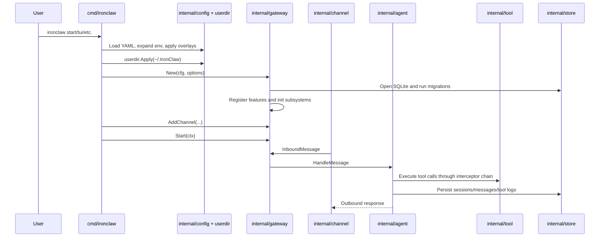
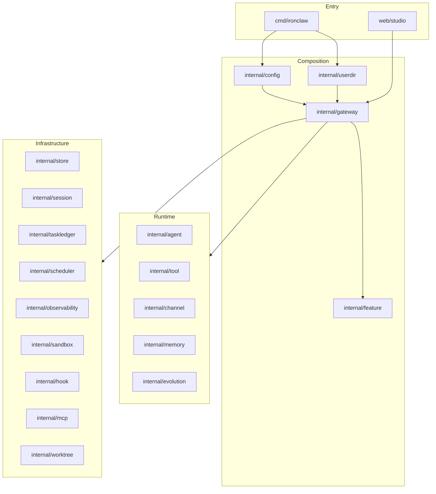
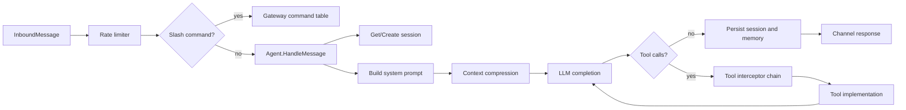

# 01. System Architecture

IronClaw is organized around one explicit composition root: `internal/gateway.Gateway`. The CLI loads config, applies user-directory overlays, constructs the Gateway, adds one or more channels, and starts lifecycle-managed subsystems.

## Top-Level Flow

## Package Layers

## Runtime Responsibilities

### CLI

`cmd/ironclaw` owns user-facing commands. It does not directly implement agent behavior. Its job is to load config, apply userdir, choose a channel or command mode, and call Gateway or package-level services.

### Gateway

Gateway owns cross-module wiring:

- Database and session manager.
- Feature Registry and persisted feature overrides.
- Tool registry, hooks, permission engine, sandbox, verification, audit.
- LLM provider and `AgentDeps`.
- Memory, Skills, Agents, Teams.
- Scheduler, task ledger, health server, metrics, config reload.

### Agent

`internal/agent` receives normalized channel messages. It builds the system prompt from base prompt, userdir persona/rules, memories, profile sections, skills, and agent specs. It executes either SimpleLoop or UnifiedLoop, persists session state, emits events, and optionally forwards events to evolution.

### Tools

Tools are plain implementations of `tool.Tool`. Runtime concerns such as approval, user hooks, sandbox policy, post-edit verification, and audit are added by the interceptor chain rather than hidden inside every tool.

### Memory

Memory stores persistent user/session facts in files with a SQLite-backed index and optional embeddings. A unified retriever fuses the memory store and procedural memory into a single retrieval surface.

### Channels

Channels normalize Telegram, Discord, TUI, scheduler, and subprocess inputs into `channel.InboundMessage`. Optional channel interfaces add approval prompts, reflection prompts, feedback, notifications, and live tool-output streaming.

### State and Observability

SQLite stores sessions, messages, tool logs, memory indexes, task ledger state, execution events, and replay data. The observability package exposes OpenTelemetry traces and metrics, and cognitive metrics are surfaced to the TUI status bar.

## Data Flow for a User Message

## Source-of-Truth Files

| Concern | Primary files |
|---|---|
| CLI commands | `cmd/ironclaw/*.go` |
| Gateway lifecycle | `internal/gateway/gateway.go`, `internal/gateway/init_*.go` |
| Feature defaults | `internal/gateway/features.go` |
| Config defaults and structs | `internal/config/*.go`, `configs/ironclaw.example.yaml` |
| Agent loops | `internal/agent/simple_loop.go`, `internal/agent/unified_loop.go`, `internal/agent/loop_common.go` |
| Tool registry/interceptors | `internal/gateway/init_tools.go`, `internal/tool/*.go` |
| Memory | `internal/gateway/init_memory.go`, `internal/memory/*.go` |
| Store | `internal/store/sqlite.go`, `internal/store/migrations/*.sql` |
