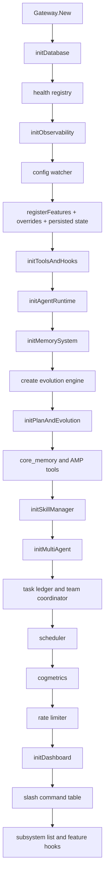
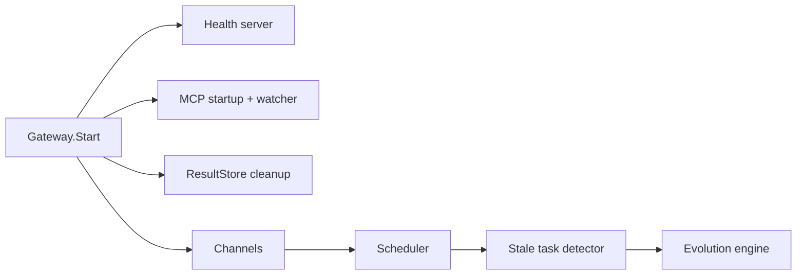

# 03. Gateway and Feature Lifecycle

Gateway is the central coordinator. It owns initialization order, late dependency wiring, runtime start/stop, slash command dispatch, feature hot reload, and subsystem shutdown.

## Construction Order

`gateway.New(cfg, opts...)` follows this order:

The order matters:

- Database is first because sessions, audit logs, memory indexes, and task ledger depend on it.
- Tools and security chain exist before Agent runtime.
- Agent is created before Memory, then `AgentDeps` is late-wired with real memory dependencies.
- Evolution engine exists before cognitive/evolution hooks are attached.
- Dashboard starts after rate limiter so dashboard routes can be wrapped correctly.

## Feature Registry Defaults

| Feature | Default | Phase | Notes |
|---|---:|---|---|
| `memory` | on | construct | File memory store and memory tools. |
| `skills` | on | construct | Built-in/user skills and `read_skill` tool. |
| `multi_agent` | on | construct | Sub-agent manager, agent tools, orchestrator. |
| `team` | on | construct | Depends on `multi_agent`; `/team` coordination. |
| `speculative` | on | construct | Read-only tool pre-execution during streaming. |
| `scheduler` | on | start | Hot-reloadable scheduled task execution. |
| `sandbox` | on | construct | Auto-detects Docker; config can disable it. |
| `evolution` | off | start | Hot-reloadable self-evolution engine. |
| `model_routing` | off | construct | Depends on `evolution`. |
| `dashboard` | off | construct | Hot-reloadable web dashboard server. |
| `server` | off | construct | Standalone HTTP admin server. |
| `worktree` | on | construct | Auto-detects Git; registers worktree tools. |
| `mcp_<name>` | on | start | One feature per configured MCP server. |

`configToOverrides` maps config booleans into feature overrides. Persisted runtime overrides are applied after config overrides unless disabled by options.

## Start Lifecycle

`Gateway.Start(ctx)` starts long-running runtime work:

1. Health server.
2. MCP servers asynchronously.
3. MCP directory watcher for `~/.IronClaw/mcp/`.
4. Tool result store cleanup loop.
5. Registered channels.
6. Scheduler if enabled.
7. Standalone HTTP admin server if `server` is enabled and dashboard is disabled.
8. Task ledger stale detector.
9. Evolution engine if enabled.

## Stop Lifecycle

`Gateway.Stop(ctx)` stops subsystems in reverse dependency order, closes MCP clients, persists/stops evolution state when enabled, shuts down health server, closes the stop channel, stops config watcher, and closes SQLite.

Subsystem ordering is declared as:

1. Observability
2. Memory
3. Sandbox
4. Evolution
5. Tasks
6. Channels
7. Dashboard

`StopAll` runs in reverse order so dashboard/channels/tasks stop before base infrastructure.

## Config Hot Reload

When `GatewayOptions.ConfigPath` is provided, Gateway builds a `ConfigWatcher`. Reload updates:

- Gateway config pointer under lock.
- Current agent model.
- Rate limiter.
- Agent event bus publishes `ConfigChanged`.

Feature lifecycle hooks are separately bound for dashboard, evolution, scheduler, and each `mcp_*` feature.

## Slash Command Table

Gateway routes slash commands before sending a message to Agent:

| Command | Handler | Session required |
|---|---|---:|
| `/tasks` | task ledger view | yes |
| `/team` | team coordination | no |
| `/mode` | switch simple/unified/cognitive | no |
| `/feature` | list/enable/disable features | no |
| `/config` | config inspection | yes |
| `/compact` | context compression | yes |
| `/model` | model switching | no |
| `/new`, `/start` | reset session | yes |

If no slash command handles the message, Gateway calls `agent.HandleMessage`.
