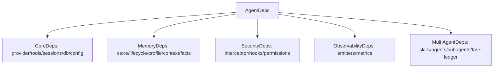
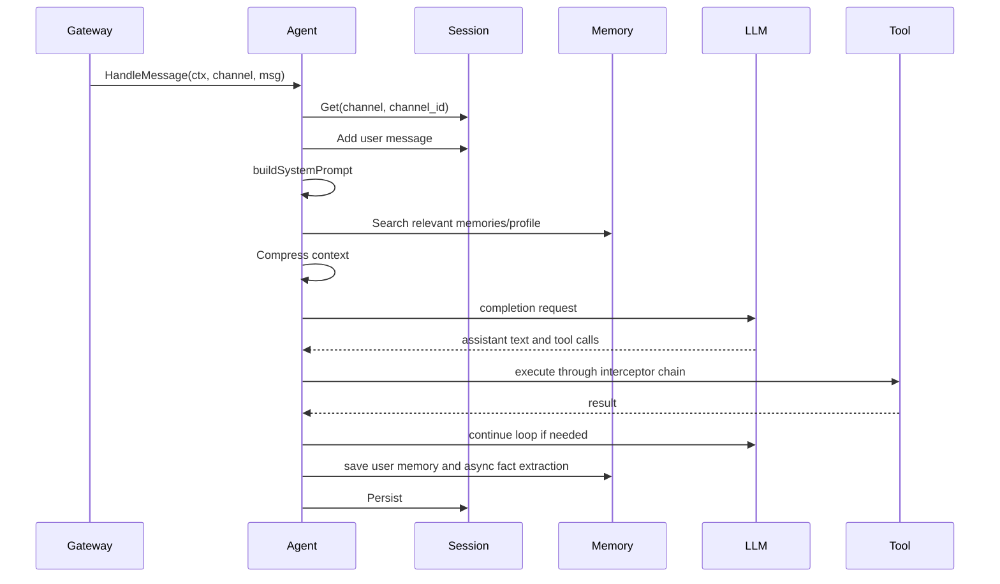
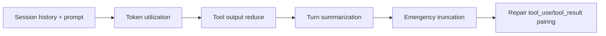

# 04. Agent Runtime

The Agent runtime is in `internal/agent`. It receives normalized channel messages, builds context, calls an LLM provider, executes tools, persists session state, and emits runtime events.

## Dependency Model

`AgentDeps` is the shared dependency bundle. Gateway passes it by pointer to `agent.NewAgent`, then fills late-bound fields as subsystems become available.

This pointer-based design prevents stale copies. For example, Agent is created before Memory, but after `initMemorySystem` Gateway updates `gw.agentDeps.Memory.Store`, and Agent sees the real store on the next access.

## Provider Selection

`internal/gateway/init_agent.go` selects the provider:

- `llm.provider: claude` -> `agent.NewClaudeProvider`.
- `llm.provider: openai` or `openai-compatible` -> `agent.NewOpenAIProvider`.

If retry is configured, the provider is wrapped in `agent.NewRetryProvider`.

## Message Handling

## System Prompt Assembly

`Agent.buildSystemPrompt` combines:

1. `cfg.Agent.Personality` from `~/.IronClaw/Soul.md`.
2. `cfg.Agent.SystemPrompt` from config plus `~/.IronClaw/Agent.md`.
3. `cfg.Agent.PersistentRules` from `~/.IronClaw/Memory.md`.
4. Dynamic context marker for prompt cache splitting.
5. Relevant memory search results, excluding profile memories.
6. User profile sections from file memory storage.
7. Cold-start profile prompt from the profiler.
8. Skill metadata from `SkillManager`.
9. Agent spec metadata from `AgentManager`.

Full skill bodies are loaded lazily through the `read_skill` tool.

## Loop Strategies

| Mode | Strategy | Behavior |
|---|---|---|
| `simple` | `SimpleLoop` | LLM/tool loop with serial tool execution. |
| `unified` | `UnifiedLoop` | LLM/tool loop with parallel dispatch for compatible tools. |
| `cognitive` | `UnifiedLoop` alias | Backward-compatible alias accepted by config and `/mode`. |

The current runtime does not have a separate active RL or evolution package. Loop execution is Simple/Unified.

## Tool Execution

Tool definitions are sent to the LLM through provider adapters. When the model returns tool calls:

- `SimpleLoop` executes them serially.
- `UnifiedLoop` dispatches independent compatible calls in parallel.
- Tool side effects are mediated by the interceptor chain.
- Tool results are appended to session history.
- Large tool outputs can be persisted to disk through `ResultStore` and represented by previews.

## Context Compression

`PipelineContextManager` supports layered and legacy strategies.

Layered compression runs when utilization crosses configured thresholds:

- Tool output reduction truncates or evicts old large tool results.
- Turn summarization summarizes older turns with the LLM.
- Emergency truncation keeps only recent critical context.

Reactive compression handles context length failures by forcing all layers, retrying, reducing max output tokens, and finally returning a context-length error if still failing.

## Sub-Agents

Agent specs are loaded from:

- `~/.IronClaw/agents/`
- `cfg.Agents.ExtraDirs`
- inline `cfg.Agents.Definitions`

Each spec can become an `agent_<name>` tool. Supported local execution concepts include:

- `spawn`: independent runtime.
- `background`: asynchronous goroutine mode.
- backend: in-process only (goroutine execution).

`AgentSpec.Remote` is present for future A2A support but is not an active remote execution backend.
