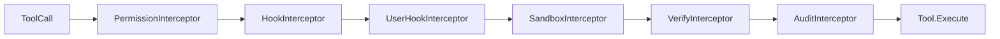
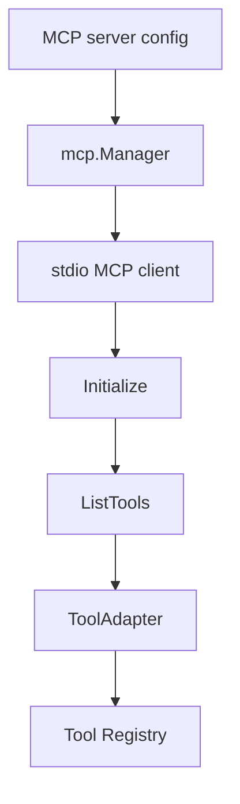

# 05. Tools, Permissions, Sandbox, and Hooks

Tools are registered in `internal/gateway/init_tools.go` and executed through the interceptor chain in `internal/tool`.

## Tool Interface

Every tool implements:

```go
type Tool interface {
    Name() string
    Description() string
    InputSchema() map[string]any
    Execute(ctx context.Context, input []byte) (Result, error)
    RequiresApproval() bool
}
```

Optional interfaces add runtime behavior:

- `ReadOnlyTool`: eligible for read-only concurrency.
- `CapableTool`: declares read-only/destructive/network/approval/parallel-safety metadata.
- `PathScopedTool`: allows path conflict detection for concurrent file operations.
- `AvailableTool`: hides a tool when runtime prerequisites are missing.

## Built-In Tool Registration

Gateway registers built-ins based on `cfg.Tools`:

| Config area | Tools |
|---|---|
| `tools.bash` | `bash`, `test_run` |
| `tools.file` | `file_read`, `file_write`, `file_edit`, `file_patch`, `file_list`, `grep_code`, `find_symbol`, `list_imports` |
| `tools.http` | HTTP tool |
| codebase index | semantic code search when embeddings are configured and index is available |
| `worktree` feature | `worktree_create`, `worktree_diff`, `worktree_merge`, `worktree_list` |
| memory init | `memory_manage`, later `core_memory`, AMP memory tool |
| skill init | `read_skill` |
| agent manager | `agent_<name>` tools for loaded agent specs |
| MCP manager | `mcp_<server>_<tool>` adapters |

## Interceptor Chain

The chain order is:



Behavior by layer:

- Permission decides allow/notify/approve/deny from rules, capabilities, and legacy blocked commands.
- Hook fires configured `pre_tool_use` and `post_tool_use` handlers.
- User hook runs scripts from `~/.IronClaw/hooks`.
- Sandbox applies file guard, network policy, and Docker session behavior where enabled.
- Verify performs post-edit verification.
- Audit records tool execution when audit interceptor initialization succeeds.

## Permission Rules

Config example:

```yaml
permissions:
  default: approve
  rules:
    - tool: bash
      pattern: "git *"
      action: none
    - tool: bash
      pattern: "rm -rf *"
      action: deny
    - tool: file
      path_pattern: "/etc/*"
      action: deny
```

Actions:

| Action | Meaning |
|---|---|
| `none` | Allow silently. |
| `notify` | Allow and notify/log. |
| `approve` | Ask user through channel approval flow. |
| `deny` | Block execution. |

Legacy aliases:

- `allow` -> `none`
- `ask` -> `approve`

Rule evaluation is top-to-bottom. If no rule matches, destructive tool capability forces approval; otherwise the default action is used.

## Sandbox

Sandbox controls are split by concern:

| Concern | Package/config |
|---|---|
| File path restrictions | `sandbox.allowed_directories`, `sandbox.readonly_directories`, `FileGuard` |
| Bash backend | `sandbox.bash.backend` with `host` or `docker` |
| Docker session limits | image, network, memory, CPU, idle timeout |
| Network policy | whitelist/blacklist mode and URL checks |
| HTTP redirects | redirect URLs are checked against network policy |

The Feature Registry default for `sandbox` is on with Docker auto-detect, but config can override it. The example config currently sets `sandbox.enabled: false`, which disables the sandbox feature unless changed.

## MCP Tools

MCP server configs can come from project config or `~/.IronClaw/mcp/*.yaml`. Gateway creates one hot-reloadable feature per server: `mcp_<name>`.

Startup flow:



Tool names use `mcp_<server>_<tool>`. Responses are redacted before being returned to the agent. Failed servers are marked degraded and retried with exponential backoff.

Standalone `ironclaw mcp serve` starts an IronClaw MCP server over stdio or HTTP, but current standalone CLI wiring passes minimal dependencies. Treat it as a server transport entry point, not the same as a fully Gateway-wired runtime.

## Worktree Tools

When Git is available and the `worktree` feature is enabled, Gateway registers worktree tools:

- `worktree_create`: create isolated worktree and branch; requires approval.
- `worktree_diff`: read diff for a managed worktree; read-only.
- `worktree_merge`: merge branch back and remove worktree; requires approval.
- `worktree_list`: list managed worktrees; read-only.

These tools support safer code-edit workflows by separating implementation branches from the main checkout.

## Adding a Tool

1. Implement `tool.Tool`.
2. Add `InputSchema` with complete JSON schema.
3. Implement `Capabilities()` if side effects, network, destructive behavior, or parallel safety matter.
4. Add unit tests for parsing, validation, success, failure, and capabilities.
5. Register the tool in the correct Gateway initializer or subsystem.
6. Update this document and relevant config docs.
