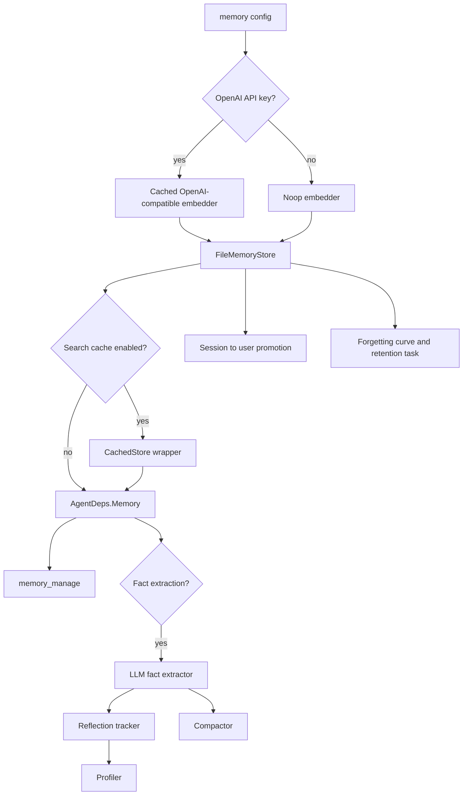
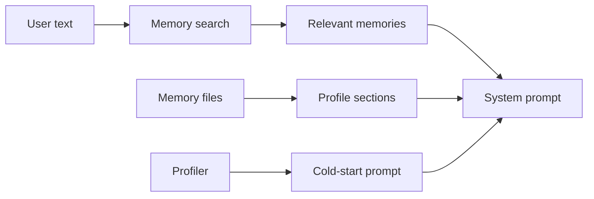
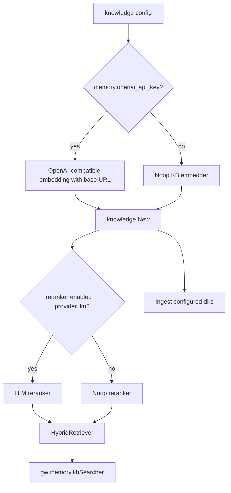
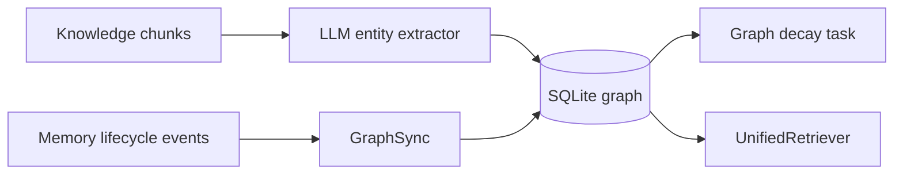

# 06. Memory, Knowledge, and Graph

IronClaw has two related but distinct retrieval systems:

- Memory stores user/session/runtime facts and profile information.
- Knowledge ingests external documents into searchable chunks.

Knowledge Graph can connect both systems through entity/relation extraction.

## Memory Initialization

`internal/gateway/init_memory.go` runs when the `memory` feature is enabled.

Key behaviors:

- Storage dir defaults to `~/.IronClaw/memory`.
- `~/` prefixes in `memory.storage_dir` are expanded.
- Embeddings use `memory.openai_api_key`, `memory.embedding_model`, and `memory.embedding_base_url`.
- Search cache is optional.
- Fact extraction enables LLM fact extraction, lifecycle manager, reflection tracker, compactor, profiler, and audit logger.
- Consolidator runs regardless of fact extraction and promotes session facts to user scope.
- Retention/fade logic runs daily until Gateway stop.

## Memory Tools and AMP

Gateway registers:

- `memory_manage` after `FileMemoryStore` creation.
- `core_memory` after Knowledge initialization when memory store exists.
- AMP memory tool through `memorywire.NewAdapter`, supporting standardized remember/recall/forget/merge/expire style operations.

The agent also reads memory passively during prompt construction and writes the user message to memory after handling a request.

## Prompt Memory Use

The prompt excludes `profile` memory type from general relevant memory search, then loads profile sections separately.

## Knowledge Base

`internal/gateway/init_knowledge.go` runs after Memory and evolution/plan initialization.

Knowledge config controls:

- `chunk_size`
- `chunk_overlap`
- `bm25_weight`
- `vector_weight`
- `ingest_dirs`
- optional search cache
- optional reranker

If no embedding key is configured, Knowledge falls back to text/BM25-style search through the no-op embedder path.

## Knowledge Ingestion

The Knowledge package has ingestion support for:

- Code
- Markdown
- Plain text
- PDF
- Web/content ingestion paths

Pipeline chunking and storage live under `internal/knowledge`. At startup, Gateway loops over configured `knowledge.ingest_dirs` and calls `kb.GetPipeline().IngestDir(...)`.

For large directories, this startup path is functional but can delay startup. The roadmap recommends queueing/progress events if large knowledge corpora become common.

## Knowledge Graph

When `knowledge_graph` is enabled, Gateway:

1. Creates `graph.NewSQLiteGraph(gw.db)`.
2. Stores it in `gw.memory.graphStore`.
3. Creates an LLM entity extractor.
4. Starts background extraction from already-ingested KB chunks.
5. Wires `GraphSync` into Memory lifecycle manager when lifecycle exists.
6. Starts graph decay task every 24 hours.

## Unified Retrieval

After Knowledge initializes, Gateway can construct:

- procedural memory store,
- unified retriever combining memory store,
- KB searcher,
- graph store,
- procedural store,
- shared embedder.

This gives the Agent a single memory/cortex style retrieval surface while retaining separate storage responsibilities.

## Current Fixed Wiring

Knowledge Base embedding now uses the same OpenAI-compatible embedding base URL config as Memory. This matters for deployments using relays, local embedding services, or non-default OpenAI-compatible endpoints.
