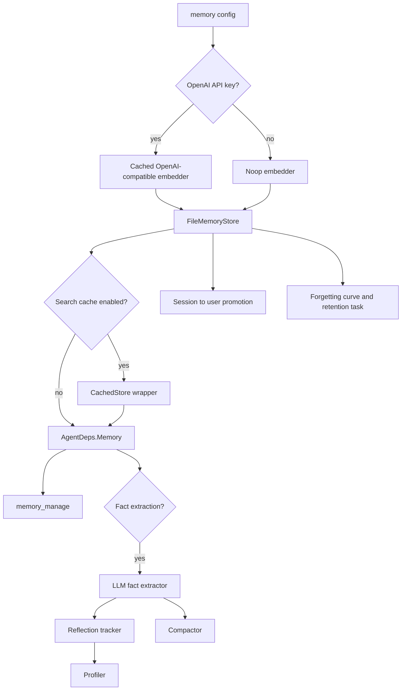
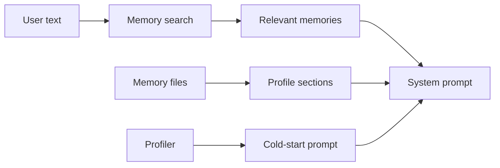
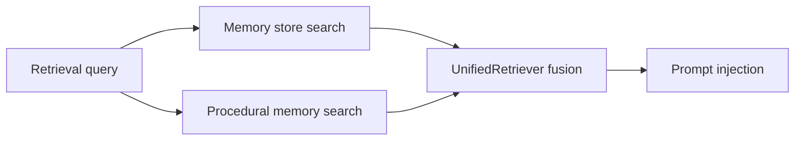

# 06. Memory

Memory stores user/session/runtime facts and profile information with a SQLite-backed index and optional embeddings.

## Memory Initialization

`internal/gateway/init_memory.go` runs when the `memory` feature is enabled.

Key behaviors:

- Storage dir defaults to `~/.IronClaw/memory`.
- `~/` prefixes in `memory.storage_dir` are expanded.
- Embeddings use `memory.openai_api_key`, `memory.embedding_model`, and `memory.embedding_base_url`.
- Search cache is optional.
- Fact extraction enables LLM fact extraction, lifecycle manager, reflection tracker, compactor, profiler, and audit logger.
- Consolidator runs regardless of fact extraction and promotes session facts to user scope.
- Retention/fade logic runs daily until Gateway stop.

## Memory Tools and AMP

Gateway registers:

- `memory_manage` after `FileMemoryStore` creation.
- `core_memory` after memory initialization when memory store exists.
- AMP memory tool through `memorywire.NewAdapter`, supporting standardized remember/recall/forget/merge/expire style operations.

The agent also reads memory passively during prompt construction and writes the user message to memory after handling a request.

## Prompt Memory Use

The prompt excludes `profile` memory type from general relevant memory search, then loads profile sections separately.

## Unified Retrieval

Gateway can construct a unified retriever (the "cortex") that fuses two sources:

- the memory store, and
- procedural memory.

`FusionWeights` exposes `MemoryWeight` and `ProceduralWeight`. This gives the Agent a single memory/cortex style retrieval surface while retaining separate storage responsibilities.

The prompt injector emits memory-derived sections (relevant memories, profile, and the memory taxonomy's `## Knowledge Context` block built from semantic memory).

## Current Fixed Wiring

Memory embedding uses the OpenAI-compatible embedding base URL config (`memory.embedding_base_url`). This matters for deployments using relays, local embedding services, or non-default OpenAI-compatible endpoints.
