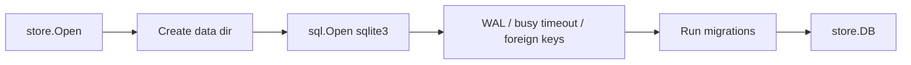
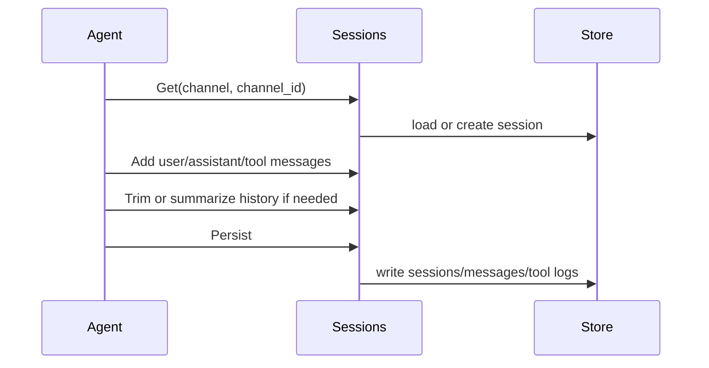
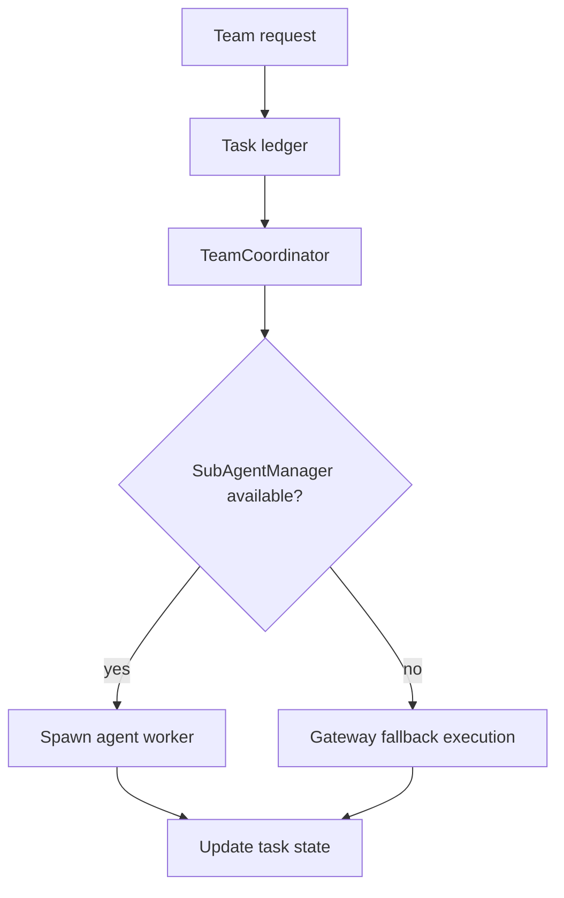

# 08. Store, Session, Task Ledger, and Scheduler

IronClaw uses SQLite as the durable runtime store. It also has file-based Memory storage, but the SQLite database remains the index, session, audit, and runtime coordination database.

## SQLite Store

`internal/store.Open(path)`:

1. Creates the parent directory.
2. Opens SQLite with:
   - WAL journal mode.
   - busy timeout.
   - foreign keys enabled.
3. Sets max open connections to 1 for SQLite single-writer behavior.
4. Runs embedded migrations from `internal/store/migrations`.



Migrations are tracked in `_migrations`. Existing databases from older migration logic can tolerate already-applied errors such as duplicate columns and record the migration as applied.

## Migration Domains

Current migrations cover:

- Initial sessions/messages/tool logs.
- File memory index.
- Memory access and audit logs.
- Reflection and temporal memory tables.
- Permission audit log.
- Sidechain/session chain/session summary tables.
- Task checkpoints and task ledger.
- Execution events and agent replays.
- Cleanup of legacy RL tables.
- Temporal facts.
- Cleanup of legacy Knowledge Base and Knowledge Graph tables.

The presence of `022_drop_rl_tables.sql` is important: current code uses `internal/evolution`, not an active `internal/rl` package.

## Session Manager

`internal/session` owns:

- Session identity per channel/channel ID.
- In-memory message history.
- Message add/trim operations.
- Previous summary storage for compaction.
- Persistence through the store.

Agent flow:



## Task Ledger

`internal/taskledger` records long-running or decomposed work:

- User request task registration in `Agent.HandleMessage`.
- Task completion update after handling finishes.
- Team coordinator tasks.
- Stale task detection.
- Team planner and team coordination tests.

Gateway initializes:

- `taskledger.NewSQLiteTaskLedger(gw.db)`
- `taskledger.NewTeamCoordinator(...)` when team is enabled.
- `TaskSubsystem` stale detector during `Gateway.Start`.

## Team Coordination

When `/team` or team features create work items, the ledger tracks task state. The coordinator can use sub-agents when available:



## Scheduler

`internal/scheduler` stores and polls scheduled tasks. Gateway creates it with the database and configured poll interval:

```go
gw.channels.sched = scheduler.New(gw.db, cfg.Scheduler.PollInterval)
```

At start, if the `scheduler` feature is enabled, Gateway starts the scheduler. The handler converts each scheduled task into an inbound message:

- `Channel`: task channel.
- `ChannelID`: task channel ID.
- `UserID`: `scheduler`.
- `UserName`: `scheduler`.
- `Text`: task prompt.

This means scheduled tasks reuse the same rate limit, slash command, agent, memory, tool, and persistence path as interactive messages.

## Operational Notes

- SQLite path defaults to `./data/ironclaw.db`.
- `make test` uses CGO because `go-sqlite3` is CGO-based.
- Store tests and session tests should be run after migration or schema changes.
