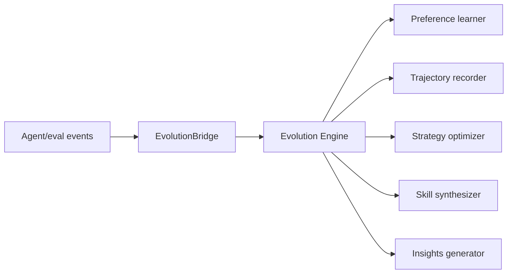
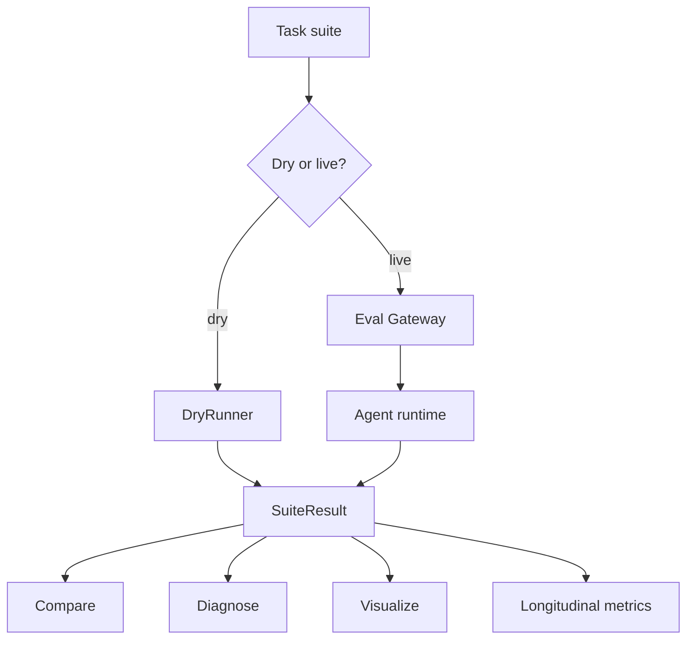

# 09. Evolution, Eval, and Training

IronClaw separates live runtime execution from optional self-evolution and reproducible evaluation.

## Evolution Engine

`internal/evolution` contains:

- Preference learning.
- Trajectory recording and cleanup.
- Reward modeling helpers.
- Strategy optimization.
- Prompt optimization.
- Skill draft scoring, loading, proposing, synthesizing, and activation.
- Model routing configuration support.
- Insights generation.
- Safety gates.

Evolution is opt-in by default:

```yaml
evolution:
  enabled: false
```

Gateway still constructs an evolution engine during initialization, but starts it only when the `evolution` feature is enabled.



## Runtime Wiring

Gateway creates the engine before cognitive/evolution hooks are initialized:

1. `gw.evolution.engine = evolution.NewEngine(cfg.Evolution)`
2. `initPlanAndEvolution`
3. `Start()` starts the engine if the feature is enabled.
4. On stop, Gateway saves evolution state and stops the engine when enabled.

When a provider is available, Gateway can wire `LLMSkillOpt` into the engine at runtime start.

## Insights CLI

`ironclaw insights` reads trajectory files and reports behavior:

```bash
./bin/ironclaw insights report --days 7
./bin/ironclaw insights export --days 30 --output trajectories.jsonl
./bin/ironclaw insights health --days 7
```

`report` can produce Markdown or JSON. `health` builds a cognitive health report by replaying trajectory records into `internal/cogmetrics`.

## Eval Harness

`internal/eval` contains dry and live evaluation support:

- Task suites and fixtures.
- Dry runner.
- Live `CognitiveAgentRunner`.
- Assertions, scoring, diagnosis, verifier, classifier.
- Benchmark wrappers for GAIA, HumanEval, SWE-style tasks.
- Longitudinal runner.
- Adaptive evaluation.
- LLM-as-judge path.
- Training export.

CLI commands are under `ironclaw eval`.



## Live Eval Isolation

`initEvalGateway` changes config intentionally:

- Forces `agent.mode` to `cognitive` for backward-compatible UnifiedLoop eval.
- Enables evolution so eval hooks populate before/after evolution fields.
- Sets permissions to `none` and disables tool approvals.
- Enables memory, multi-agent, and team.
- Disables dashboard to avoid port conflicts.
- Uses a temporary memory directory.
- Skips persisted feature state so prior `/feature disable` choices cannot affect eval results.

This makes eval behavior reproducible and isolated from a user's normal `~/.IronClaw/memory`.

## Training Export

`ironclaw training export` converts trajectory data into:

- reward/RLHF-style samples,
- DPO pairs,
- SFT samples.

Examples:

```bash
./bin/ironclaw training export --format reward --days 30
./bin/ironclaw training export --format dpo --days 30 --output ./training_output
./bin/ironclaw training export --format sft --min-confidence 0.5
```

Generated data may include prompts and tool outputs. Treat it as private unless sanitized.

## Current Boundaries

- Evolution is not a replacement for the Agent loop. The active loops are SimpleLoop and UnifiedLoop.
- Removed historical RL tables are not active runtime modules.
- Strategy and skill optimization are opt-in and should be verified with eval before being treated as production improvements.
