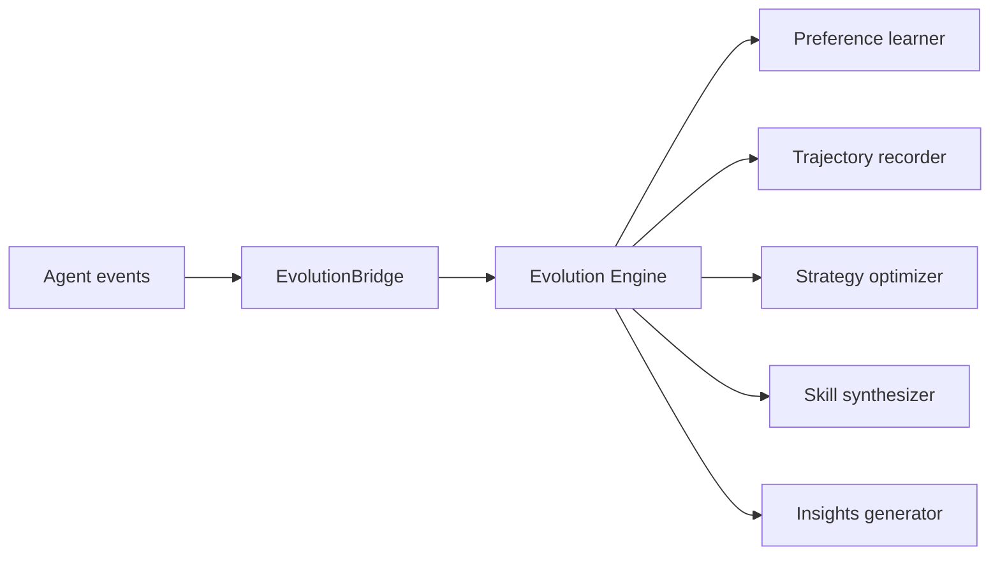

# 09. Evolution and Insights

IronClaw separates live runtime execution from optional self-evolution.

## Evolution Engine

`internal/evolution` contains:

- Preference learning.
- Trajectory recording and cleanup.
- Reward modeling helpers.
- Strategy optimization.
- Prompt optimization.
- Skill draft scoring, loading, proposing, synthesizing, and activation.
- Model routing configuration support.
- Insights generation.
- Safety gates.

Evolution is opt-in by default:

```yaml
evolution:
  enabled: false
```

Gateway still constructs an evolution engine during initialization, but starts it only when the `evolution` feature is enabled.



## Runtime Wiring

Gateway creates the engine before cognitive/evolution hooks are initialized:

1. `gw.evolution.engine = evolution.NewEngine(cfg.Evolution)`
2. `initPlanAndEvolution`
3. `Start()` starts the engine if the feature is enabled.
4. On stop, Gateway saves evolution state and stops the engine when enabled.

When a provider is available, Gateway can wire `LLMSkillOpt` into the engine at runtime start.

## Insights CLI

`ironclaw insights` reads trajectory files and reports behavior:

```bash
./bin/ironclaw insights report --days 7
./bin/ironclaw insights export --days 30 --output trajectories.jsonl
./bin/ironclaw insights health --days 7
```

`report` can produce Markdown or JSON. `health` builds a cognitive health report by replaying trajectory records into `internal/cogmetrics`.

## Current Boundaries

- Evolution is not a replacement for the Agent loop. The active loops are SimpleLoop and UnifiedLoop.
- Removed historical RL tables are not active runtime modules.
- Strategy and skill optimization are opt-in and should be verified before being treated as production improvements.
