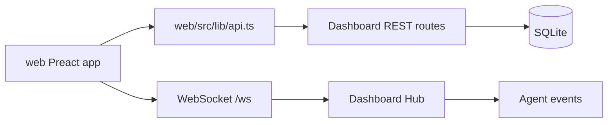

# 10. Frontend Apps

IronClaw has two frontend workspaces with different maturity and integration levels.

## Embedded Dashboard: `web/`

`web/` is a Preact + Vite application. It is intended to be served by the Go dashboard server.

Routes:

| Route | Component | Backend dependency |
|---|---|---|
| `/` | `Overview` | `/api/agent/state`, `/ws` |
| `/sessions` | `Sessions` | `/api/sessions` |
| `/sessions/:id` | `SessionDetail` | `/api/sessions/{id}/messages`, `/api/sessions/{id}/tools` |
| `/metrics` | `Metrics` | `/api/metrics/health` |

API client: `web/src/lib/api.ts`.

Auth helper: `web/src/lib/auth.ts`.

The dashboard backend lives in `internal/dashboard/server.go` and uses token auth for API/WS routes when `dashboard.token` is configured.



## Building Dashboard

```bash
cd web
npm ci
npm run build
```

`make build` runs the dashboard build before compiling the Go binary. The Go package `internal/dashboard` embeds the dashboard static files.

## Studio: `web/studio/`

`web/studio/` is a Vue 3 + Vite application with:

- Vue Router.
- Pinia.
- Vue Flow.
- Monaco editor dependency.
- D3 dependency.
- Splitpanes dependency.

Routes:

| Route | View | Current behavior |
|---|---|---|
| `/` | `Dashboard.vue` | Reads WebSocket-derived store metrics. |
| `/flows` | `FlowEditor.vue` | Local visual flow mock and YAML preview. |
| `/prompts` | `PromptIDE.vue` | Local prompt editor; test preview is randomized simulation. |
| `/memory` | `MemoryExplorer.vue` | Local static memory graph/list demo. |
| `/evolution` | `EvolutionMonitor.vue` | Evolution monitoring UI surface. |

The Studio connects to `/ws` through `web/studio/src/stores/agent.ts`. Other views currently use local state. This means Studio should be described as a prototype or visual IDE surface unless backend APIs are added.

## Building Studio

```bash
cd web/studio
npm ci
npm run build
```

This runs `vue-tsc` and Vite. It creates `web/studio/dist/`. That directory is generated output and should usually be removed before committing.

## Frontend Change Checklist

Dashboard changes:

1. Update Go route if the frontend needs new backend data.
2. Update `web/src/lib/types.ts` and `web/src/lib/api.ts`.
3. Add/adjust dashboard tests when backend route behavior changes.
4. Run `cd web && npm run build`.

Studio changes:

1. Decide whether the view is prototype-only or backend-connected.
2. If backend-connected, add API routes and document auth/state behavior.
3. Run `cd web/studio && npm run build`.
4. Remove accidental `web/studio/dist/` before commit unless release policy requires it.

## Current Frontend Boundary

Do not document Studio's Prompt IDE save/test, Flow Editor run/export, or Memory Explorer search as production-connected until backend APIs and persistence exist. Dashboard is the production-connected frontend surface.
