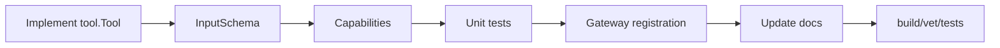

# 11. Developer Workflows

## Build Targets

| Target | Command | Meaning |
|---|---|---|
| Full binary | `make build` | Builds the Go binary with `CGO_ENABLED=1` and `-tags fts5`. |
| Go-only binary | `make build-bin` | Builds `./cmd/ironclaw`. |
| Short tests | `make test-short` | All Go tests without race detector. |
| Race tests | `make test` | All Go tests with `-race -count=1`. |
| Coverage | `make test-coverage` | Writes `coverage.out`. |
| Vet | `make vet` | Runs `go vet ./...`. |
| Format | `make fmt` | Runs `go fmt ./...` and best-effort `goimports`. |

## Adding a Gateway Feature

1. Add config fields if needed.
2. Register the feature in `internal/gateway/features.go`.
3. Decide phase: construct or start.
4. Declare dependencies.
5. Add auto-detect when availability depends on host tools.
6. Add hot-reload hooks if users can enable/disable it at runtime.
7. Wire initialization in the appropriate `init_*.go` file.
8. Update `docs/03-gateway-feature-lifecycle.md`.
9. Run build/vet/tests.

## Adding a Config Key

1. Add the field in the relevant `internal/config/config_*.go` file.
2. Add default in `defaultConfig()` when needed.
3. Add merge behavior in `merge.go` if hierarchy overlays should support it.
4. Add validation in `validate.go` if bad values can break runtime.
5. Add example in `configs/ironclaw.example.yaml`.
6. Update `docs/02-cli-config-userdir.md`.

## Adding a Tool

Follow this path:



New tools that can mutate files, run commands, call network, or write state should implement `Capabilities()` so permission and parallel execution behavior are explicit.

## Adding a Migration

1. Add a numbered SQL file under `internal/store/migrations`.
2. Prefer idempotent SQL when possible.
3. Add store/session/task tests when behavior changes.
4. Remember migrations are embedded by `internal/store/sqlite.go`.

## Troubleshooting

| Symptom | Check |
|---|---|
| Go build fails around SQLite | Ensure CGO toolchain is available and use Makefile targets. |
| Knowledge vector search does not use custom endpoint | Check `memory.embedding_base_url`; Knowledge now uses this field. |
| MCP tools missing | Check `~/.IronClaw/mcp/*.yaml`, command availability, server logs, and `mcp_<name>` feature state. |
| Sandbox not active | Check `sandbox.enabled`, Docker availability, and Feature Registry state. |
| Vue Studio appears disconnected | Studio only connects to `/ws`; most views are prototype-local until backend APIs are added. |
| Race test prints macOS linker warnings | Warnings can appear without test failure; inspect final exit status. |

## Final Pre-Merge Checklist

```bash
git status --short
make build-bin
make vet
make test-short
```

Run broader checks for broader changes:

```bash
make test
cd web/studio && npm run build
```
