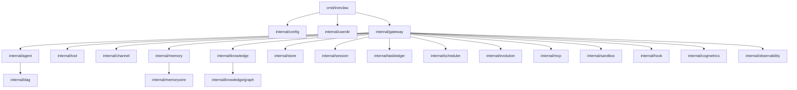

# 12. Package Inventory

This inventory is based on `go list ./...`.

## Entry

| Package | Role |
|---|---|
| `cmd/ironclaw` | Cobra CLI, runtime entry points, TUI startup, skill commands, memory reindex, MCP serve, insights. |

## Runtime Core

| Package | Role |
|---|---|
| `internal/gateway` | Composition root, feature lifecycle, subsystem init/start/stop, slash commands, config hot reload. |
| `internal/agent` | Agent runtime, provider adapters, loop strategies, context compression, sub-agents, teams, speculative execution, prompt cache, codebase index. |
| `internal/dag` | DAG executor support for structured task execution. |
| `internal/feature` | Feature registry, dependency resolution, persistence of runtime feature overrides. |
| `internal/config` | YAML config structs, defaults, env expansion, hierarchy overlays, validation, permission merge rules. |
| `internal/userdir` | `~/.IronClaw` initialization and injection for persona/rules/MCP/skills/agents. |

## Tools and Integration

| Package | Role |
|---|---|
| `internal/tool` | Built-in tools, registry, schemas, capabilities, permissions, interceptors, result persistence. |
| `internal/mcp` | MCP client manager, MCP tool adapters, standalone MCP server wrapper. |
| `internal/worktree` | Git worktree manager and worktree tools. |
| `internal/hook` | Built-in hook manager, user hook scripts, injectors, audit hooks, precompact preservation. |
| `internal/sandbox` | File guard, network policy, Docker session backend, macOS seatbelt, bubblewrap support/probing. |
| `internal/guardian` | Safety/guardian checks. |
| `internal/logging` | Redaction helpers. |

## Agent I/O

| Package | Role |
|---|---|
| `internal/channel` | Channel interfaces and common message types. |
| `internal/channel/telegram` | Telegram adapter, formatting, approval/reflection/feedback callbacks. |
| `internal/channel/discord` | Discord adapter, formatting, approval/reflection/feedback callbacks. |
| `internal/channel/tui` | Bubble Tea TUI channel, view model, formatter, command suggestions, observability emitter. |

## Memory and Knowledge

| Package | Role |
|---|---|
| `internal/memory` | File memory store, embeddings, cache, lifecycle, facts, compactor, consolidator, profiler, privacy, temporal memory, unified retrieval. |
| `internal/memorywire` | Agent Memory Protocol adapter. |
| `internal/knowledge` | Knowledge Base, chunking, ingestion pipelines, store, retriever, reranker, cache. |
| `internal/knowledge/graph` | SQLite graph store, entity extraction, graph sync, graph decay. |

## Persistence and Coordination

| Package | Role |
|---|---|
| `internal/store` | SQLite open/migration/audit helpers. |
| `internal/session` | Session model, history, persistence manager. |
| `internal/taskledger` | Task ledger, stale detector, team coordinator/planner, noop implementation. |
| `internal/scheduler` | Scheduled task model and poller. |

## Observability

| Package | Role |
|---|---|
| `internal/observability` | OpenTelemetry tracing/metrics setup and metric instruments. |
| `internal/cogmetrics` | Cognitive metric collector, health report, breaker, rolling averages. |
| `internal/health` | Health check registry and checker abstraction. |
| `internal/ratelimit` | Request rate limiter and middleware-style helpers. |

## Evolution and Evaluation

| Package | Role |
|---|---|
| `internal/evolution` | Evolution engine, preferences, strategies, reward, insights, trajectory recorder, skill synthesis/activation, prompt optimization. |

## Utility

| Package | Role |
|---|---|
| `internal/errors` | Typed/wrapped error helpers. |
| `internal/util` | Small string utilities. |

## Package Relationship Map

