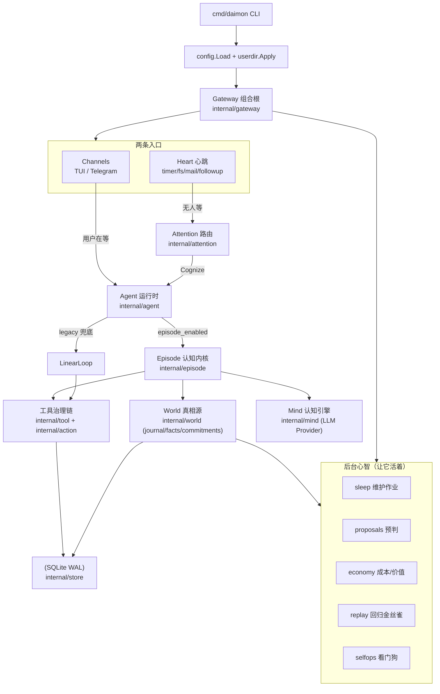
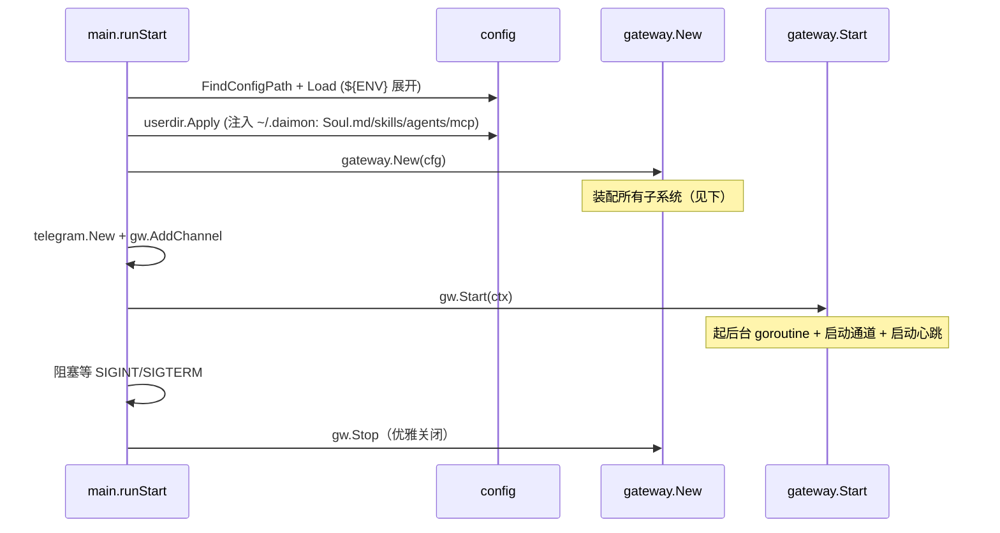
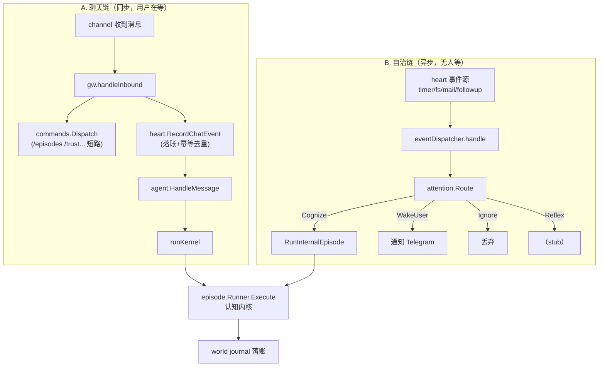
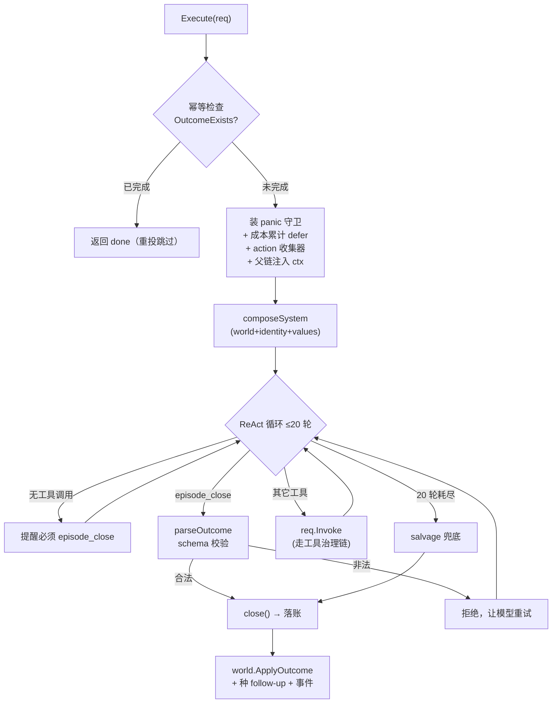
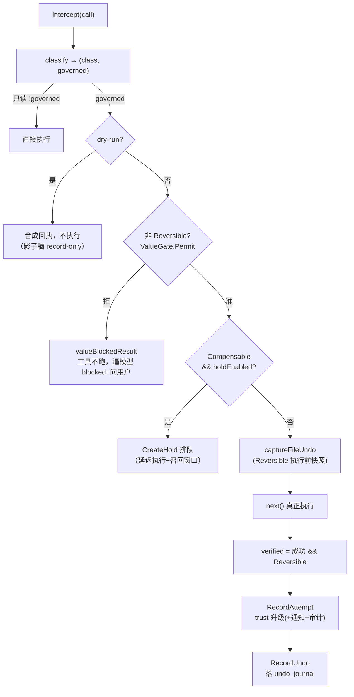

# Daimon 项目导读：从零到通透

> 目标读者：第一次接触本仓库、想快速通透理解「它是什么、怎么工作、数据怎么流动」的工程师。
> 阅读方式：本文每个关键环节都标注了 `文件:行号` 锚点，建议边读边在编辑器里跳转对照源码。
> 配套文档：`README_zh.md`（速览，略旧）、`DAIMON_BLUEPRINT.md`（设计蓝图，章节号 §4.x 在代码注释里被反复引用）、`CLAUDE.md`（维护者速记）。

---

## 第 0 章 · 这是什么（先建心智模型）

### 一句话定性

**Daimon 不是聊天机器人，是一个常驻型、本地优先、单用户的「主权 Agent 运行时」。**

普通 chatbot 的生命周期是「收到消息 → 回复 → 结束」。Daimon 多了一条**自治回路**：它有"心跳"（heart），会被定时器、文件变化、邮件等事件唤醒，自己决定要不要思考、思考完把结论记进"世界模型"，并对自己花的钱、做的动作、能不能撤销负责。

### 三个核心隐喻（理解全项目的钥匙）

1. **Gateway = 组合根（composition root）**
   所有子系统在一个地方显式接线，没有隐藏的全局单例。读懂 `internal/gateway/gateway.go:75 New()` 就读懂了项目的"装配图"。

2. **Episode kernel = 认知内核**
   每一次"思考"是一个 **episode**（情节）。无论来自聊天还是自治心跳，最终都走进同一个内核 `internal/episode/episode.go:141 Runner.Execute`——一个带护栏的 ReAct 循环。

3. **交账（Accountability）= 最高纪律**
   每个 episode **必须**以一个结构化的 `Outcome` 收尾，并落账到 world journal（世界日志）。模型不调用 `episode_close` 就强制兜底（salvage）。**world 是唯一真相源**——成本、动作、价值、撤销记录都围绕它。

### 它"不是"什么（澄清常见误解）

- **不是** 多种 agent 模式可选：只有一个执行策略 `LinearLoop`，没有 `/mode` 命令，没有 `agent.mode` 配置。
- **不是** 沙箱隔离的：工具直接在宿主机执行（文件工具被围栏在工作目录内，但没有 Docker/OS 级隔离）。bash 在 macOS 上可选 seatbelt 沙箱。
- **不是** 有遥测埋点的：agent/工具路径里没有 OpenTelemetry/metrics（只有自建的 replay 录制 + 事件总线）。
- **子代理** 只在进程内（goroutine）运行，不是分布式。

### 默认形态 vs 完全体

项目大量使用 **feature flag**，且**默认大多关闭**。关闭时二进制行为与"旧版"逐字节等价。这是「绞杀者模式（strangler）」纪律：新能力先加 flag、默认关、证明无回归后再考虑默认开。

| 能力 | flag | 默认 | 打开后 |
|---|---|---|---|
| 认知内核 | `agent.episode_enabled` | **on** | 聊天走 episode 内核（否则走 legacy loop） |
| 自治心跳 | `agent.heart_enabled` | off | 定时器/邮件/文件事件驱动自治 episode |
| 子代理 episode 化 | `agent.subagent_episode_enabled` | off | 子代理也走内核，强制交账+治理 |
| 行动 hold 队列 | `agent.action.hold_enabled` | off | 可补偿动作进延迟执行队列（带召回窗口） |
| 自我运维看门狗 | feature `selfops` | off | 确定性健康巡检 |
| HTTP admin server | feature `server` | off | 起 :8080 健康服务 |

> 记住这条：**读代码时先看 flag。** 很多路径在默认配置下根本不执行。

---

## 第 1 章 · 全局地图（模块全景）

### 运行时全景



### 模块职责表（`internal/*` 全清单）

| 包 | 一句话职责 | 你会在什么时候读它 |
|---|---|---|
| `gateway` | **组合根**：装配所有子系统、两条入口的调度 | 第一个读，理解全局接线 |
| `episode` | **认知内核**：ReAct 循环 + 交账契约 + Outcome 落账 | 第二个读，项目心脏 |
| `agent` | LLM 会话处理、`LinearLoop`、工具执行管道、子代理、上下文压缩 | 理解聊天链 + 工具怎么跑 |
| `mind` | 可换的 LLM Provider 抽象（Claude/OpenAI）+ 类型 + 熔断 + 缓存分段 | 理解 LLM 调用底座 |
| `attention` | 注意力路由：决定一个事件值不值得花一次昂贵认知 | 理解自治链怎么省钱 |
| `heart` | 心跳：事件源（timer/fs/mail/followup）+ 事件存储 + 分发 | 理解自治怎么被唤醒 |
| `action` | **行动治理**：value gate→trust→classify→hold→undo→verify | 理解"自治动作"的护栏 |
| `tool` | 工具实现（bash/file/http/...）+ 拦截器链（权限/hook/审计/...） | 理解每个工具调用经过什么 |
| `world` | **世界模型**：journal/facts/commitments + Outcome 元数据 + 检索 | 理解"真相源"和落账 |
| `values` | 用户价值模型（markdown 持久化）——自治动作的"许可源" | 理解 value gate 凭什么放行 |
| `sleep` | 维护作业：digest/drift/reconcile/rollup/distill/proposals/synthesize | 理解后台"消化" |
| `proposals` | 预判闭环：sleep 填队列 → 决策 → Telegram 投递 → dismiss 学习 | 理解主动提案 |
| `economy` | 成本台账：token 归因 + 定价 + ROI + 节流 | 理解花钱与价值核算 |
| `replay` | 回归金丝雀：录制 → 纠正集 → model-swap 重打分 | 理解"换模型不退化"的保障 |
| `selfops` | 自我运维看门狗：确定性健康巡检 + 错误日志聚类 | 理解自检 |
| `vcs` | 极简 git 封装（os/exec）：身份/规则文件可 revert | 理解自我修改可逆性 |
| `mcp` | Model Context Protocol 工具集成（STDIO 外部 server） | 接入外部工具时 |
| `memory` | 文件记忆 + embedding + 事实抽取 + 混合检索 | 理解记忆系统 |
| `skill` | 技能加载（懒加载 `read_skill`）+ 草稿晋升 | 理解技能系统 |
| `session` | 会话/消息持久化 | 理解会话状态 |
| `store` | SQLite 连接 + 嵌入式迁移 | 理解 DB |
| `config` | YAML 加载 + `${ENV}` 展开 + 默认值 | 理解配置 |
| `feature` | 功能开关注册表 + 依赖解析 | 理解 flag 系统 |
| `channel` | 通道抽象（telegram/tui/scheduler）+ 审批/反思/流式 | 理解 I/O |
| `hook` | 生命周期钩子（PreToolUse/PostToolUse/...） | 理解扩展点 |
| `taskruntime` | 任务账本（调度任务状态机） | 理解定时任务 |
| `workflow` | 工作流缓存 | 子代理工作流 |
| `appdir`/`userdir` | `~/.daimon` 目录管理 + 用户配置注入 | 理解用户目录 |
| `telemetry` | 事件总线 + replay 录制装配 | 理解可观测 |
| `errors`/`util`/`netdial` | 基础设施 | 按需 |

### 依赖方向（单向，无环）

```
config / errors           ← 最内层，不依赖任何业务包
   ↑
mind  (只依赖 config + errors)
   ↑
agent (依赖 mind)
   ↑
episode (依赖 agent + mind + tool + world)
   ↑
gateway (依赖几乎所有包，组合根)
```

> 关键纪律：**`mind` 是叶子，`agent` 单向依赖 `mind`，`episode` 单向依赖 `agent`。** 这保证认知引擎可替换、内核可独立测试。`action` 也是叶子（零 gateway/channel import），通过接口 seam 被 gateway 注入。

---

## 第 2 章 · 启动链（从 main 到 running）

### 时序



入口：`cmd/daimon/main.go:257 runStart`。

### `gateway.New` 接线顺序（`gateway.go:75`）

这是全项目最重要的一段。按顺序：

1. **硬不变式校验**（`:86`）：`heart_enabled ⇒ episode_enabled`。心跳驱动 episode，没内核每个事件都会失败——所以在分配任何资源前就拒绝这个组合。
2. **DB** → `InitDatabase`（迁移自动按字母序应用）→ sessions → taskLedger。
3. **toolSub**（`InitTools`）→ 注册所有工具 + 组装**拦截器链** + 建 **WorldStore / ValuesStore / ActionStore**（见第 5 章）。
4. **agent deps** → `InitAgentRuntime`（建 LLM Provider）。
5. **EpisodeRunner**（`:127`）= 认知内核，注入 Provider/World/Identity/EventBus + Values + **CostRecorder**（每 episode token 异步落 economy）。
6. **sleep.Runner**（`:145`）→ 注册 8 个维护作业（digest/drift/rollup/reconcile/distill/promote/proposals/distill-screen/throttle）。
7. **memory / skills / multiAgent / mcp** 子系统。
8. **`agent.NewAgent(&deps, &LinearLoop{}, eventBus)`**（`:209`）→ `SetKernel(EpisodeRunner, episodeEnabled)`。注意：策略永远是 `LinearLoop`，内核是可选叠加。
9. **proposals** 协调器 + 投递器接线（`:215`）。
10. **scheduler**（定时任务通道）。
11. **heart**（`:228`，仅 `heart_enabled`）→ 注册事件源：timer / daily_brief / health / sleep / fs / mail / followup，并注册 synthesize-rules 作业。
12. **config.OnReload**（`:297`）→ 热重载时保护"心跳运行中不能关内核"。

### `gateway.Start` 起了什么（`gateway.go:334`）

- health server（若 feature `server` 开）
- MCP servers + 目录监听 goroutine
- ResultStore 清理 ticker（每小时）
- **holds drain ticker**（若 `hold_enabled`）：先 `RecoverStaleHolds`（崩溃恢复）再起排空循环
- **proposal inline-button 处理器注册**（在通道 update loop 启动前，避免 race）
- 启动所有通道 `ch.Start(ctx, gw.handleInbound)`
- 启动 heart（在通道之后，这样 wake_user 能触达通道）

---

## 第 3 章 · 数据怎么流动（两条入口）★ 核心

整个系统有**两条 ingress**，但**都汇聚到同一个认知内核**。理解这张图就理解了"数据怎么流动"：



### 3.1 聊天链 详细 trace

```
channel(telegram/tui) 收到消息
  → gw.handleInbound                              gateway.go:432
      ├ commands.Dispatch        // slash 命令短路（/episodes /trust /holds /brief /feature /model...）
      ├ heart.RecordChatEvent    // 统一事件流落账 + 同 message_id 幂等去重（重投则跳过，best-effort）
      └ agent.HandleMessage                        agent.go:106
          ├ per-session 互斥锁（channel:channelID，防同会话并发交错）
          ├ sess = Sessions.Get(...)
          ├ priorTranscript = BuildMessages(sess)
          ├ sess.AddMessage(user 消息)
          ├ if kernel && kernelEnabled:
          │     handled, err = runKernel(...)       agent.go:187   ← 走认知内核
          ├ if !handled:                            // 内核失败/未启用 → 回退
          │     frame = preparePromptFrame()
          │     ContextMgr.Compress()               // 上下文压缩（layered 三层）
          │     strategy.Execute()                   linear_loop.go:16  ← legacy ReAct
          ├ Memory.Store.Save(user 消息)
          └ Sessions.Persist(sess)
```

**`runKernel`（`agent.go:187`）做了什么**：把这一轮组装成 `CognitiveRequest`（goal/persona/rules/memories/toolDefs + 一个 `Invoke` 闭包）→ 调 `kernel.Execute` → 把 `Outcome.Reply` 经 `ch.Send` 回给用户。

- 内核失败或 `Status=="failed"` → 返回 `handled=false`，**回退 legacy loop**（聊天路径才回退；子代理路径是 terminal，已交账不回退，避免双跑+绕过治理）。
- `Invoke` 闭包指向 `agent.invokeTool`——这就是内核与"工具治理链"的接缝。

### 3.2 自治链（heart）详细 trace

```
heart 事件源 → eventDispatcher.handle              heart_dispatch.go:34
  ├ ev.Kind == "message"          → skip（聊天事件已被同步处理）
  ├ ev.Kind == "internal.daily_brief" → deliverDailyBrief()  // 确定性，不进模型（宪法#5/#7）
  ├ ev.Kind == "internal.health"      → runHealthCheck()      // selfops 看门狗
  ├ ev.Kind == "internal.sleep"       → triggerAutonomousSleep()  // 独立 goroutine
  ├ 非 internal. 前缀 → recordActivity()  // 记录"有真实活动"，供 idle 检测
  └ v = attention.Route(ev)                                   attention.go:162
        switch v.Action:
          Ignore   → 丢
          Reflex   → reflex stub（workflow-by-id loader 是死胡同，见第 6 章）
          WakeUser → gw.wakeUser → 通知 Telegram（primaryNotifier）
          Cognize  → gw.agent.RunInternalEpisode(ev.ID, goal, payload, ev.Kind)   agent.go:274
```

**`RunInternalEpisode`（`agent.go:274`）的关键差异**：
- **没有通道**（`ch=nil`）→ 需审批的工具被自动拒绝（无人签字），只跑只读/自动批准工具。
- 用 `ev.ID` 作幂等键 → 崩溃重投同一事件不会重复执行。
- 独立的 `internal` session（隔离聊天会话）。
- Outcome 落 journal，**不回复任何人**——它的产出是世界模型的变化 + 可能的提案/唤醒。
- `ev.Kind` 作 activity class → 成本按"什么触发的"归类（heartbeat/followup/...）。

### 3.3 注意力路由（成本之根）

`internal/attention/attention.go:162 Chain.Route`——廉价优先的多层链，**刻意偏向"过度唤醒"**（漏掉重要事件的代价 ≫ 浪费一次思考）：

```
1. 硬白名单（isHighRisk）                       attention.go:165
     payment. / security. / legal. / account.delete  → 永远 WakeUser
     规则和模型都不能覆盖它（宪法#4：不可逆/高风险永远人签）
2. RulesRouter                                  attention.go:97
     用户可编辑的 ~/.daimon/attention/rules.yaml，首条匹配胜出
     sleep 的 synthesize-rules 作业也往这里写"学到的"规则
3. ModelRouter（可选，model_router: true）       attention.go:114
     小模型（haiku）triage 规则没覆盖的事件；可弃权
4. default → Cognize                            attention.go:176
     未分类的事件"值得想一下"，绝不静默丢
```

---

## 第 4 章 · 认知内核 episode kernel ★ 项目心脏

`internal/episode/episode.go:141 Runner.Execute`——一个加了**交账护栏**的 ReAct 循环。这是全项目最该精读的函数。

### 逐步拆解



逐行要点（带锚点）：

| 步骤 | 行号 | 做什么 / 为什么 |
|---|---|---|
| 幂等跳过 | `:155` | `OutcomeExists(episodeID)`：崩溃后重投同一事件，已完成则直接返回，不重跑 |
| 交账 panic 守卫 | `:167` | 任何 panic（最可能是 `req.Invoke` 工具崩）→ `failEpisode` 仍落 journal + 报错。**不变式#3：episode 绝不凭空消失** |
| 成本累计 | `:180` | `defer recordCost`：跨所有 provider 调用累加 token，无论从哪条路退出都记一次（economy §4.11） |
| action 收集器 | `:186` | `WithActionCollector`：统计本 episode 有多少"未验证的治理动作"→ 供 distill 判断这个 episode 干不干净 |
| 父链注入 | `:192` | `EpisodeIDToCtx`：子代理 Spawn 时读它，把子 episode 链回父（§4.3） |
| 组装 system | `:194` | `composeSystem`：world 模型 + identity.md + 高置信 values 注入 system prompt |
| ReAct 循环 | `:206` | 最多 20 轮：`streamCompletion` → `publishExchange`（replay 录制）→ 处理工具调用 |
| 无工具调用 | `:232` | 提醒"必须 `episode_close`"，再没有就 break |
| `episode_close` | `:243` | **唯一正常出口**：`parseOutcome` schema 校验通过 → `close()` |
| 其它工具 | `:254` | `req.Invoke` → 走 agent 工具治理链；失败计入 `toolFailures`（clean 信号） |
| salvage | `:267` | 没 close 就兜底：先让模型抽 JSON Outcome，再启发式，标 `Salvaged=true` |

### Outcome 退出契约（核心数据结构）

`episode.go:27 Outcome` + `episode.go:578 episode_close` 工具 schema：

```go
type Outcome struct {
    Status          string           // 必须 ∈ {done, blocked, handed_off}
    Summary         string           // 必填，≤500 字，落 journal
    WorldWrites     []world.Mutation // commitment.create/update | journal.append | fact.upsert
    Receipts        []string         // 工具产生的动作回执 id
    FollowUps       []FollowUp       // timer(重入心跳) | watch/check(落 commitment)
    OpenQuestion    *string          // blocked 时：要问用户的确切问题
    ValueCreatedUSD float64          // 自报 ROI（保守诚实，落 world 不落成本台账）
    Salvaged        bool             // 框架设的（非模型）：episode_close 没被调用时的兜底标记
}
```

### `close()` 落账（`episode.go:281`）

1. 展开 follow-ups：`timer` → 种回 heart 重入；`watch`/`check` → 转成 commitment 事务落账。
2. `world.ApplyOutcome`（事务）：world 写 + journal 标记。**world 写失败 → `failEpisode` 重落空写**（summary 仍在，episode 不凭空消失）。
3. 种 timer follow-up 到 heart 队列（best-effort）。
4. 发 `TurnClosed` 事件 → 聊天链据此回复用户。

### 交账三大不变式（贯穿全内核的设计哲学）

1. **不变式#1（world 是唯一真相）**：成本/价值/动作/撤销都围绕 world journal；reconcile 作业保证内部一致。
2. **不变式#3（交账强制）**：episode 一旦开始，无论 panic/stream 错/world 写失败，**必须留下一条 durable Outcome**。这是 `failEpisode`（`:375`）存在的全部理由。
3. **Outcome schema 校验**（`parseOutcome :423`）：`status` 必须在枚举内，`summary` 非空且 ≤500 字，否则拒绝让模型重试。

### legacy `LinearLoop` 对比（`linear_loop.go:16`）

兜底路径，极简——标准 ReAct：`LLM → 工具（并行派发独立 tool_use）→ LLM → ...`，最多 `max_iterations` 轮，无工具调用即结束。**没有交账、没有 Outcome、没有 world 落账**。这就是为什么内核是核心、legacy 只是安全网。

---

## 第 5 章 · 工具与行动治理

### 5.1 工具拦截器链（每个工具调用都穿过）

在 `internal/gateway/subsystem_tool.go:185` 组装，外→内顺序：

```
permission        权限引擎 + 审批 + 审计 sink + 决策上报      tool.NewPermissionInterceptor
  → hook          内置 hook（safety_analyzer / audit_logger）  tool.NewHookInterceptor
  → user_hook     ~/.daimon/hooks 用户脚本                     newUserHookInterceptor
  → readBeforeEdit 编辑前必须先读                              tool.NewReadBeforeEditInterceptor
  → [verify]      可选：执行结果验证                           tool.NewVerifyInterceptor
  → [audit]       可选：审计落库                               tool.NewAuditInterceptor
  → ACTION        ★行动治理核心（见 5.2）                      action.Interceptor
  → activity      最内层：流式上报（只报通过前面所有 gate 的） tool.NewActivityInterceptor
  → 真正的 tool.Execute
```

调用入口：`agent.invokeTool`（`agent.go:366`）。它把工具调用送进 `Interceptor.Execute`，在最内层闭包里做审批检查 + 真正 `t.Execute`，并把软失败（如 `file_edit "old_string not found"`）通过 `Result.Error` 如实传播（不传播会让 action 拦截器误判成功 → 错误的 undo 记录 + 错误的 trust 提升）。

### 5.2 行动治理：`values → trust → classify → hold → execute → undo → verify → audit`

`internal/action/interceptor.go:83 Intercept`——这是最有"Daimon 味"的一段，决定"自治动作"能不能跑：



关键设计点（带锚点）：

- **可逆性三分类**（`Reversible` / `Compensable` / `Irreversible`，由 `classifier` 判定）。
- **Value gate**（`:104`）：自治的**非可逆**动作，必须有一条覆盖它的 value 决策（或已挣得的 trust）才能跑。否则 `valueBlockedResult`——工具**不执行**，回错误让模型以 `blocked` 收尾、用 `open_question` 问用户。`internal/values` 是这条"许可源"。
- **可逆动作豁免**：`Reversible` 动作可自由跑（因为可撤销），执行前 `captureFileUndo` 快照（`:135`），成功后落 undo_journal。
- **Compensable + hold**（`:112`）：进延迟执行队列（默认 120s 召回窗口），到期由 gateway drain ticker 自动执行；期间可 `daimon holds recall` 撤销。邮件发送就走这条。
- **verified 只给可逆**（`:154`）：只有可逆动作靠"执行成功"挣自治（trust 升级 ask_every→...→full_auto）；可补偿/不可逆动作永远停在 ask-every，等显式客观验证。
- **trust 升级有通知+审计**（`:173`）：代理不能"偷偷"给自己授更多自治权。
- **value_ref 回执**（`:187`）：每个自治动作都在回执上盖"凭什么放行"（`value:<id>` / `trust:<level>` / `reversible`），可追溯。

### 5.3 撤销（undo）

`daimon undo [receipt-id | --episode <id> | list]`：读 undo_journal，反转文件变更（恢复快照或删除新建文件，幂等）。`--episode` 撤销整个坏 episode 的全部可逆动作（LIFO）。身份文件（identity.md）和注意力规则（rules.yaml）则通过 `internal/vcs` git 化，用 `daimon world revert` / `daimon attention revert` 回滚。

### 5.4 权限系统（`subsystem_tool.go` + config `permissions`）

- **profile（通道地板）**：`local`(tui) / `remote`(telegram) / `scheduled`(cron) / `background`(子代理)。远程/定时/后台默认要求写/破坏/网络操作审批。
- **rule（首条匹配胜出）**：`tool + pattern/path_pattern → action`（none/notify/approve/deny）。
- **default**：`approve`（无规则匹配时问用户）。

---

## 第 6 章 · 后台心智（让它"活着"而非被动应答）

| 子系统 | 入口 | 职责 | 触发 |
|---|---|---|---|
| **sleep** | `internal/sleep` | digest(自摘要)/drift(价值漂移检测)/rollup/**reconcile**(消矛盾,维护 world 一致)/**distill**(挖重复成功模式→候选)/promote(草稿入 staging,**不自动加载**)/proposals(预判)/synthesize-rules(写注意力规则)/distill-screen(草稿→提案) | `/sleep` 手动 或 `sleep_interval_minutes` 自治（带 idle 门控） |
| **proposals** | `internal/proposals` | sleep 填队列 → coordinator typed-accept 决策 → Telegram inline `[做/不做]` → dismiss 学习(14天 cooldown 抑制同题) | sleep 后投递 |
| **economy** | `internal/economy` | 每 episode token 归因 + activity-class 分类 + 月报 + ROI-by-class + **throttle 节流**(超预算/低价值的类自动跳过自治，可 `/throttle` 否决) | 自动落账 + `daimon costs` |
| **replay** | `internal/replay` | 录制 ProviderExchange → `daimon correct` 纠正集 → `replay --against --canary` model-swap 重打分(fail-closed，不退化才放行) | `daimon replay` |
| **selfops** | `internal/selfops` | 确定性巡检：salvaged 率 / 路由漏报 / holds 积压 / 磁盘 / **错误日志聚类** → critical 唤醒用户 / warn 提案 | feature `selfops` + `health_interval_minutes` |
| **world** | `internal/world` | journal / commitments / facts + Outcome 元数据 + FTS 检索 + `ClassifyOutcome` | 内核落账 |

### 关于"死胡同"（诚实标注，避免你白找）

代码注释和记忆里反复出现几个**有意未实现**的点，别误以为是 bug：
- **Reflex executor**：注意力可路由到 `Reflex`，但没有 workflow-by-id 加载器（`heart_dispatch.go:114` 是 stub）。技能是懒加载文档不是可执行单元，且没有自治 reflex 规则生产者——真死胡同。
- **mail/calendar 感官源**：需要 IMAP/CalDAV/SMTP 真凭证才能端到端（外部阻塞）。fs 感官源已实现（零凭证）。
- **多步行为金丝雀**：distill 自治转正需要多步轨迹的行为级 replay 验证，但没有诚实的 dry-run 形态（§706 墙）。所以技能晋升保持"提案式人签"。

---

## 第 7 章 · 概念词典（黑话表）

| 术语 | 含义 |
|---|---|
| **交账 / Accountability** | 每个 episode 必须留下 durable Outcome 落 world journal，绝不凭空消失 |
| **Episode（情节）** | 一次完整的"思考单元"，从触发到 `episode_close` |
| **Outcome** | episode 的结构化退出契约（status/summary/world_writes/follow_ups/...） |
| **episode_close** | 模型必须调用的收尾工具；不调用则 salvage 兜底 |
| **Salvage** | 模型没 close 时框架的兜底恢复（先 LLM 抽 JSON，再启发式） |
| **World（世界模型）** | 唯一真相源：journal(日志) + commitments(承诺) + facts(可检索事实) |
| **Heart（心跳）** | 自治事件循环：timer/fs/mail/followup 事件源 |
| **Attention（注意力）** | 路由：决定事件是 Ignore/Reflex/Cognize/WakeUser |
| **Cognize** | "花一次完整认知 episode" |
| **WakeUser** | 直接打断用户（通知 Telegram） |
| **Reflex** | 跑预编译确定性处理器（目前 stub） |
| **Value gate（价值门）** | 自治非可逆动作的许可检查：有 value 决策/trust 才放行 |
| **Trust ledger（信任账本）** | 按"动作类×上下文"累积自治等级（ask_every→ask_first→hold_then_auto→full_auto） |
| **可逆性三分类** | Reversible(可撤销,自由跑) / Compensable(可补偿,进 hold 队列) / Irreversible(不可逆,永人签) |
| **Hold（保留队列）** | 可补偿动作的延迟执行+召回窗口 |
| **Undo** | 可逆动作的撤销（读 undo_journal 反转） |
| **Distill（蒸馏）** | 从 journal 挖重复成功模式 → 候选技能 |
| **Promote/Demote** | 草稿技能晋升/降级（人签，移动 staging↔active） |
| **Drift（漂移）** | 近期活动与已声明价值的矛盾检测 |
| **Reconcile（调和）** | 消除 world 中矛盾/重复事实，保持一致 |
| **Canary（金丝雀）** | replay 回归门：换模型重放，不退化才放行 |
| **Feature flag** | 功能开关，默认大多关，关时行为等价旧版 |

---

## 第 8 章 · 配置与 feature flag 地图

### 配置加载顺序（`gateway.go` + `config` + `userdir`）

```
1. internal/config 内置默认值
2. YAML 文件（-c 指定，默认 ~/.daimon/config.yaml；--dev 用 configs/daimon.yaml）
3. ~/.daimon 用户目录注入：Soul.md / Memory.md / Agent.md / mcp/*.yaml / skills/ / agents/
4. ~/.daimon/feature_state.json 持久化功能开关
   （${ENV} 在 YAML 加载时展开）
```

### Feature Registry（`internal/feature/registry.go`）

解析顺序：**AutoDetect（不可用→强制 off）> config override > 默认值**。唯一硬依赖：`team` 需要 `multi_agent`。

- 默认 **on**：`memory`、`skills`、`multi_agent`
- 默认 **off**：`server`、`selfops`

### 关键配置块（`configs/daimon.example.yaml` 是权威地图）

| 块 | 关键字段 | 说明 |
|---|---|---|
| `llm` | `provider`(claude/openai)/`model`/`max_tokens`/`thinking_budget` | LLM 底座，支持 relay/Ollama/vLLM |
| `agent` | `episode_enabled`(默认 on)/`heart_enabled`(off)/`max_iterations` | 内核 + 自治开关 |
| `agent.heart` | `heartbeat/daily_brief/health/sleep_interval_minutes`(均 0=off)/`fs_watch_dirs`/`mail`/`model_router` | 自治节奏 |
| `agent.action` | `hold_enabled`(off)/`hold_window_seconds`(120) | 可补偿动作队列 |
| `agent.compression` | `strategy: layered`(三层:30%/60%/85%) | 上下文压缩 |
| `tools` | `bash`/`file`/`http`/`email`/`exec.backend`(host/seatbelt)/`mcp` | 工具开关 |
| `permissions` | `default: approve` + `profiles` + `rules` | 权限策略 |
| `hooks` | `pre_tool_use`/`post_tool_use`/`on_user_message` | 生命周期钩子 |
| `telemetry` | `replay_enabled`(on)/`replay_dir` | replay 录制 |
| `economy` | `prices`/`throttle`(enforce 默认 off) | 成本定价 + 节流 |

---

## 第 9 章 · 存储模型（SQLite）

单一 SQLite（WAL 模式），路径默认 `~/.daimon/data/daimon.db`。迁移嵌入在 `internal/store/migrations/`，开库时按字母序自动应用。`make test` 用 CGO + `fts5` tag + race。

迁移演进史（从编号能读出项目的发展轨迹）：

| 编号 | 引入 | 阶段 |
|---|---|---|
| 001-026 | sessions / messages / memory / tasks / replays / scheduled_tasks / workflow_cache | **早期 IronClaw**：聊天 agent + 记忆 + 任务 |
| 027 `world_model` | commitments + journal（世界模型） | **Daimon 重构起点** |
| 028 `action_ledger` | trust_ledger + undo_journal + holds | 行动治理 |
| 029 `events` | heart 事件流 | 自治心跳 |
| 030 `attention_feedback` | 路由纠正 | 注意力学习 |
| 031 `follow_ups` | 心跳重入队列 | episode 重入 |
| 032 `world_fts` | 世界模型全文检索 | 检索 |
| 033 `proposals` | 提案队列 | 预判闭环 |
| 034 `costs` | token 成本台账 | economy §4.11 |
| 035 `journal_parent` | parent_episode_id | 子代理父链 §4.3 |
| 036 `proposals_delivered` | 投递标记 | 提案投递 |
| 037 `regression_corrections` | 纠正集 | replay 金丝雀 §4.10 |
| 038 `value_created` | 自报 ROI | economy 价值 |
| 039 `proposal_action_kind` | typed 提案 | distill 转正 |
| 040 `undo_episode` | episode 级撤销 | undo §4.3 |
| 041 `mail_state` | IMAP 去重高水位 | mail 感官源 §4.1 |

---

## 第 10 章 · 实操上手

### 跑起来

```bash
cp configs/daimon.example.yaml configs/daimon.yaml   # 改 LLM api_key（或设环境变量）
make build-bin                                         # 只构建 Go 二进制 → ./bin/daimon
./bin/daimon version
./bin/daimon tui -c configs/daimon.yaml               # TUI 模式（推荐先用这个探索）
# 或：./bin/daimon start --dev                         # 用 configs/daimon.yaml 起完整 runtime（含 Telegram）
```

### `daimon` 子命令地图（`cmd/daimon/main.go:57`）

| 命令 | 作用 |
|---|---|
| `start` / `tui` | 启动 runtime（start=完整含 Telegram；tui=终端 UI） |
| `skill list/search/install/update/remove/drafts/promote/demote` | 技能管理（含草稿晋升） |
| `memory` | 记忆操作 |
| `mcp` | MCP server 管理 |
| `replay` | 回放/金丝雀（`--against --canary`） |
| `correct <session-id>` | 录入回归纠正 |
| `proposals` | 提案队列 |
| `costs` | 成本/ROI 报表 |
| `undo [receipt\|list\|--episode id]` | 撤销可逆动作 |
| `holds list\|recall` | 可补偿动作队列 |
| `world history\|revert` | 身份文件 git 回滚 |
| `attention history\|revert` / feedback | 注意力规则回滚 / 路由纠正 |
| `trust` | 查看信任账本 |

### TUI 内只读巡检 slash 命令（不退出 session 看治理状态）

```
/episodes   最近 episode outcome
/trust      信任账本
/holds      待执行的 hold
/proposals  待决提案
/replay     replay 语料汇总
/brief      手动触发每日早报
/feature    功能开关列表 / enable / disable
/model      模型面板
/sleep      手动触发维护作业
/attention  注意力规则 / feedback
/throttle   节流 list/on/off
/selfops    健康巡检 top5
```

### 验证命令（`CLAUDE.md`）

```bash
make build-bin   # 编译
make vet         # go vet
make test-short  # 快速测试
make test        # 全量：CGO + fts5 tag + race 检测（最权威）
```

### 调试切入点

- 想看一次聊天怎么跑：在 `agent.go:106 HandleMessage` 和 `agent.go:187 runKernel` 打断点。
- 想看 episode 内核：`episode.go:141 Execute` 的 ReAct 循环 `:206`。
- 想看工具治理：`agent.go:366 invokeTool` → `action/interceptor.go:83 Intercept`。
- 想看自治：开 `heart_enabled` + `heartbeat_interval_minutes: 1`，看 `heart_dispatch.go:34 handle`。
- replay 录制在 `~/.daimon/replays/*.jsonl`（按天），用 `daimon replay` 分析。

---

## 第 11 章 · 推荐阅读路径 + 学习检查清单

### 按这个顺序读源码（每步对照本文对应章节）

1. `internal/gateway/gateway.go` New/Start —— 全局接线（第 2 章）
2. `internal/episode/episode.go` Execute —— 项目心脏，交账契约（第 4 章）
3. `internal/agent/agent.go` HandleMessage / runKernel / invokeTool —— 聊天链 + 工具执行（第 3、5 章）
4. `internal/gateway/heart_dispatch.go` + `internal/attention/attention.go` —— 自治链 + 路由（第 3 章）
5. `internal/action/interceptor.go` + `value_gate.go` —— 行动治理（第 5 章）
6. `internal/world/world.go` —— 真相源落账（第 4 章）
7. `internal/gateway/subsystem_*.go` —— 每个子系统一个文件，按需查（第 1、6 章）

### 学习检查清单（能回答这些就算通透了）

- [ ] 聊天消息从进来到回复，经过哪些函数？哪里决定走内核还是 legacy？
- [ ] 一个 episode 凭什么"绝不凭空消失"？三处护栏分别在哪？
- [ ] `episode_close` 不被调用会怎样？salvage 两级兜底是什么？
- [ ] 自治 episode 和聊天 episode 的三个关键差异？（通道/幂等/落账）
- [ ] 注意力路由的四层，为什么默认是 Cognize 而不是 Ignore？
- [ ] 一个写文件的工具调用，依次穿过哪 8 层拦截器？
- [ ] Reversible / Compensable / Irreversible 三类动作的自治授权规则分别是什么？
- [ ] value gate 拒绝一个动作时，模型应该怎么收尾？
- [ ] trust 怎么升级？为什么升级必须有通知+审计？
- [ ] world 为什么是"唯一真相源"？成本/价值/撤销怎么都挂在它上面？
- [ ] 哪些 feature flag 默认关？关了之后行为和旧版有区别吗？
- [ ] 哪些功能是"有意未实现的死胡同"？为什么？

### ⚠️ 索引污染警告

仓库里有大量 worktree 副本（`.worktrees/`、`.git-wt/`、`.wt/`、`.claude/worktrees/`、`.understand-anything/`）。用 `context_search` 或全局搜索时，**规范源只在顶层 `internal/` 路径**——认准**没有** worktree 前缀的那条结果，否则会读到陈旧的分支副本。

---

*本文是 onboarding 导读，随项目演进可能滞后于代码。任何"代码说一套、本文说另一套"的地方，以代码为准，并欢迎更新本文。设计意图的权威来源是 `DAIMON_BLUEPRINT.md`（§4.x 章节号在代码注释里被引用）。*
