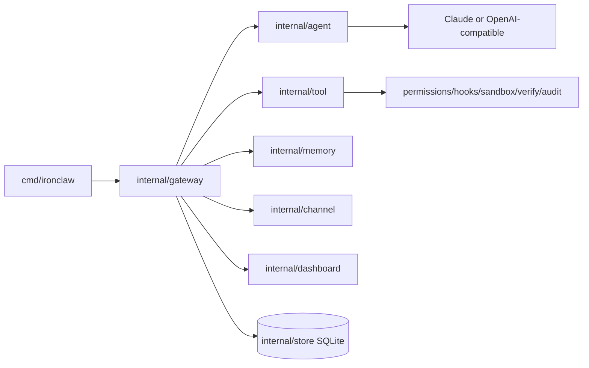

# IronClaw Documentation

This documentation set was rewritten from the current source tree. It intentionally replaces older feature-plan documents that referenced removed packages or historical implementation plans.

## Reading Order

| File | Purpose |
|---|---|
| [00-current-state-and-verification.md](00-current-state-and-verification.md) | Current audit result, verification matrix, fixed defect, residual risks. |
| [01-system-architecture.md](01-system-architecture.md) | End-to-end architecture, package map, runtime data flow. |
| [02-cli-config-userdir.md](02-cli-config-userdir.md) | CLI commands, config loading, hierarchy, user directory, MCP/skill/agent discovery. |
| [03-gateway-feature-lifecycle.md](03-gateway-feature-lifecycle.md) | Gateway initialization order, Feature Registry defaults, hot reload, start/stop lifecycle. |
| [04-agent-runtime.md](04-agent-runtime.md) | AgentDeps, providers, SimpleLoop, UnifiedLoop, context compression, sub-agents, teams. |
| [05-tools-permissions-sandbox-hooks.md](05-tools-permissions-sandbox-hooks.md) | Tool registry, built-in tools, MCP tools, worktree tools, interceptor chain, permissions, hooks, sandbox. |
| [06-memory.md](06-memory.md) | File memory, embeddings, lifecycle, AMP, unified retrieval, prompt injection. |
| [07-channels-dashboard-observability.md](07-channels-dashboard-observability.md) | Telegram, Discord, TUI, Dashboard REST/WS, Prometheus, OpenTelemetry, cognitive metrics. |
| [08-store-session-taskledger-scheduler.md](08-store-session-taskledger-scheduler.md) | SQLite migrations, session persistence, task ledger, team coordination, scheduler. |
| [09-evolution-eval-training.md](09-evolution-eval-training.md) | Evolution engine, insights, eval harness, benchmark runners, training export. |
| [10-frontend-apps.md](10-frontend-apps.md) | Preact dashboard and Vue Studio, build behavior, API contracts, prototype boundaries. |
| [11-developer-workflows.md](11-developer-workflows.md) | Build/test workflows, adding features/tools/config/routes, troubleshooting. |
| [12-package-inventory.md](12-package-inventory.md) | Package-by-package inventory for all current Go packages. |

## Documentation Principles

- Current-state docs describe what the source actually wires today.
- Future or prototype fields are labeled as future/prototype.
- Mermaid diagrams show runtime flows, not historical wish lists.
- Operational Markdown assets outside this docs tree, such as `.codex/skills/**/SKILL.md`, `.agent/workflows/*.md`, and `openspec/**`, are not replaced by this public architecture documentation.

## Quick Architecture

