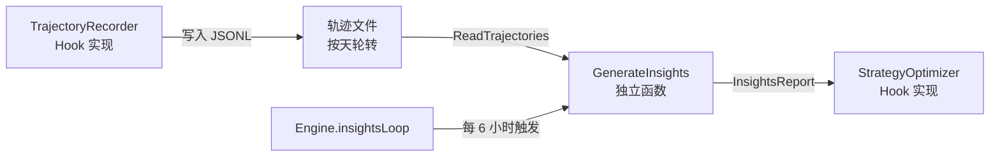
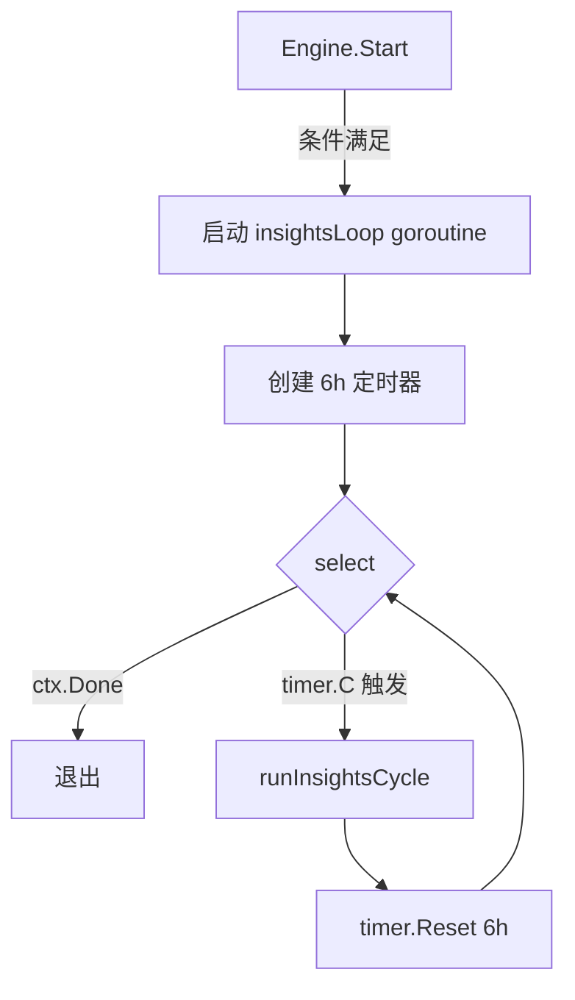
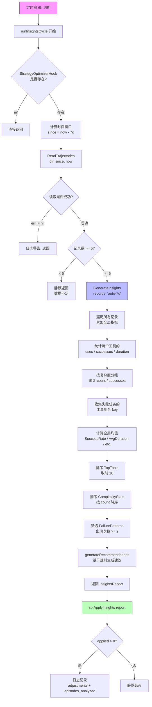
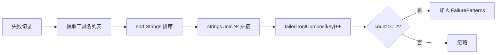
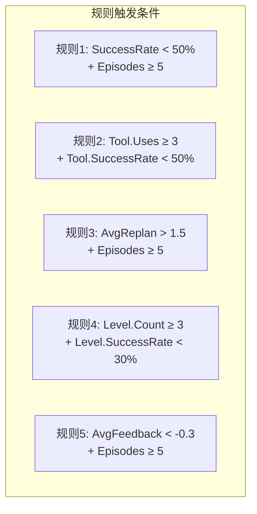
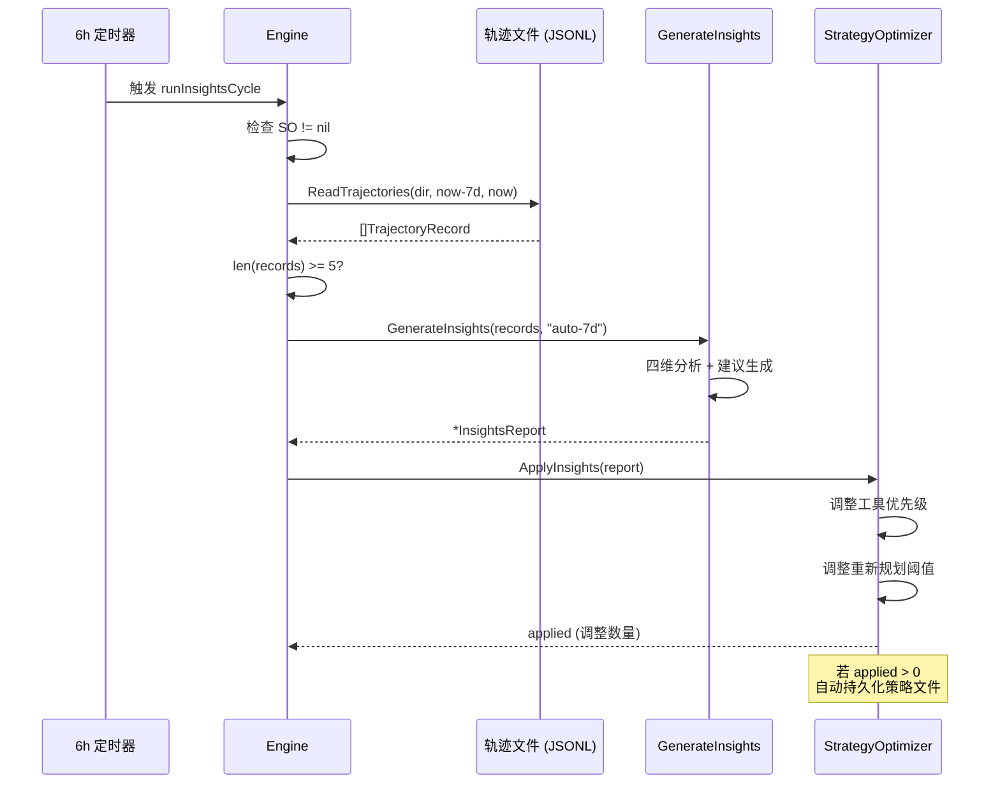
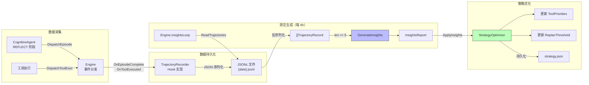
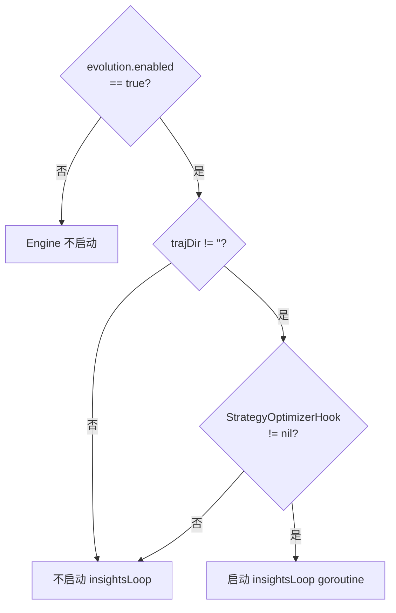
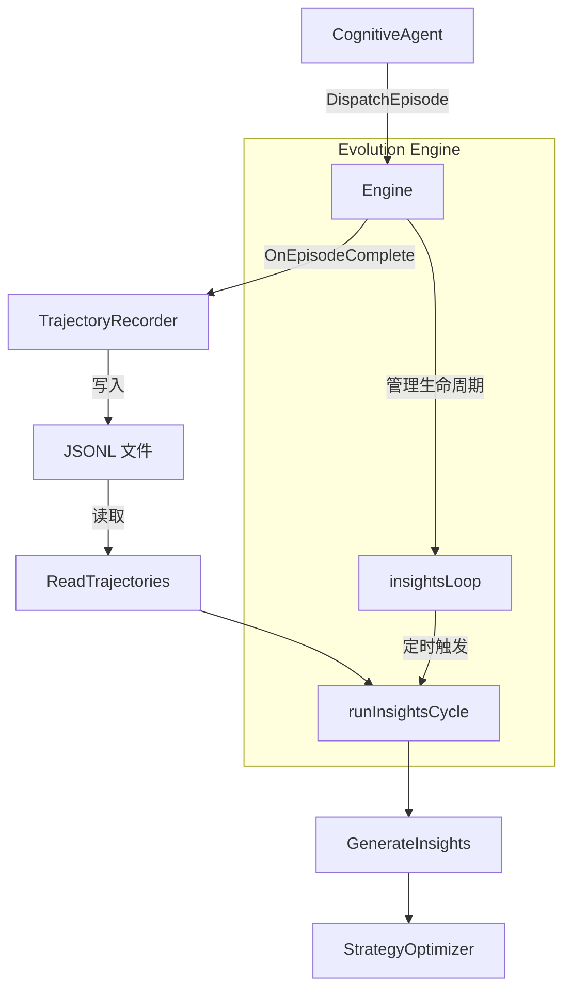

# InsightGenerator（洞见生成器）详解

> 源文件：`internal/evolution/insights.go`
> 所属包：`package evolution`
> 类型：**独立函数**（非 Hook 实现），由 Engine 后台循环调用

---

## 目录

1. [概述](#1-概述)
2. [核心数据结构](#2-核心数据结构)
3. [触发机制](#3-触发机制)
4. [完整执行流程](#4-完整执行流程)
5. [四维分析](#5-四维分析)
6. [自动建议生成规则](#6-自动建议生成规则)
7. [洞见 → 策略闭环](#7-洞见--策略闭环)
8. [Markdown 报告格式](#8-markdown-报告格式)
9. [数据流图](#9-数据流图)
10. [配置与触发条件](#10-配置与触发条件)
11. [与其他组件的交互](#11-与其他组件的交互)
12. [关键源码注释](#12-关键源码注释)

---

## 1. 概述

InsightGenerator（洞见生成器）是 IronClaw 自我进化系统中的**数据分析引擎**。它的职责是：

- 从 TrajectoryRecorder 产生的 JSONL 轨迹文件中读取历史认知周期记录
- 从四个维度对 Agent 行为进行统计分析
- 生成包含定量指标和可操作建议的 `InsightsReport`
- 将报告传递给 `StrategyOptimizer`，驱动策略参数的自动调整

**关键设计决策**：InsightGenerator **不是** Hook 接口的实现。它是一组独立的纯函数（`GenerateInsights` + `generateRecommendations`），由 `Engine` 的 `insightsLoop` 后台 goroutine 定时调用。这种设计使得洞见生成逻辑可以独立测试，不依赖事件分发机制。



---

## 2. 核心数据结构

### 2.1 InsightsReport — 洞见报告（主结构）

| 字段 | 类型 | JSON 键 | 说明 |
|------|------|---------|------|
| `Period` | `string` | `period` | 报告时段标识，如 `"auto-7d"` |
| `TotalEpisodes` | `int` | `total_episodes` | 分析的认知周期总数 |
| `SuccessRate` | `float64` | `success_rate` | 整体成功率（0.0 ~ 1.0） |
| `AvgDurationMs` | `int64` | `avg_duration_ms` | 平均执行时长（毫秒） |
| `AvgReplanCount` | `float64` | `avg_replan_count` | 平均重新规划次数 |
| `AvgUserFeedback` | `float64` | `avg_user_feedback` | 平均用户反馈（-1.0 ~ 1.0，仅计算非零值） |
| `TopTools` | `[]ToolInsight` | `top_tools` | 使用频率 Top 10 的工具分析 |
| `ComplexityStats` | `[]ComplexityStat` | `complexity_stats` | 按复杂度分组的统计 |
| `FailurePatterns` | `[]FailurePattern` | `failure_patterns` | 重复出现的失败模式（`omitempty`） |
| `Recommendations` | `[]string` | `recommendations` | 自动生成的优化建议（`omitempty`） |
| `GeneratedAt` | `time.Time` | `generated_at` | 报告生成时间 |

### 2.2 ToolInsight — 工具洞见

| 字段 | 类型 | JSON 键 | 说明 |
|------|------|---------|------|
| `Name` | `string` | `name` | 工具名称（如 `bash`、`http`、`file`） |
| `Uses` | `int` | `uses` | 被调用总次数 |
| `SuccessRate` | `float64` | `success_rate` | 该工具的成功率 |
| `AvgDuration` | `int64` | `avg_duration_ms` | 该工具的平均执行时长（毫秒） |

### 2.3 ComplexityStat — 复杂度统计

| 字段 | 类型 | JSON 键 | 说明 |
|------|------|---------|------|
| `Level` | `string` | `level` | 复杂度级别（如 `low`、`medium`、`high`） |
| `Count` | `int` | `count` | 该级别任务总数 |
| `SuccessRate` | `float64` | `success_rate` | 该级别的成功率 |

### 2.4 FailurePattern — 失败模式

| 字段 | 类型 | JSON 键 | 说明 |
|------|------|---------|------|
| `Description` | `string` | `description` | 失败模式描述，格式为 `"tool combo [bash+http] failed"` |
| `Occurrences` | `int` | `occurrences` | 该模式出现的次数（≥ 2 才纳入报告） |

### 2.5 输入数据结构 — TrajectoryRecord

洞见生成器的输入来自 `trajectory.go` 中的 `TrajectoryRecord`：

```go
type TrajectoryRecord struct {
    SessionID    string          `json:"session_id"`
    Goal         string          `json:"goal"`
    Complexity   string          `json:"complexity"`      // low/medium/high
    Tools        []ToolRecord    `json:"tools"`            // 按执行顺序排列
    Reflection   ReflectionBrief `json:"reflection"`       // 反思阶段结果
    UserFeedback float64         `json:"user_feedback"`    // -1.0 ~ 1.0
    ReplanCount  int             `json:"replan_count"`     // 重新规划次数
    DurationMs   int64           `json:"duration_ms"`      // 整体执行时长
    Timestamp    time.Time       `json:"timestamp"`        // 记录时间戳
}
```

其中每个工具调用记录：

```go
type ToolRecord struct {
    Name       string `json:"name"`
    Succeeded  bool   `json:"succeeded"`
    DurationMs int64  `json:"duration_ms"`
}
```

---

## 3. 触发机制

InsightGenerator 通过 `Engine.insightsLoop` 后台 goroutine 触发，而非事件驱动。

### 3.1 启动前置条件

在 `Engine.Start()` 中，只有**同时满足**以下两个条件时才会启动 `insightsLoop`：

```go
if e.trajDir != "" && e.StrategyOptimizerHook() != nil {
    e.wg.Add(1)
    go e.insightsLoop()
}
```

| 条件 | 含义 |
|------|------|
| `e.trajDir != ""` | 轨迹目录已配置（通过 `SetTrajectoryDir` 设置） |
| `e.StrategyOptimizerHook() != nil` | 至少有一个 `*StrategyOptimizer` 类型的 Hook 已注册 |

### 3.2 定时器机制



- **定时间隔**：`6 * time.Hour`（固定，不可配置）
- **定时器类型**：`time.NewTimer`（非 Ticker），每次执行完毕后手动 `Reset`
- **首次触发**：启动后 6 小时
- **优雅退出**：响应 `e.ctx.Done()`，通过 `e.wg.Done()` 通知 Engine 等待组

---

## 4. 完整执行流程

### 4.1 流程图



### 4.2 步骤详解

| 步骤 | 函数 | 说明 |
|------|------|------|
| 1 | `runInsightsCycle` | 检查 StrategyOptimizer 是否可用 |
| 2 | `ReadTrajectories` | 从 JSONL 文件读取过去 7 天的轨迹记录 |
| 3 | — | 最少 5 条记录的阈值检查 |
| 4 | `GenerateInsights` | 核心分析：四维统计 + 建议生成 |
| 5 | `ApplyInsights` | 将洞见报告传递给策略优化器，驱动参数调整 |
| 6 | — | 日志记录调整结果 |

---

## 5. 四维分析

`GenerateInsights` 函数对输入的 `[]TrajectoryRecord` 进行**四个维度**的统计分析：

### 5.1 全局指标（Global Metrics）

在单次遍历所有记录的过程中，累加器收集以下数据：

```go
var (
    successes     int      // Reflection.Succeeded == true 的计数
    totalDuration int64    // 所有 DurationMs 之和
    totalReplans  int      // 所有 ReplanCount 之和
    totalFeedback float64  // 非零 UserFeedback 之和
    feedbackCount int      // 非零 UserFeedback 的计数
)
```

最终计算：

| 指标 | 计算公式 | 说明 |
|------|---------|------|
| `SuccessRate` | `successes / N` | N = 总记录数 |
| `AvgDurationMs` | `totalDuration / N` | 整数除法 |
| `AvgReplanCount` | `totalReplans / N` | 浮点除法 |
| `AvgUserFeedback` | `totalFeedback / feedbackCount` | 仅当 `feedbackCount > 0` 时计算，**排除 feedback=0 的记录** |

> **注意**：`UserFeedback == 0` 被视为"未收集"而非"中性评价"。这意味着只有明确给出正面或负面反馈的记录才参与平均计算。

### 5.2 工具效能分析（Tool Performance）

使用 `map[string]*struct{uses, successes int; totalDuration int64}` 按工具名称聚合：

```go
for _, tool := range rec.Tools {
    ts.uses++
    if tool.Succeeded { ts.successes++ }
    ts.totalDuration += tool.DurationMs
}
```

聚合完成后，为每个工具计算：

| 计算值 | 公式 |
|--------|------|
| `SuccessRate` | `successes / uses` |
| `AvgDuration` | `totalDuration / uses` |

**排序与截断**：

1. 所有工具按 `Uses` **降序**排序
2. 保留前 **10** 个（`report.TopTools = report.TopTools[:10]`）

### 5.3 复杂度分布分析（Complexity Distribution）

使用 `map[string]*struct{count, successes int}` 按 `rec.Complexity` 分组：

```go
cs.count++
if rec.Reflection.Succeeded { cs.successes++ }
```

每个复杂度级别的 `SuccessRate = successes / count`。结果按 `Count` **降序**排序。

### 5.4 失败模式检测（Failure Pattern Detection）

这是最精巧的分析维度。检测逻辑如下：

```go
if !rec.Reflection.Succeeded && len(rec.Tools) > 0 {
    names := make([]string, 0, len(rec.Tools))
    for _, t := range rec.Tools { names = append(names, t.Name) }
    sort.Strings(names)                    // 排序使组合顺序无关
    key := strings.Join(names, "+")        // 生成规范化的 key
    failedToolCombos[key]++
}
```

**算法要点**：

1. **仅分析失败任务**：`Reflection.Succeeded == false`
2. **提取工具名列表**：从该任务使用的所有 `ToolRecord` 中提取 `Name`
3. **排序 + 拼接**：`sort.Strings` 确保 `bash+http` 和 `http+bash` 被视为相同组合
4. **频次计数**：`failedToolCombos[key]++`
5. **阈值过滤**：仅保留出现次数 **≥ 2** 的组合
6. **结果排序**：按 `Occurrences` 降序排序

**生成的描述格式**：`"tool combo [bash+http] failed"`



### 5.5 四维分析对照表

| 维度 | 数据来源 | 聚合键 | 排序规则 | 截断 |
|------|---------|--------|---------|------|
| 全局指标 | 所有记录 | — | — | — |
| 工具效能 | `rec.Tools` | `tool.Name` | Uses 降序 | Top 10 |
| 复杂度分布 | `rec.Complexity` | Complexity 级别 | Count 降序 | 无 |
| 失败模式 | 失败记录的工具组合 | 排序后的 `name+name` | Occurrences 降序 | `>= 2` |

---

## 6. 自动建议生成规则

`generateRecommendations` 函数包含 **5 条**基于阈值的建议规则，按顺序评估：

### 规则一览表

| # | 条件 | 生成的建议 |
|---|------|-----------|
| 1 | `SuccessRate < 0.5` **且** `TotalEpisodes >= 5` | `"Overall success rate is low (XX%). Consider reviewing common failure patterns."` |
| 2 | 遍历 `TopTools`：`tool.Uses >= 3` **且** `tool.SuccessRate < 0.5` | `"Tool 'XXX' has a low success rate (XX% across N uses). Consider reviewing its usage patterns."` |
| 3 | `AvgReplanCount > 1.5` **且** `TotalEpisodes >= 5` | `"High average replan count (X.X). Plans may be overly ambitious or confidence thresholds too low."` |
| 4 | 遍历 `ComplexityStats`：`cs.Count >= 3` **且** `cs.SuccessRate < 0.3` | `"'LEVEL' complexity tasks succeed only XX% of the time. Consider breaking them into simpler subtasks."` |
| 5 | `AvgUserFeedback < -0.3` **且** `TotalEpisodes >= 5` | `"Average user feedback is negative. Review recent sessions for quality issues."` |

### 规则详解

#### 规则 1：整体成功率过低

```go
if r.SuccessRate < 0.5 && r.TotalEpisodes >= 5 {
    // 触发
}
```

- **阈值**：成功率 < 50%，样本量 ≥ 5
- **含义**：超过半数任务失败，需要全面审查
- **注意**：`TotalEpisodes >= 5` 是最小样本保护，避免在数据不足时误报

#### 规则 2：特定工具成功率过低

```go
for _, tool := range r.TopTools {
    if tool.Uses >= 3 && tool.SuccessRate < 0.5 {
        // 为每个符合条件的工具生成一条建议
    }
}
```

- **阈值**：使用次数 ≥ 3 且成功率 < 50%
- **含义**：该工具可能被不当使用或存在系统性问题
- **注意**：可能生成**多条**建议（每个低效工具一条）

#### 规则 3：重新规划次数过高

```go
if r.AvgReplanCount > 1.5 && r.TotalEpisodes >= 5 {
    // 触发
}
```

- **阈值**：平均重新规划 > 1.5 次，样本量 ≥ 5
- **含义**：计划制定可能过于激进，或信心阈值设置过低

#### 规则 4：高复杂度任务成功率极低

```go
for _, cs := range r.ComplexityStats {
    if cs.Count >= 3 && cs.SuccessRate < 0.3 {
        // 为每个符合条件的复杂度级别生成建议
    }
}
```

- **阈值**：该级别任务数 ≥ 3 且成功率 < 30%
- **含义**：该复杂度的任务对 Agent 来说太难，应拆解为子任务
- **注意**：成功率阈值（0.3）比规则 1（0.5）更低，对高复杂度任务更宽容

#### 规则 5：用户反馈偏负面

```go
if r.AvgUserFeedback < -0.3 && r.TotalEpisodes >= 5 {
    // 触发
}
```

- **阈值**：平均反馈 < -0.3（范围 -1.0 ~ 1.0），样本量 ≥ 5
- **含义**：用户普遍不满意，需要审查近期会话质量

### 阈值速查图



---

## 7. 洞见 → 策略闭环

`InsightsReport` 生成后，通过 `StrategyOptimizer.ApplyInsights(report)` 形成闭环。

### 7.1 策略优化器对洞见的消费

`ApplyInsights` 方法接收 `InsightsReport` 后执行两类调整：

#### 调整 1：工具优先级

```go
for _, ti := range report.TopTools {
    if ti.Uses < minToolObservations { continue }  // 最小观测数保护
    switch {
    case ti.SuccessRate > toolBoostThreshold:       // 高成功率 → 提升优先级
        newVal = clamp(prev*(1+adjFraction), min, max)
    case ti.SuccessRate < toolReduceThreshold:      // 低成功率 → 降低优先级
        newVal = clamp(prev*(1-adjFraction), min, max)
    }
}
```

#### 调整 2：重新规划阈值

| 条件 | 动作 | 原因 |
|------|------|------|
| `AvgReplanCount > 1.5` 且 `SuccessRate < 0.5` | 提高阈值（减少重新规划） | 重新规划多但成功率低 |
| `AvgReplanCount < 0.5` 且 `SuccessRate > 0.8` | 降低阈值（允许更多重新规划） | 很少重新规划且成功率高 |

### 7.2 闭环流程



### 7.3 返回值

`ApplyInsights` 返回 `int`（应用的调整数量）。Engine 仅在 `applied > 0` 时输出日志：

```go
slog.Info("evolution: insights cycle complete",
    "adjustments", applied,
    "episodes_analyzed", report.TotalEpisodes,
)
```

---

## 8. Markdown 报告格式

`InsightsReport.FormatMarkdown()` 将报告渲染为人类可读的 Markdown 字符串，输出结构如下：

### 输出模板

```markdown
# IronClaw Insights — {Period}

Generated: {RFC3339 时间戳}

## Summary

| Metric | Value |
|--------|-------|
| Total episodes | {N} |
| Success rate | {X.X}% |
| Avg duration | {格式化时长} |
| Avg replans | {X.X} |
| Avg user feedback | {X.XX} |    ← 仅当非零时显示

## Tool Usage

| Tool | Uses | Success Rate | Avg Duration |
|------|------|-------------|-------------|
| {name} | {N} | {XX}% | {格式化时长} |
...

## By Complexity

| Level | Count | Success Rate |
|-------|-------|--------------|
| {level} | {N} | {XX}% |
...

## Failure Patterns

- {description} ({N} occurrences)
...

## Recommendations

- {recommendation text}
...
```

### 时长格式化逻辑

`formatDuration` 函数根据量级选择不同的展示格式：

```go
func formatDuration(ms int64) string {
    if ms < 1000    → "{N}ms"      // 毫秒
    if s < 60       → "{X.X}s"     // 秒
    else            → "{M}m{S}s"   // 分+秒
}
```

| 输入 (ms) | 输出 |
|-----------|------|
| 500 | `500ms` |
| 3200 | `3.2s` |
| 125000 | `2m5s` |

### 条件渲染

各部分仅在有数据时才渲染：

| 部分 | 渲染条件 |
|------|---------|
| Summary | 始终渲染 |
| Avg user feedback 行 | `AvgUserFeedback != 0` |
| Tool Usage | `len(TopTools) > 0` |
| By Complexity | `len(ComplexityStats) > 0` |
| Failure Patterns | `len(FailurePatterns) > 0` |
| Recommendations | `len(Recommendations) > 0` |

---

## 9. 数据流图

从数据产生到策略更新的完整数据流：



### JSONL 文件格式

轨迹按天轮转，文件命名：`{YYYY-MM-DD}.jsonl`

每行一条 JSON 记录：

```json
{"session_id":"abc123","goal":"查询天气","complexity":"low","tools":[{"name":"http","succeeded":true,"duration_ms":230}],"reflection":{"confidence":0.9,"succeeded":true},"user_feedback":1.0,"replan_count":0,"duration_ms":1500,"timestamp":"2026-04-14T10:30:00Z"}
```

### ReadTrajectories 过滤逻辑

1. 读取目录下所有 `.jsonl` 文件
2. 按文件名解析日期，过滤掉不在 `[since, until]` 范围内的文件
3. 逐行反序列化，再次按 `Timestamp` 精确过滤
4. 跳过格式错误的行（`json.Unmarshal` 失败则 `slog.Debug` 并 continue）
5. 不存在的目录返回 `nil, nil`（非错误）

---

## 10. 配置与触发条件

InsightGenerator 本身没有显式配置项，其行为由 Engine 和上下文中的隐式参数控制：

### 隐式配置汇总

| 参数 | 值 | 位置 | 可配置 |
|------|----|------|--------|
| 执行间隔 | `6 * time.Hour` | `engine.go` `insightsLoop` 常量 | **否**（硬编码） |
| 回溯窗口 | `7 * 24 * time.Hour` | `engine.go` `runInsightsCycle` | **否**（硬编码） |
| 最小记录数 | `5` | `engine.go` `runInsightsCycle` | **否**（硬编码） |
| 时段标签 | `"auto-7d"` | `engine.go` `runInsightsCycle` | **否**（硬编码） |
| Top 工具数量 | `10` | `insights.go` `GenerateInsights` | **否**（硬编码） |
| 失败模式阈值 | `>= 2` 次 | `insights.go` `GenerateInsights` | **否**（硬编码） |
| 轨迹目录 | `e.trajDir` | `Engine.SetTrajectoryDir` | **是**（启动前设置） |

### 启动前置条件清单



### 运行时门控

即使 `insightsLoop` 已启动，每次执行 `runInsightsCycle` 时还有两道保护：

1. **二次检查 StrategyOptimizer**：`so := e.StrategyOptimizerHook(); if so == nil { return }`
2. **最小数据量**：`if len(records) < 5 { return }`

---

## 11. 与其他组件的交互

### 组件交互图



### 各组件职责

| 组件 | 包/文件 | 与 InsightGenerator 的关系 |
|------|---------|--------------------------|
| **Engine** | `engine.go` | 宿主：管理 `insightsLoop` 的生命周期，调用 `runInsightsCycle` |
| **TrajectoryRecorder** | `trajectory.go` | 上游数据源：将认知周期记录写入 JSONL 文件 |
| **ReadTrajectories** | `trajectory.go` | 数据读取器：从 JSONL 文件反序列化 `[]TrajectoryRecord` |
| **GenerateInsights** | `insights.go` | 核心分析函数：生成 `InsightsReport` |
| **generateRecommendations** | `insights.go` | 子函数：基于规则生成建议 |
| **StrategyOptimizer** | `optimizer.go` | 下游消费者：接收报告并调整策略参数 |
| **CognitiveAgent** | `agent/` | 间接上游：产生触发 TrajectoryRecorder 的事件 |

### 调用关系（函数级别）

```
Engine.insightsLoop()
  └─ Engine.runInsightsCycle()
       ├─ Engine.StrategyOptimizerHook()    → *StrategyOptimizer
       ├─ ReadTrajectories(dir, since, now) → []TrajectoryRecord
       ├─ GenerateInsights(records, label)  → *InsightsReport
       │    └─ generateRecommendations(r)   → []string
       └─ StrategyOptimizer.ApplyInsights(report) → int
```

---

## 12. 关键源码注释

### 12.1 GenerateInsights — 空输入保护

```go
func GenerateInsights(records []TrajectoryRecord, periodLabel string) *InsightsReport {
    if len(records) == 0 {
        return &InsightsReport{Period: periodLabel, GeneratedAt: time.Now()}
    }
    // ...
}
```

当传入空切片时，返回一个仅包含 `Period` 和 `GeneratedAt` 的空报告，不会触发任何分析。这是一种防御性编程——尽管 `runInsightsCycle` 已经有 `len(records) < 5` 的保护，`GenerateInsights` 作为公开函数仍需自行处理边界情况。

### 12.2 UserFeedback 的零值处理

```go
if rec.UserFeedback != 0 {
    totalFeedback += rec.UserFeedback
    feedbackCount++
}
```

`UserFeedback` 的范围是 `-1.0 ~ 1.0`，`0` 被定义为"未收集"（而非"中性"）。这意味着：

- 用户未给出反馈的记录**不参与**平均值计算
- 只有明确表达正/负态度的记录才被统计
- 如果所有记录的 `UserFeedback == 0`，则 `AvgUserFeedback` 保持默认的 `0`

### 12.3 失败工具组合的规范化

```go
sort.Strings(names)
key := strings.Join(names, "+")
```

通过先排序再拼接，确保 `["bash", "http"]` 和 `["http", "bash"]` 生成相同的 key `"bash+http"`。这使得**工具调用顺序**不影响模式匹配——只关注"哪些工具一起使用时会失败"。

### 12.4 Top 工具截断

```go
sort.Slice(report.TopTools, func(i, j int) bool {
    return report.TopTools[i].Uses > report.TopTools[j].Uses
})
if len(report.TopTools) > 10 {
    report.TopTools = report.TopTools[:10]
}
```

只保留使用频率最高的 10 个工具。被截断的低频工具不会出现在报告中，也不会参与建议生成规则 2 的评估。

### 12.5 runInsightsCycle 的静默失败

```go
records, err := ReadTrajectories(e.trajDir, since, time.Now())
if err != nil {
    slog.Warn("evolution: insights cycle read failed", "err", err)
    return
}
if len(records) < 5 {
    return // not enough data
}
```

读取失败时仅记录 `Warn` 级别日志；数据不足时完全静默。两种情况都不会阻止下一个 6 小时周期的正常执行——系统设计为**尽力而为**，单次失败不影响整体运行。

### 12.6 定时器选择：Timer 而非 Ticker

```go
timer := time.NewTimer(interval)
// ...
timer.Reset(interval)
```

使用 `time.NewTimer` + `Reset` 而非 `time.NewTicker`，原因是：

- Timer 确保每次执行**完成后**才开始计算下一个间隔
- Ticker 可能在执行耗时较长时产生信号堆积
- 首次触发在启动后 6 小时，给系统充足的数据积累时间

---

> **总结**：InsightGenerator 是 IronClaw 自我进化系统的"分析大脑"，它将粗粒度的轨迹数据提炼为结构化的洞见报告，并通过策略优化器形成"数据 → 分析 → 优化 → 执行 → 数据"的自动化闭环。其设计特点是：纯函数、无状态、防御性边界处理、静默降级。
