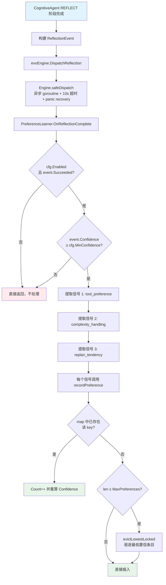
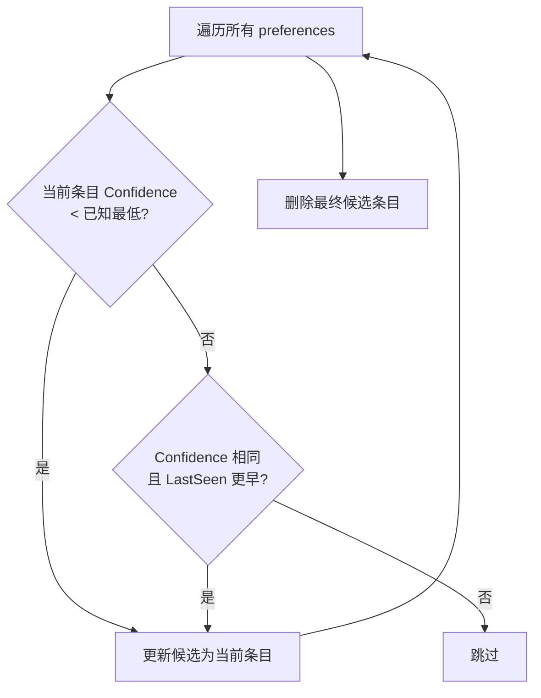
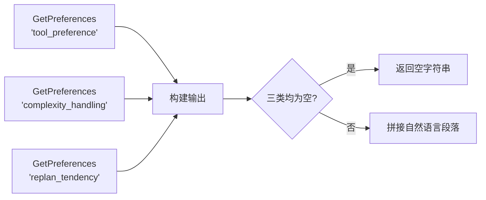
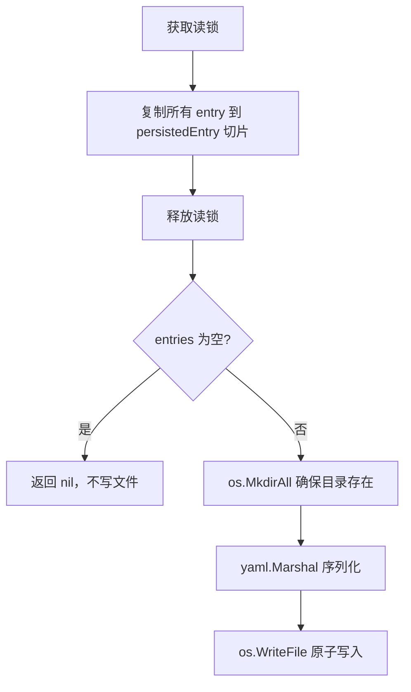
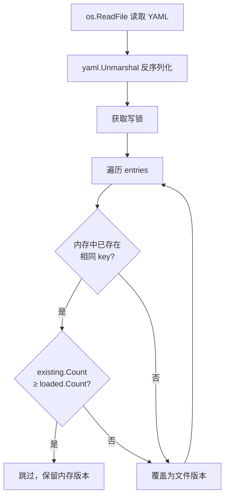
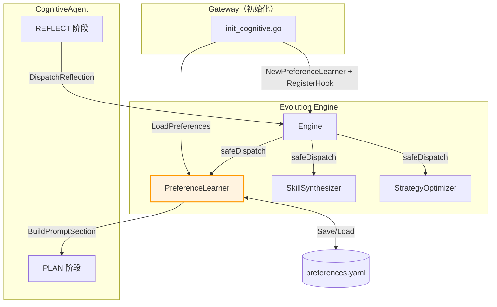

# PreferenceLearner（偏好学习器）详解

> **源文件**: `internal/evolution/preference.go`
> **所属系统**: IronClaw 自进化引擎 · Loop 1
> **Hook 标识**: `preference_learner`

---

## 目录

1. [概述](#1-概述)
2. [核心数据结构](#2-核心数据结构)
3. [完整执行流程](#3-完整执行流程)
4. [信号提取规则](#4-信号提取规则)
5. [置信度模型](#5-置信度模型)
6. [容量管理与驱逐策略](#6-容量管理与驱逐策略)
7. [Prompt 注入机制](#7-prompt-注入机制)
8. [持久化机制](#8-持久化机制)
9. [并发安全模型](#9-并发安全模型)
10. [配置参数](#10-配置参数)
11. [与其他组件的交互](#11-与其他组件的交互)
12. [关键源码注释](#12-关键源码注释)

---

## 1. 概述

PreferenceLearner 是自进化引擎（Evolution Engine）的 **Loop 1** 组件，负责从成功的认知反思（REFLECT 阶段）中提取用户偏好信号，并将这些偏好以自然语言的形式注入到后续的 PLAN 阶段 prompt 中，使 Agent 的行为逐渐向用户习惯靠拢。

**核心职责**：

- **观察** — 监听 `ReflectionEvent`，仅处理成功且置信度达标的事件
- **提取** — 从事件中识别三类偏好信号：工具偏好、复杂度适应、重规划倾向
- **积累** — 通过重复观察提高置信度，自动淘汰低置信条目
- **注入** — 将高置信偏好构建为 prompt 片段，影响后续决策
- **持久化** — 以 YAML 格式保存/加载，跨会话保持学习成果

PreferenceLearner 实现了 `Hook` 接口，通过 `Engine.RegisterHook()` 注册，由引擎异步分发事件。

---

## 2. 核心数据结构

### 2.1 PreferenceLearner 结构体

```go
type PreferenceLearner struct {
    cfg         PreferenceConfig          // 配置（启用开关、容量上限、最低置信度）
    preferences map[string]*PreferenceEntry // 偏好存储，key 格式为 "category:key"
    mu          sync.RWMutex              // 读写锁，保护 preferences map
}
```

| 字段 | 类型 | 说明 |
|------|------|------|
| `cfg` | `PreferenceConfig` | 从配置文件加载的参数，控制启用状态、容量和置信度阈值 |
| `preferences` | `map[string]*PreferenceEntry` | 内存偏好存储。key 由 `prefMapKey(category, key)` 生成，格式为 `"category:key"`，如 `"tool_preference:bash"` |
| `mu` | `sync.RWMutex` | 保证所有公开方法在并发调用下的安全性 |

### 2.2 PreferenceEntry 结构体

```go
type PreferenceEntry struct {
    Category   string    // 偏好分类："tool_preference" / "complexity_handling" / "replan_tendency"
    Key        string    // 分类内的唯一标识，如工具名 "bash"、复杂度 "complex"
    Value      string    // 人类可读的偏好值："preferred" / "handles_well" / "approved"
    Confidence float64   // 置信度 [0.0, 1.0]，由观察次数推导
    Count      int       // 累计观察次数
    LastSeen   time.Time // 最近一次观察时间
}
```

| 字段 | 范围/格式 | 初始值 | 更新规则 |
|------|-----------|--------|----------|
| `Category` | 固定三种 | 事件提取 | 不可变 |
| `Key` | 字符串 | 事件提取 | 不可变 |
| `Value` | 字符串 | 事件提取 | 不可变 |
| `Confidence` | `[0.0, 1.0]` | `0.2` | `min(1.0, Count * 0.2)` |
| `Count` | `≥ 1` | `1` | 每次观察 +1 |
| `LastSeen` | `time.Time` | `time.Now()` | 每次观察更新为当前时间 |

### 2.3 PreferenceConfig 配置结构

```go
type PreferenceConfig struct {
    Enabled        bool    `yaml:"enabled"`
    MaxPreferences int     `yaml:"max_preferences"`
    MinConfidence  float64 `yaml:"min_confidence"`
    LLMModel       string  `yaml:"llm_model"`
}
```

### 2.4 persistedEntry（持久化专用）

```go
type persistedEntry struct {
    Category   string    `yaml:"category"`
    Key        string    `yaml:"key"`
    Value      string    `yaml:"value"`
    Confidence float64   `yaml:"confidence"`
    Count      int       `yaml:"count"`
    LastSeen   time.Time `yaml:"last_seen"`
}
```

YAML 序列化时使用此中间结构，与 `PreferenceEntry` 字段一一对应，额外提供 yaml tag。

---

## 3. 完整执行流程

### 3.1 端到端流程图



### 3.2 时序说明

```
CognitiveAgent          Engine                  PreferenceLearner
     │                    │                           │
     │  DispatchReflection│                           │
     │ ──────────────────>│                           │
     │                    │  go safeDispatch(...)      │
     │                    │ ─────────────────────────> │
     │                    │                           │ OnReflectionComplete
     │                    │                           │ ├─ 检查 Enabled/Succeeded/Confidence
     │                    │                           │ ├─ 遍历 ToolsUsed → recordPreference
     │                    │                           │ ├─ 检查 Complexity → recordPreference
     │                    │                           │ └─ 判断 ReplanCount → recordPreference
     │                    │                           │
     │                    │  <── goroutine 完成 ────── │
     │                    │                           │
```

### 3.3 分步详解

1. **事件产生** — `CognitiveAgent` 的 REFLECT 阶段完成后，在 `cognitive.go` 中调用 `ca.evoEngine.DispatchReflection(event)` 分发反思事件。

2. **异步分发** — `Engine.DispatchReflection` 对每个已注册的 Hook 启动一个 goroutine，通过 `safeDispatch` 包装：
   - 创建带 10s 超时的 `context.Context`
   - `defer recover()` 捕获 panic
   - `defer e.wg.Done()` 保证优雅关闭

3. **前置过滤** — `OnReflectionComplete` 依次检查：
   - `cfg.Enabled` 为 `false` → 跳过
   - `event.Succeeded` 为 `false` → 跳过（只从成功案例中学习）
   - `event.Confidence < cfg.MinConfidence` → 跳过（低置信反思不可靠）

4. **信号提取** — 通过三个独立逻辑分别提取信号（详见[第 4 节](#4-信号提取规则)）

5. **偏好记录** — 每个信号调用 `recordPreference(category, key, value)`，在写锁内完成 upsert 或驱逐

---

## 4. 信号提取规则

PreferenceLearner 从每个合格的 `ReflectionEvent` 中提取三类信号：

### 4.1 信号一览表

| 信号类别 | Category 值 | 提取条件 | Key 值 | Value 值 | 含义 |
|----------|-------------|----------|--------|----------|------|
| 工具偏好 | `tool_preference` | `event.ToolsUsed` 中每个非空工具名 | 工具名（如 `"bash"`, `"file"`, `"http"`） | `"preferred"` | 该工具在成功任务中被使用 |
| 复杂度适应 | `complexity_handling` | `event.Complexity != ""` | 复杂度等级（`"simple"` / `"moderate"` / `"complex"`） | `"handles_well"` | 用户在该复杂度下成功完成任务 |
| 重规划倾向 | `replan_tendency` | `event.ReplanCount >= 2` 或 `== 0` | `"uses_replans"` 或 `"no_replans"` | `"approved"` 或 `"preferred"` | 用户的重规划行为模式 |

### 4.2 信号提取代码逻辑

```go
// 信号 1：工具偏好
for _, tool := range event.ToolsUsed {
    if tool != "" {
        p.recordPreference("tool_preference", tool, "preferred")
    }
}

// 信号 2：复杂度适应
if event.Complexity != "" {
    p.recordPreference("complexity_handling", event.Complexity, "handles_well")
}

// 信号 3：重规划倾向
switch {
case event.ReplanCount >= 2:
    p.recordPreference("replan_tendency", "uses_replans", "approved")
case event.ReplanCount == 0:
    p.recordPreference("replan_tendency", "no_replans", "preferred")
}
// ReplanCount == 1 被视为模糊信号，有意跳过
```

### 4.3 重规划倾向判定细则

| ReplanCount | 处理方式 | 理由 |
|-------------|----------|------|
| `0` | 记录 `"no_replans"` / `"preferred"` | 用户一次性成功，偏好直接执行 |
| `1` | **不记录** | 一次重规划可能是偶发行为，信号不明确 |
| `≥ 2` | 记录 `"uses_replans"` / `"approved"` | 用户多次重规划仍然成功，说明受益于此策略 |

---

## 5. 置信度模型

### 5.1 计算公式

$$
\text{Confidence} = \min(1.0, \text{Count} \times 0.2)
$$

对应实现：

```go
func clampConfidence(count int) float64 {
    c := float64(count) * 0.2
    if c > 1.0 {
        return 1.0
    }
    return c
}
```

### 5.2 置信度增长表

| Count（观察次数） | Confidence（置信度） | 说明 |
|-------------------|---------------------|------|
| 1 | 0.2 | 新条目初始值 |
| 2 | 0.4 | 二次验证 |
| 3 | 0.6 | 达到默认 `MinConfidence=0.3` 的两倍 |
| 4 | 0.8 | 高置信 |
| 5 | 1.0 | 满置信，已封顶 |
| 6+ | 1.0 | 继续计数但置信度不再增长 |

### 5.3 置信度与过滤

`MinConfidence`（默认 `0.3`）在两个场景中作为过滤阈值：

1. **事件过滤** — `OnReflectionComplete` 中 `event.Confidence < cfg.MinConfidence` 时跳过整个事件
2. **查询过滤** — `GetPreferences` 和 `GetTopPreferences` 中排除 `entry.Confidence < cfg.MinConfidence` 的条目

注意：`event.Confidence` 是**反思事件本身的置信度**（由 REFLECT 阶段 LLM 输出），与 `entry.Confidence` 是**偏好条目的置信度**（由观察次数推导），两者含义不同。

### 5.4 设计意图

- **线性增长** — 每次观察固定增加 0.2，简单可预测
- **5 次封顶** — 避免频繁工具（如 `bash`）的置信度无限膨胀
- **低起点** — 单次观察仅 0.2，需要至少 2 次才能超过默认 `MinConfidence=0.3`，防止偶发行为被当作偏好

---

## 6. 容量管理与驱逐策略

### 6.1 容量上限

`MaxPreferences`（默认 `100`）控制内存中偏好条目的总数上限。当插入新条目时：

```go
if p.cfg.MaxPreferences > 0 && len(p.preferences) >= p.cfg.MaxPreferences {
    p.evictLowestLocked()
}
```

- `MaxPreferences <= 0` 表示不限容量
- 驱逐发生在**插入新条目之前**（不含已有条目的更新）
- 已有条目的 upsert（`Count++`）不触发驱逐检查

### 6.2 驱逐算法



**驱逐优先级**（由高到低）：

1. **最低置信度** — Confidence 最小的条目最先被驱逐
2. **最久未见**（平局打破）— 相同 Confidence 时，`LastSeen` 最早的优先驱逐

### 6.3 驱逐实现

```go
func (p *PreferenceLearner) evictLowestLocked() {
    var (
        evictKey  string
        evictConf = 2.0  // 高于任何可能的置信度，确保第一个条目一定被选中
        evictTime time.Time
        first     = true
    )
    for k, entry := range p.preferences {
        if first ||
            entry.Confidence < evictConf ||
            (entry.Confidence == evictConf && entry.LastSeen.Before(evictTime)) {
            evictKey = k
            evictConf = entry.Confidence
            evictTime = entry.LastSeen
            first = false
        }
    }
    if evictKey != "" {
        delete(p.preferences, evictKey)
    }
}
```

`evictConf` 初始化为 `2.0`（远大于置信度上限 `1.0`），配合 `first` 标志保证遍历第一个元素时一定被选为候选。

---

## 7. Prompt 注入机制

### 7.1 注入时机

在 CognitiveAgent 处理用户消息时（`cognitive.go`），PLAN 阶段准备前：

```go
if ca.evoEngine != nil && ca.evoEngine.IsEnabled() {
    if pl := ca.evoEngine.PreferenceLearnerHook(); pl != nil {
        state.Preferences = pl.BuildPromptSection()
    }
}
```

`state.Preferences` 随后在 `plan.go` 中通过模板替换注入 PLAN prompt：

```go
msg = strings.ReplaceAll(msg, "{{PREFERENCES}}", state.Preferences)
```

### 7.2 BuildPromptSection 工作方式



**构建规则**：

| 类别 | 取值策略 | 输出格式 |
|------|----------|----------|
| `tool_preference` | 按 Confidence 降序，取 **前 5 个** | `- Preferred tools: bash, file, http` |
| `complexity_handling` | 按 Confidence 降序，全部输出 | `- Handles well: complex complexity, moderate complexity` |
| `replan_tendency` | 取 Confidence **最高的 1 个** | `- This user benefits from replanning on failure` 或 `- This user prefers direct execution without replanning` |

### 7.3 示例输出

假设经过多次交互后，偏好数据如下：

| Category | Key | Count | Confidence |
|----------|-----|-------|------------|
| tool_preference | bash | 8 | 1.0 |
| tool_preference | file | 5 | 1.0 |
| tool_preference | http | 3 | 0.6 |
| complexity_handling | complex | 4 | 0.8 |
| complexity_handling | moderate | 6 | 1.0 |
| replan_tendency | uses_replans | 3 | 0.6 |

生成的 prompt 片段：

```
USER PREFERENCES (learned from past interactions):
- Preferred tools: bash, file, http
- Handles well: moderate complexity, complex complexity
- This user benefits from replanning on failure
```

当所有类别均无达到 `MinConfidence` 的条目时，`BuildPromptSection` 返回空字符串，`{{PREFERENCES}}` 模板位被替换为空，不影响 prompt。

---

## 8. 持久化机制

### 8.1 存储路径

默认路径：`~/.IronClaw/evolution/preferences.yaml`

由配置项 `evolution.preference_file`（默认值 `"preferences.yaml"`）指定文件名，Gateway 初始化时解析为绝对路径。

### 8.2 保存（SavePreferences）



**关键细节**：

- 读锁只在复制阶段持有，序列化和 I/O 在锁外执行，减少锁持有时间
- 空偏好不写文件（避免创建空文件）
- 写入使用 `0o644` 权限

### 8.3 加载（LoadPreferences）



### 8.4 合并策略：高 Count 胜出

加载时的合并遵循 **"high Count wins"** 原则：

```go
existing, ok := p.preferences[key]
if ok && existing.Count >= e.Count {
    continue  // 内存版本观察次数更多，保留
}
p.preferences[key] = &PreferenceEntry{...}  // 否则使用文件版本
```

| 场景 | 内存 Count | 文件 Count | 结果 |
|------|-----------|-----------|------|
| 内存更新 | 5 | 3 | 保留内存版本 |
| 文件更新 | 2 | 4 | 使用文件版本覆盖 |
| 相同 | 3 | 3 | 保留内存版本（`>=` 判断） |
| 内存无此 key | — | 2 | 插入文件版本 |

### 8.5 YAML 文件格式示例

```yaml
- category: tool_preference
  key: bash
  value: preferred
  confidence: 1
  count: 8
  last_seen: 2026-04-14T10:30:00Z
- category: tool_preference
  key: file
  value: preferred
  confidence: 1
  count: 5
  last_seen: 2026-04-14T09:15:00Z
- category: complexity_handling
  key: complex
  value: handles_well
  confidence: 0.8
  count: 4
  last_seen: 2026-04-13T22:00:00Z
```

### 8.6 保存触发时机

`Engine.SaveState()` 在优雅关闭时调用，持久化 PreferenceLearner 状态：

```go
func (e *Engine) SaveState(prefPath string) {
    if pl := e.PreferenceLearnerHook(); pl != nil && prefPath != "" {
        if err := pl.SavePreferences(prefPath); err != nil {
            slog.Warn("evolution: failed to save preferences", "err", err)
        }
    }
}
```

---

## 9. 并发安全模型

### 9.1 锁类型

PreferenceLearner 使用 `sync.RWMutex` 提供读写分离的并发控制。

### 9.2 锁粒度一览

| 方法 | 锁类型 | 锁范围 | 说明 |
|------|--------|--------|------|
| `recordPreference` | **写锁** (`Lock`) | 整个方法体 | 可能修改 map（upsert/evict），必须排他 |
| `GetPreferences` | **读锁** (`RLock`) | 遍历+复制 | 只读遍历，允许并发读 |
| `GetTopPreferences` | **读锁** (`RLock`) | 遍历+复制 | 同上 |
| `BuildPromptSection` | **无直接锁** | — | 内部调用 `GetPreferences`（每次调用各自加读锁） |
| `SavePreferences` | **读锁** (`RLock`) | 仅复制阶段 | 复制后释放锁，I/O 在锁外 |
| `LoadPreferences` | **写锁** (`Lock`) | 合并阶段 | 文件 I/O 在锁外，只在 merge 时持写锁 |
| `evictLowestLocked` | **调用者持写锁** | — | 后缀 `Locked` 表示假定调用者已持有写锁 |

### 9.3 并发安全保证

```
                    ┌──────────────────────────────────────┐
                    │          preferences map              │
                    │                                      │
   写锁             │  recordPreference ──► upsert/evict   │
   (排他)           │  LoadPreferences  ──► merge          │
                    │                                      │
   读锁             │  GetPreferences   ──► 遍历+复制     │
   (共享)           │  GetTopPreferences──► 遍历+复制     │
                    │  SavePreferences  ──► 快照复制       │
                    └──────────────────────────────────────┘
```

**设计要点**：

- `SavePreferences` 先在读锁内快照复制 `[]persistedEntry`，释放锁后再做 `yaml.Marshal` 和文件 I/O，避免序列化期间阻塞写入
- `LoadPreferences` 先在锁外完成文件读取和 `yaml.Unmarshal`，只在合并阶段持有写锁
- `BuildPromptSection` 调用三次 `GetPreferences`，每次独立加/释放读锁，不会长时间持锁
- `evictLowestLocked` 遵循 Go 惯例：`Locked` 后缀表明调用者必须在持锁状态下调用

### 9.4 异步调度安全

Engine 通过 `safeDispatch` 在独立 goroutine 中调用 Hook 方法：

```go
func (e *Engine) safeDispatch(hookName string, fn func(ctx context.Context)) {
    defer e.wg.Done()
    defer func() {
        if r := recover(); r != nil {
            slog.Error("evolution: hook panicked", "hook", hookName, "panic", r)
        }
    }()
    ctx, cancel := context.WithTimeout(e.ctx, timeout) // 默认 10s
    defer cancel()
    fn(ctx)
}
```

即使 PreferenceLearner 内部发生 panic，也不会击垮 Engine 或其他 Hook。

---

## 10. 配置参数

### 10.1 完整配置 YAML

```yaml
agent:
  evolution:
    enabled: true
    hook_timeout: 10s
    preference_file: preferences.yaml   # 相对于 ~/.IronClaw/evolution/
    preference:
      enabled: true
      max_preferences: 100
      min_confidence: 0.3
      llm_model: ""                     # 空 = 使用 reflect 模型
```

### 10.2 参数详解

| 参数 | 类型 | 默认值 | 说明 |
|------|------|--------|------|
| `evolution.enabled` | `bool` | `false` | 自进化引擎总开关。关闭时所有 Hook 均不执行 |
| `evolution.hook_timeout` | `duration` | `10s` | 单个 Hook 执行的最大超时时间 |
| `evolution.preference_file` | `string` | `"preferences.yaml"` | 偏好持久化文件名，相对于 `~/.IronClaw/evolution/` |
| `preference.enabled` | `bool` | `true` | PreferenceLearner 是否启用（Engine 启用时此项才有效） |
| `preference.max_preferences` | `int` | `100` | 内存中偏好条目上限。`0` 或负数表示不限 |
| `preference.min_confidence` | `float64` | `0.3` | 最低置信度阈值，用于事件过滤和查询过滤 |
| `preference.llm_model` | `string` | `""` | 偏好分类使用的 LLM 模型（当前版本未使用，预留扩展） |

### 10.3 默认值来源

`DefaultConfig()` 在 `config.go` 中定义：

```go
Preference: PreferenceConfig{
    Enabled:        true,
    MaxPreferences: 100,
    MinConfidence:  0.3,
},
```

---

## 11. 与其他组件的交互

### 11.1 组件关系图



### 11.2 交互时序

| 阶段 | 交互方 | 调用 | 说明 |
|------|--------|------|------|
| **启动** | Gateway → PreferenceLearner | `NewPreferenceLearner(cfg)` | 创建实例 |
| **启动** | Gateway → PreferenceLearner | `LoadPreferences(path)` | 从磁盘恢复上次会话的偏好 |
| **启动** | Gateway → Engine | `RegisterHook(pl)` | 注册到事件分发链 |
| **运行** | CognitiveAgent → Engine | `DispatchReflection(event)` | REFLECT 阶段完成后分发事件 |
| **运行** | Engine → PreferenceLearner | `OnReflectionComplete(ctx, event)` | 异步调用，提取偏好信号 |
| **运行** | CognitiveAgent → PreferenceLearner | `BuildPromptSection()` | PLAN 阶段前获取偏好 prompt |
| **关闭** | Engine → PreferenceLearner | `SavePreferences(path)` | 通过 `SaveState()` 持久化 |

### 11.3 与 Hook 接口的关系

PreferenceLearner 实现 `Hook` 接口的三个方法：

| 方法 | 实现情况 |
|------|----------|
| `Name() string` | 返回 `"preference_learner"` |
| `OnReflectionComplete(ctx, ReflectionEvent)` | **核心逻辑** — 提取偏好信号 |
| `OnEpisodeComplete(ctx, EpisodeEvent)` | **空实现**（no-op） |
| `OnToolExecuted(ctx, ToolExecEvent)` | **空实现**（no-op） |

PreferenceLearner 只关心反思事件，不处理 Episode 和 ToolExec 事件。

---

## 12. 关键源码注释

### 12.1 OnReflectionComplete — 入口方法

```go
func (p *PreferenceLearner) OnReflectionComplete(_ context.Context, event ReflectionEvent) {
    // 双重前置过滤：组件未启用或任务失败时直接跳过。
    // 只从成功案例中学习，避免将失败模式错误地记录为偏好。
    if !p.cfg.Enabled || !event.Succeeded {
        return
    }
    // 第二层过滤：反思本身的置信度过低时跳过。
    // 这里的 Confidence 是 REFLECT 阶段 LLM 自评的置信度，
    // 与 PreferenceEntry.Confidence（观察次数推导）不同。
    if event.Confidence < p.cfg.MinConfidence {
        return
    }

    // 信号 1：每个成功使用的工具都获得一次正向记录
    for _, tool := range event.ToolsUsed {
        if tool != "" {
            p.recordPreference("tool_preference", tool, "preferred")
        }
    }

    // 信号 2：成功完成的复杂度等级获得正向记录
    if event.Complexity != "" {
        p.recordPreference("complexity_handling", event.Complexity, "handles_well")
    }

    // 信号 3：重规划倾向。ReplanCount==1 被视为模糊信号，刻意跳过。
    switch {
    case event.ReplanCount >= 2:
        p.recordPreference("replan_tendency", "uses_replans", "approved")
    case event.ReplanCount == 0:
        p.recordPreference("replan_tendency", "no_replans", "preferred")
    }
}
```

### 12.2 recordPreference — 核心 upsert 逻辑

```go
func (p *PreferenceLearner) recordPreference(category, key, value string) {
    prefKey := prefMapKey(category, key) // "category:key" 作为 map key
    now := time.Now()

    p.mu.Lock()
    defer p.mu.Unlock()

    // 已存在 → 仅更新计数和置信度，不修改 Category/Key/Value
    if entry, ok := p.preferences[prefKey]; ok {
        entry.Count++
        entry.Confidence = clampConfidence(entry.Count) // min(1.0, Count*0.2)
        entry.LastSeen = now
        return
    }

    // 新条目 → 先检查容量，必要时驱逐
    if p.cfg.MaxPreferences > 0 && len(p.preferences) >= p.cfg.MaxPreferences {
        p.evictLowestLocked() // 调用者已持有写锁
    }

    // 新条目起始 Count=1, Confidence=0.2
    p.preferences[prefKey] = &PreferenceEntry{
        Category:   category,
        Key:        key,
        Value:      value,
        Confidence: 0.2,
        Count:      1,
        LastSeen:   now,
    }
}
```

### 12.3 GetPreferences — 分类查询

```go
func (p *PreferenceLearner) GetPreferences(category string) []PreferenceEntry {
    p.mu.RLock()
    defer p.mu.RUnlock()

    var result []PreferenceEntry
    for _, entry := range p.preferences {
        // 双重过滤：匹配分类 + 达到最低置信度
        if entry.Category == category && entry.Confidence >= p.cfg.MinConfidence {
            result = append(result, *entry) // 值拷贝，避免锁外修改
        }
    }

    // 按置信度降序排列，高置信偏好优先
    sort.Slice(result, func(i, j int) bool {
        return result[i].Confidence > result[j].Confidence
    })
    return result
}
```

### 12.4 LoadPreferences — 合并加载

```go
func (p *PreferenceLearner) LoadPreferences(path string) error {
    // 文件 I/O 在锁外执行
    data, err := os.ReadFile(path)
    if err != nil {
        return err
    }
    var entries []persistedEntry
    if err := yaml.Unmarshal(data, &entries); err != nil {
        return fmt.Errorf("unmarshal preferences: %w", err)
    }

    p.mu.Lock()
    defer p.mu.Unlock()

    for _, e := range entries {
        key := prefMapKey(e.Category, e.Key)
        existing, ok := p.preferences[key]
        // "high Count wins"：内存中已有且 Count >= 文件版本时保留内存版本
        if ok && existing.Count >= e.Count {
            continue
        }
        // 否则文件版本胜出，覆盖内存
        p.preferences[key] = &PreferenceEntry{
            Category:   e.Category,
            Key:        e.Key,
            Value:      e.Value,
            Confidence: e.Confidence,
            Count:      e.Count,
            LastSeen:   e.LastSeen,
        }
    }
    return nil
}
```

---

## 附录：快速参考

| 项目 | 值 |
|------|-----|
| Hook 名称 | `preference_learner` |
| 实现接口 | `evolution.Hook` |
| 监听事件 | `ReflectionEvent` |
| 忽略事件 | `EpisodeEvent`, `ToolExecEvent` |
| 信号类别数 | 3（tool / complexity / replan） |
| 置信度公式 | `min(1.0, Count × 0.2)` |
| 满置信观察次数 | 5 次 |
| 默认容量上限 | 100 条 |
| 默认最低置信度 | 0.3 |
| 持久化格式 | YAML（`[]persistedEntry`） |
| 合并策略 | high Count wins |
| 并发控制 | `sync.RWMutex` |
| 注入位置 | PLAN 阶段 `{{PREFERENCES}}` 模板 |
| 源文件 | `internal/evolution/preference.go` |
| 配置文件 | `internal/evolution/config.go` |
