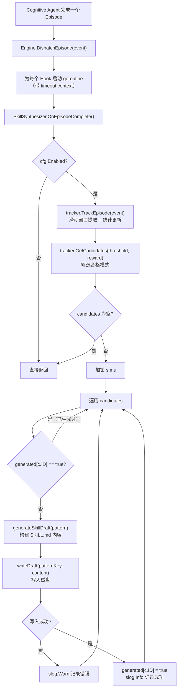
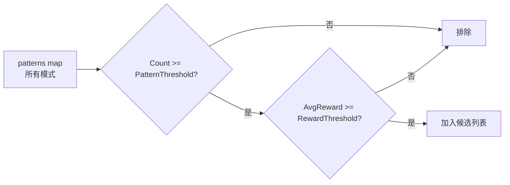
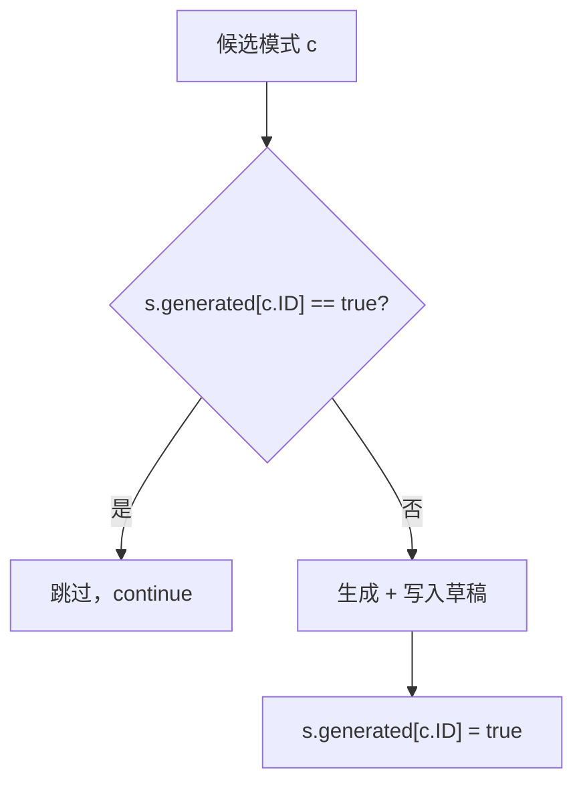
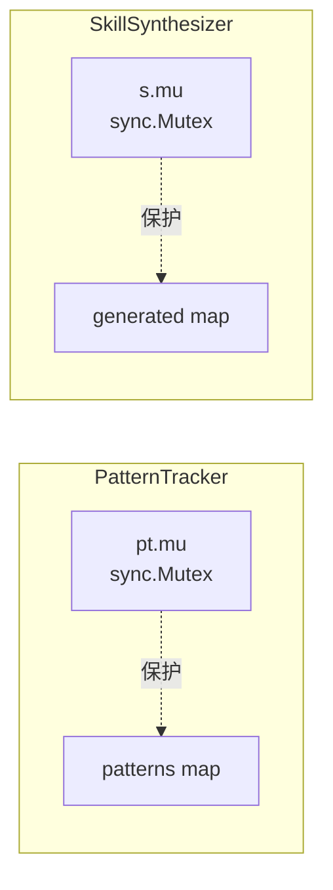
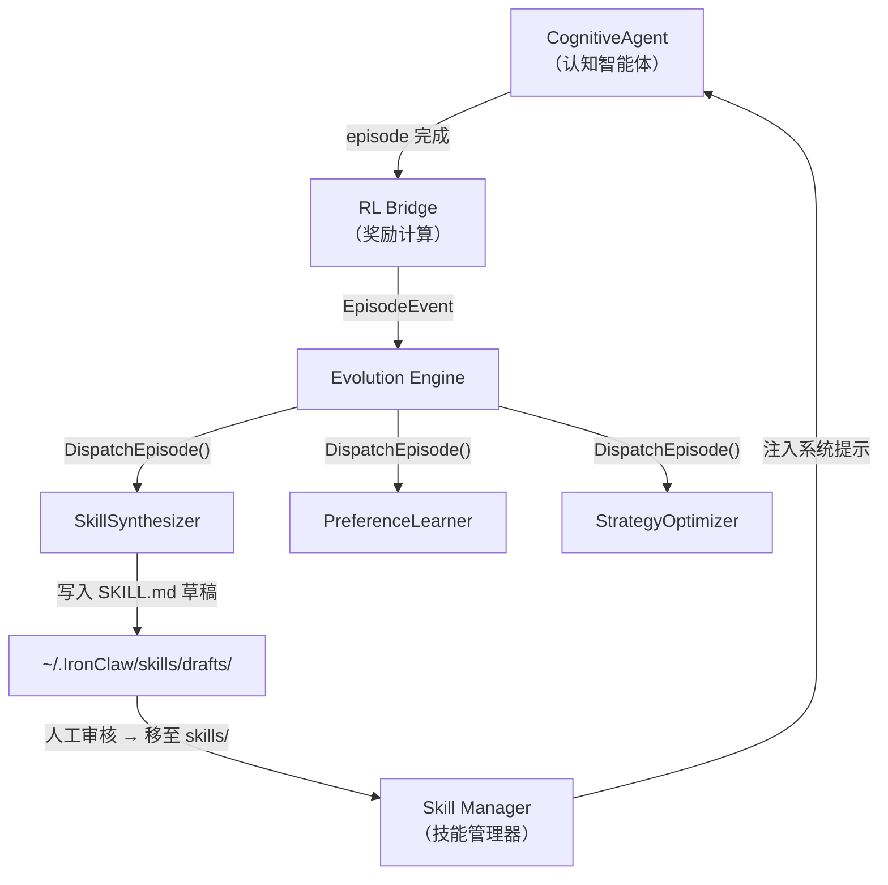

# SkillSynthesizer（技能合成器）详解

## 目录

- [1. 概述](#1-概述)
- [2. 核心数据结构](#2-核心数据结构)
- [3. 完整执行流程](#3-完整执行流程)
- [4. 模式提取算法](#4-模式提取算法)
- [5. Welford 在线均值算法](#5-welford-在线均值算法)
- [6. 候选筛选机制](#6-候选筛选机制)
- [7. 去重机制](#7-去重机制)
- [8. SKILL.md 草稿格式](#8-skillmd-草稿格式)
- [9. 文件写入机制](#9-文件写入机制)
- [10. 并发安全模型](#10-并发安全模型)
- [11. 配置参数](#11-配置参数)
- [12. 与其他组件的交互](#12-与其他组件的交互)
- [13. 关键源码注释](#13-关键源码注释)

---

## 1. 概述

**SkillSynthesizer**（技能合成器）是 IronClaw 自我进化引擎（`internal/evolution/`）的三大反馈循环之一，对应 **Loop 2**。它的职责是：

> **从智能体的历史工具调用记录中自动发现高频、高收益的工具组合模式，并将其合成为 SKILL.md 草稿文件，供人类审核后提升为正式技能。**

三大反馈循环的定位：

| 循环 | 组件 | 职责 |
|------|------|------|
| Loop 1 | `PreferenceLearner` | 从反思结果中提取用户偏好 |
| **Loop 2** | **`SkillSynthesizer`** | **检测重复工具模式，生成技能草稿** |
| Loop 3 | `StrategyOptimizer` | 基于成功/失败统计调优认知参数 |

### 源文件

| 文件 | 职责 |
|------|------|
| `internal/evolution/synthesizer.go` | SkillSynthesizer 主体逻辑：Hook 接口实现、草稿生成、文件写入 |
| `internal/evolution/pattern.go` | PatternTracker 与 ToolPattern：模式提取、滑动窗口、在线均值计算 |
| `internal/evolution/config.go` | `SynthesizerConfig` 配置定义及默认值 |
| `internal/evolution/engine.go` | Engine 事件分发——将 `EpisodeEvent` 分派给 SkillSynthesizer |

### 设计哲学

- **被动观察、主动合成**——不干预智能体执行，仅在 episode 结束后被动接收事件
- **最多一次草稿**——同一模式只会生成一次草稿文件（去重 map）
- **人在回路**——生成的是 `status: draft` 草稿，需人工审核才能成为正式技能
- **在线统计**——使用 Welford 算法增量计算均值，无需存储全部历史奖励

---

## 2. 核心数据结构

### 2.1 SkillSynthesizer

```go
type SkillSynthesizer struct {
    cfg       SynthesizerConfig    // 配置参数
    tracker   *PatternTracker      // 模式追踪器（提取和统计工具模式）
    generated map[string]bool      // 去重表：已生成草稿的模式 key → true
    mu        sync.Mutex           // 保护 generated map 的互斥锁
}
```

| 字段 | 类型 | 说明 |
|------|------|------|
| `cfg` | `SynthesizerConfig` | 不可变配置，构造时传入 |
| `tracker` | `*PatternTracker` | 内部模式追踪器，负责滑动窗口提取与统计 |
| `generated` | `map[string]bool` | 记录已生成草稿的 pattern key，防止同一模式重复写入文件 |
| `mu` | `sync.Mutex` | 互斥锁，保护 `generated` map 的并发读写 |

### 2.2 PatternTracker

```go
type PatternTracker struct {
    mu       sync.Mutex                // 保护 patterns map
    patterns map[string]*ToolPattern   // pattern key → 统计数据
}
```

| 字段 | 类型 | 说明 |
|------|------|------|
| `mu` | `sync.Mutex` | 保护内部 map 的并发访问 |
| `patterns` | `map[string]*ToolPattern` | 以规范化 key 为索引的模式统计表 |

### 2.3 ToolPattern

```go
type ToolPattern struct {
    ID        string      // 规范化 key：排序后的工具名，以 "|" 连接
    Tools     []string    // 工具名列表（已排序）
    AvgReward float64     // 在线计算的平均奖励值（Welford 算法）
    Count     int         // 出现次数（episode 数）
    FirstSeen time.Time   // 首次观察到的时间戳
    LastSeen  time.Time   // 最近一次观察到的时间戳
}
```

| 字段 | 类型 | 示例值 | 说明 |
|------|------|--------|------|
| `ID` | `string` | `"bash\|file_write"` | 工具名排序后以 `\|` 连接的规范化 key |
| `Tools` | `[]string` | `["bash", "file_write"]` | 已排序的工具名列表 |
| `AvgReward` | `float64` | `0.833` | 所有包含此模式的 episode 的平均奖励 |
| `Count` | `int` | `5` | 包含此模式的 episode 总数 |
| `FirstSeen` | `time.Time` | `2025-01-01 00:00:00` | 首次出现时间 |
| `LastSeen` | `time.Time` | `2025-06-01 12:30:00` | 最近出现时间 |

### 2.4 EpisodeEvent（输入事件）

```go
type EpisodeEvent struct {
    SessionID    string      // 会话 ID
    EpisodeID    string      // Episode ID
    Goal         string      // 用户目标
    Complexity   string      // 复杂度等级
    Succeeded    bool        // 是否成功
    TotalReward  float64     // RL 桥接计算的总奖励
    ToolSequence []string    // 按时间排序的工具调用序列
    ReplanCount  int         // 重新规划次数
    DurationMs   int64       // 持续时间（毫秒）
    UserFeedback float64     // 用户反馈（-1 ~ 1）
    Timestamp    time.Time   // 时间戳
}
```

SkillSynthesizer 核心关注的字段：

- **`ToolSequence`**——工具调用序列，是模式提取的输入
- **`TotalReward`**——总奖励值，用于计算模式的平均收益
- **`Timestamp`**——用于记录模式的 `FirstSeen` / `LastSeen`

### 2.5 SynthesizerConfig

```go
type SynthesizerConfig struct {
    Enabled          bool    `yaml:"enabled"`
    PatternThreshold int     `yaml:"pattern_threshold"`
    RewardThreshold  float64 `yaml:"reward_threshold"`
    DraftsDir        string  `yaml:"drafts_dir"`
    AutoNotify       bool    `yaml:"auto_notify"`
}
```

（详细字段解释见 [第 11 节](#11-配置参数)。）

---

## 3. 完整执行流程

### 3.1 流程图



### 3.2 分步说明

**第 1 步：事件触发**

当认知智能体（CognitiveAgent）完成一个 episode 后，RL Bridge 计算总奖励并构建 `EpisodeEvent`，通过 `Engine.DispatchEpisode()` 分发给所有注册的 Hook。

**第 2 步：安全分发**

Engine 在 goroutine 中调用每个 Hook 的 `OnEpisodeComplete()`，包裹在 `safeDispatch` 中：
- 带有 `HookTimeout`（默认 10 秒）的超时 context
- panic recovery 保护
- WaitGroup 计数确保 graceful shutdown

**第 3 步：模式追踪**

`tracker.TrackEpisode(event)` 对工具序列执行滑动窗口提取（窗口长度 2～4），为每个子序列更新出现次数和在线均值。

**第 4 步：候选筛选**

`tracker.GetCandidates()` 返回同时满足两个阈值的模式：
- `Count >= PatternThreshold`（默认 ≥ 3）
- `AvgReward >= RewardThreshold`（默认 ≥ 0.5）

**第 5 步：去重 + 草稿生成**

加锁遍历候选列表，跳过已经生成过草稿的模式（`generated` map 去重），为新模式生成 SKILL.md 内容并写入磁盘。

---

## 4. 模式提取算法

### 4.1 滑动窗口机制

`PatternTracker.TrackEpisode()` 从工具调用序列中提取**所有长度为 2 到 4 的连续子序列**：

```go
for length := 2; length <= maxLen; length++ {
    for start := 0; start <= n-length; start++ {
        window := seq[start : start+length]
        // ...
    }
}
```

其中 `maxLen = min(4, len(seq))`，即窗口上限为 4（或序列长度，取较小值）。

### 4.2 规范化 Key 生成

对每个窗口内的工具名进行**字母序排序**后以 `|` 连接，生成顺序无关的规范化 key：

```go
func patternKey(tools []string) string {
    sorted := make([]string, len(tools))
    copy(sorted, tools)
    sort.Strings(sorted)
    return strings.Join(sorted, "|")
}
```

这意味着 `["write", "read"]` 和 `["read", "write"]` 会映射到同一个 key `"read|write"`——模式识别与工具的执行顺序无关，只关注工具的**组合**。

### 4.3 具体示例

假设某个 Episode 的 `ToolSequence = ["grep", "edit", "test", "deploy"]`：

**窗口长度 = 2（3 个窗口）：**

| 起始位置 | 窗口 | 排序后 | Key |
|----------|------|--------|-----|
| 0 | `[grep, edit]` | `[edit, grep]` | `edit\|grep` |
| 1 | `[edit, test]` | `[edit, test]` | `edit\|test` |
| 2 | `[test, deploy]` | `[deploy, test]` | `deploy\|test` |

**窗口长度 = 3（2 个窗口）：**

| 起始位置 | 窗口 | 排序后 | Key |
|----------|------|--------|-----|
| 0 | `[grep, edit, test]` | `[edit, grep, test]` | `edit\|grep\|test` |
| 1 | `[edit, test, deploy]` | `[deploy, edit, test]` | `deploy\|edit\|test` |

**窗口长度 = 4（1 个窗口）：**

| 起始位置 | 窗口 | 排序后 | Key |
|----------|------|--------|-----|
| 0 | `[grep, edit, test, deploy]` | `[deploy, edit, grep, test]` | `deploy\|edit\|grep\|test` |

**总计**：一个长度为 4 的序列产生 3 + 2 + 1 = **6** 个模式。

### 4.4 窗口数量公式

对于长度为 \( n \) 的序列，提取的窗口总数为：

\[
\sum_{l=2}^{\min(4,n)} (n - l + 1)
\]

| 序列长度 \( n \) | 长度 2 | 长度 3 | 长度 4 | 总窗口数 |
|:---:|:---:|:---:|:---:|:---:|
| 2 | 1 | — | — | 1 |
| 3 | 2 | 1 | — | 3 |
| 4 | 3 | 2 | 1 | 6 |
| 5 | 4 | 3 | 2 | 9 |
| 10 | 9 | 8 | 7 | 24 |

### 4.5 短序列处理

- 序列长度 < 2（0 或 1 个工具）→ 直接返回，不提取任何模式
- 序列长度 = 2 → 只提取长度 2 的窗口
- 序列长度 ≥ 4 → 窗口上限锁定为 4

---

## 5. Welford 在线均值算法

### 5.1 算法原理

SkillSynthesizer 使用 **Welford 在线均值算法**增量更新每个模式的平均奖励，无需保留所有历史奖励值。

核心公式：

\[
\bar{x}_{n} = \bar{x}_{n-1} + \frac{x_n - \bar{x}_{n-1}}{n}
\]

对应源码：

```go
p.Count++
p.AvgReward += (event.TotalReward - p.AvgReward) / float64(p.Count)
```

### 5.2 数值计算示例

假设模式 `"bash|file_write"` 连续在三个 episode 中出现，奖励分别为 `1.0`、`0.5`、`1.5`：

**第 1 次（x₁ = 1.0）：**
- Count: 0 → 1
- AvgReward: 0.0 + (1.0 - 0.0) / 1 = **1.000**

**第 2 次（x₂ = 0.5）：**
- Count: 1 → 2
- AvgReward: 1.0 + (0.5 - 1.0) / 2 = 1.0 + (-0.25) = **0.750**

**第 3 次（x₃ = 1.5）：**
- Count: 2 → 3
- AvgReward: 0.75 + (1.5 - 0.75) / 3 = 0.75 + 0.25 = **1.000**

验证：(1.0 + 0.5 + 1.5) / 3 = 3.0 / 3 = 1.0 ✓

### 5.3 算法优势

| 特性 | 说明 |
|------|------|
| 空间复杂度 O(1) | 只需存储 `AvgReward` 和 `Count`，无需保留历史值 |
| 数值稳定性 | 避免先累加再除法造成的浮点溢出 |
| 流式处理 | 适合事件驱动架构，每次到来一个 episode 即可更新 |

---

## 6. 候选筛选机制

### 6.1 GetCandidates 逻辑

```go
func (pt *PatternTracker) GetCandidates(countThreshold int, rewardThreshold float64) []ToolPattern {
    pt.mu.Lock()
    defer pt.mu.Unlock()

    var out []ToolPattern
    for _, p := range pt.patterns {
        if p.Count >= countThreshold && p.AvgReward >= rewardThreshold {
            cp := *p                                  // 值拷贝
            cp.Tools = make([]string, len(p.Tools))   // 深拷贝 slice
            copy(cp.Tools, p.Tools)
            out = append(out, cp)
        }
    }
    return out
}
```

### 6.2 双重阈值过滤

候选模式必须**同时满足**两个条件：



| 阈值 | 配置字段 | 默认值 | 含义 |
|------|----------|--------|------|
| 频率阈值 | `pattern_threshold` | 3 | 模式至少出现 3 次才有资格 |
| 奖励阈值 | `reward_threshold` | 0.5 | 模式平均奖励 ≥ 0.5 才有资格 |

### 6.3 筛选示例

| 模式 | Count | AvgReward | `count >= 3?` | `reward >= 0.5?` | 结果 |
|------|:---:|:---:|:---:|:---:|------|
| `bash\|file_write` | 5 | 0.82 | ✅ | ✅ | **候选** |
| `grep\|read` | 10 | 0.30 | ✅ | ❌ | 排除（奖励不足） |
| `http\|parse` | 1 | 0.95 | ❌ | ✅ | 排除（频率不足） |
| `edit\|test` | 2 | 0.40 | ❌ | ❌ | 排除 |

### 6.4 深拷贝设计

返回的 `[]ToolPattern` 是**值拷贝**，`Tools` slice 也做了深拷贝。调用方可以安全地并发读写返回值，而不必持有 tracker 的锁。这个设计使得 SkillSynthesizer 在加自己的 `mu` 锁时，不会与 tracker 的锁形成嵌套死锁。

---

## 7. 去重机制

### 7.1 generated map

```go
type SkillSynthesizer struct {
    // ...
    generated map[string]bool  // pattern key → 是否已生成草稿
    mu        sync.Mutex
}
```

### 7.2 去重流程



### 7.3 关键特性

1. **写入成功才标记**——只有 `writeDraft` 成功返回后才置 `generated[c.ID] = true`；写入失败时不标记，下次 episode 会重试
2. **内存级去重**——`generated` map 存在于内存中，进程重启后会丢失。但由于 `writeDraft` 是覆盖式写入（`os.WriteFile`），即使重复生成同一文件也是幂等的
3. **生命周期**——与 `SkillSynthesizer` 实例绑定，通常与进程同生命周期

### 7.4 测试验证

测试用例 `TestSynthesizer_Dedup` 验证了此机制：先用 2 个 episode 触发草稿生成，再追加 10 个相同模式的 episode，断言文件数量不变。

---

## 8. SKILL.md 草稿格式

### 8.1 完整示例

假设模式 `"bash|file_write"` 出现 5 次，平均奖励 0.833，首次出现 2025-01-15，最近出现 2025-06-01，生成的草稿文件 `SKILL_bash_file_write.md` 内容如下：

```markdown
---
name: auto_bash_file_write
description: Skill auto-generated from 5 occurrences of tool pattern [bash|file_write] with avg reward 0.833.
status: draft
auto_generated: true
---

# auto_bash_file_write

## Pattern Summary

This skill was automatically synthesized from observed tool-usage patterns.

- **Tools:** bash, file_write
- **Occurrences:** 5
- **Average Reward:** 0.833
- **First Seen:** 2025-01-15 10:30:00
- **Last Seen:** 2025-06-01 14:22:15

## Usage

Review and refine the tool sequence below before promoting to production.

```
bash -> file_write
```
```

### 8.2 YAML Front-matter 字段

| 字段 | 值 | 说明 |
|------|-----|------|
| `name` | `auto_{key_with_underscores}` | 自动命名，`\|` 替换为 `_` 并加 `auto_` 前缀 |
| `description` | 自动生成的描述 | 包含出现次数、模式 key、平均奖励 |
| `status` | `draft` | 固定为草稿状态，需人工审核 |
| `auto_generated` | `true` | 标识为自动生成，区别于手工编写的技能 |

### 8.3 Markdown Body 结构

| 章节 | 内容 |
|------|------|
| `# {name}` | 技能名称标题 |
| `## Pattern Summary` | 工具列表、出现次数、平均奖励、时间范围 |
| `## Usage` | 引导人工审核的提示 + 工具调用链展示 |

### 8.4 生成逻辑源码

名称和描述的构建方式：

```go
name := "auto_" + strings.ReplaceAll(pattern.ID, "|", "_")

description := fmt.Sprintf(
    "Skill auto-generated from %d occurrences of tool pattern [%s] with avg reward %.3f.",
    pattern.Count, pattern.ID, pattern.AvgReward,
)
```

使用 `strings.Builder` 拼接 YAML front-matter 与 Markdown body，最终返回完整字符串。

---

## 9. 文件写入机制

### 9.1 写入流程

```go
func (s *SkillSynthesizer) writeDraft(patternKey, content string) error {
    dir := s.cfg.DraftsDir
    if dir == "" {
        return fmt.Errorf("synthesizer: DraftsDir is not configured")
    }

    if err := os.MkdirAll(dir, 0o755); err != nil {
        return fmt.Errorf("create drafts dir: %w", err)
    }

    filename := "SKILL_" + strings.ReplaceAll(patternKey, "|", "_") + ".md"
    path := filepath.Join(dir, filename)

    return os.WriteFile(path, []byte(content), 0o644)
}
```

### 9.2 文件命名规则

```
SKILL_{pattern_key_with_pipes_replaced_by_underscores}.md
```

| pattern key | 文件名 |
|-------------|--------|
| `bash\|file_write` | `SKILL_bash_file_write.md` |
| `edit\|grep\|test` | `SKILL_edit_grep_test.md` |
| `deploy\|edit\|grep\|test` | `SKILL_deploy_edit_grep_test.md` |

### 9.3 目录结构

配置中的 `drafts_dir` 相对于 `~/.IronClaw/skills/`，默认值为 `drafts`：

```
~/.IronClaw/
└── skills/
    ├── drafts/                          ← DraftsDir（自动创建）
    │   ├── SKILL_bash_file_write.md
    │   ├── SKILL_edit_grep_test.md
    │   └── SKILL_deploy_edit_grep_test.md
    └── ... (其他正式技能文件)
```

### 9.4 关键行为

| 行为 | 说明 |
|------|------|
| 自动创建目录 | `os.MkdirAll(dir, 0o755)` 递归创建路径，包括多层嵌套目录 |
| 覆盖写入 | `os.WriteFile` 若文件已存在会覆盖（幂等性保障） |
| 权限 | 目录 `0755`，文件 `0644` |
| 空目录保护 | `DraftsDir` 为空时返回 error，不会写入当前目录 |

---

## 10. 并发安全模型

### 10.1 两把互斥锁

SkillSynthesizer 系统使用**两把独立的互斥锁**：



| 锁 | 所属 | 保护对象 | 粒度 |
|----|------|----------|------|
| `PatternTracker.mu` | `PatternTracker` | `patterns map[string]*ToolPattern` | 追踪器级别 |
| `SkillSynthesizer.mu` | `SkillSynthesizer` | `generated map[string]bool` | 合成器级别 |

### 10.2 锁的获取顺序

在 `OnEpisodeComplete` 的执行过程中，两把锁**不会同时持有**：

```
1. tracker.TrackEpisode(event)     → 内部获取 pt.mu，完成后释放
2. tracker.GetCandidates(...)      → 内部获取 pt.mu，返回深拷贝后释放
3. s.mu.Lock()                     → 获取 s.mu
4.   遍历 candidates（值拷贝，无需 pt.mu）
5.   generateSkillDraft(...)       → 纯计算，无锁
6.   writeDraft(...)               → 文件 I/O，无锁
7. s.mu.Unlock()                   → 释放 s.mu
```

**无锁嵌套风险**——`GetCandidates` 返回的是深拷贝，因此在持有 `s.mu` 期间无需再获取 `pt.mu`，从根本上避免了死锁。

### 10.3 Engine 层的并发保护

Engine 使用 `sync.RWMutex` 保护 hooks 列表，并通过 `safeDispatch` 为每个 Hook 调用提供：

- **goroutine 隔离**——每个 Hook 在独立 goroutine 中执行
- **超时控制**——`context.WithTimeout(e.ctx, cfg.HookTimeout)`
- **panic recovery**——`defer recover()` 防止单个 Hook panic 影响其他 Hook
- **WaitGroup**——确保 `Engine.Stop()` 等待所有 Hook 完成

### 10.4 并发场景分析

| 场景 | 安全性 | 原因 |
|------|--------|------|
| 多个 episode 事件并发到达 | ✅ 安全 | `pt.mu` 串行化 `TrackEpisode`；`s.mu` 串行化草稿生成 |
| 读取 candidates 时新 episode 到达 | ✅ 安全 | `GetCandidates` 返回深拷贝，不持有锁 |
| 文件写入期间另一个 episode 触发相同模式 | ✅ 安全 | `s.mu` 保证同一时刻只有一个 goroutine 写入 |

---

## 11. 配置参数

### 11.1 YAML 配置

```yaml
agent:
  evolution:
    synthesizer:
      enabled: true           # 是否启用技能合成器
      pattern_threshold: 3    # 最少出现次数
      reward_threshold: 0.5   # 最低平均奖励
      drafts_dir: drafts      # 草稿输出目录（相对于 ~/.IronClaw/skills/）
      auto_notify: true       # 下次会话开始时通知用户有新草稿
```

### 11.2 参数详解

| 参数 | 类型 | 默认值 | 说明 |
|------|------|--------|------|
| `enabled` | `bool` | `true` | 总开关。`false` 时 `OnEpisodeComplete` 立即返回 |
| `pattern_threshold` | `int` | `3` | 模式出现次数 ≥ 此值才会触发草稿生成 |
| `reward_threshold` | `float64` | `0.5` | 模式平均奖励 ≥ 此值才有资格。范围通常为 0.0～1.0 |
| `drafts_dir` | `string` | `"drafts"` | SKILL.md 草稿的输出目录。配置为空则写入时报错 |
| `auto_notify` | `bool` | `true` | 启用后在下次会话开始时提示用户审核新草稿 |

### 11.3 调优建议

| 目标 | 调整方向 |
|------|----------|
| 减少噪音（只保留高质量模式） | 提高 `pattern_threshold`（如 5～10）+ 提高 `reward_threshold`（如 0.7） |
| 更积极地发现模式 | 降低 `pattern_threshold`（如 2）+ 降低 `reward_threshold`（如 0.3） |
| 禁用自动合成 | 设置 `enabled: false` |

### 11.4 默认值来源

`DefaultConfig()` 函数（`config.go`）中定义的默认值：

```go
Synthesizer: SynthesizerConfig{
    Enabled:          true,
    PatternThreshold: 3,
    RewardThreshold:  0.5,
    DraftsDir:        "drafts",
    AutoNotify:       true,
},
```

---

## 12. 与其他组件的交互

### 12.1 交互架构



### 12.2 上游：Engine 事件分发

```go
// engine.go
func (e *Engine) DispatchEpisode(event EpisodeEvent) {
    if !e.cfg.Enabled { return }
    e.mu.RLock()
    defer e.mu.RUnlock()

    for _, h := range e.hooks {
        hook := h
        e.wg.Add(1)
        go e.safeDispatch(hook.Name(), func(ctx context.Context) {
            hook.OnEpisodeComplete(ctx, event)
        })
    }
}
```

Engine 将同一个 `EpisodeEvent` 并发分发给所有注册的 Hook，SkillSynthesizer 是其中之一。

### 12.3 下游：Skill 系统集成

1. **草稿写入**——SkillSynthesizer 将 `SKILL.md` 写入 `~/.IronClaw/skills/drafts/`
2. **人工审核**——用户检查草稿内容，修改描述、补充使用指南，然后将文件移至 `~/.IronClaw/skills/` 目录
3. **技能加载**——`internal/skill/` 包的 Skill Manager 在启动时扫描 `~/.IronClaw/skills/` 目录下的所有 `SKILL.md` 文件
4. **自动通知**——若 `auto_notify: true`，下次会话开始时提醒用户有待审核的草稿

### 12.4 与同级 Hook 的关系

| Hook | 共享 EpisodeEvent | 交互 |
|------|:-:|------|
| `PreferenceLearner` | ✅ | 无直接交互。各自独立处理同一事件 |
| `StrategyOptimizer` | ✅ | 无直接交互。StrategyOptimizer 调整的参数可能间接影响后续 episode 的工具选择，从而影响 SkillSynthesizer 发现的模式 |
| `TrajectoryRecorder` | ✅ | 无直接交互。记录的轨迹数据供 insights 循环使用 |

### 12.5 Hook 接口契约

SkillSynthesizer 实现 `Hook` 接口的三个方法：

| 方法 | 实现 |
|------|------|
| `OnEpisodeComplete` | **核心逻辑**——模式追踪 + 候选筛选 + 草稿生成 |
| `OnReflectionComplete` | 空操作（no-op） |
| `OnToolExecuted` | 空操作（no-op） |

---

## 13. 关键源码注释

### 13.1 OnEpisodeComplete——核心入口

```go
func (s *SkillSynthesizer) OnEpisodeComplete(_ context.Context, event EpisodeEvent) {
    // ① 开关检查：未启用则直接返回
    if !s.cfg.Enabled {
        return
    }

    // ② 模式追踪：滑动窗口提取子序列 + 更新统计
    //    内部持有 tracker.mu，返回时已释放
    s.tracker.TrackEpisode(event)

    // ③ 候选筛选：返回 ToolPattern 的深拷贝切片
    //    内部持有 tracker.mu，返回时已释放
    candidates := s.tracker.GetCandidates(s.cfg.PatternThreshold, s.cfg.RewardThreshold)
    if len(candidates) == 0 {
        return
    }

    // ④ 加锁保护 generated map（与 tracker.mu 不嵌套）
    s.mu.Lock()
    defer s.mu.Unlock()

    for i := range candidates {
        c := &candidates[i]

        // ⑤ 去重检查：已生成过草稿的模式直接跳过
        if s.generated[c.ID] {
            continue
        }

        // ⑥ 生成 SKILL.md 内容（纯字符串拼接，无 I/O）
        content := s.generateSkillDraft(*c)

        // ⑦ 写入磁盘（含目录自动创建）
        if err := s.writeDraft(c.ID, content); err != nil {
            slog.Warn("skill_synthesizer: failed to write draft",
                "pattern", c.ID, "error", err)
            continue  // 写入失败不标记，下次会重试
        }

        // ⑧ 标记已生成 + 日志记录
        s.generated[c.ID] = true
        slog.Info("skill_synthesizer: draft generated",
            "pattern", c.ID,
            "count", c.Count,
            "avg_reward", c.AvgReward)
    }
}
```

### 13.2 TrackEpisode——滑动窗口 + Welford 均值

```go
func (pt *PatternTracker) TrackEpisode(event EpisodeEvent) {
    seq := event.ToolSequence
    n := len(seq)
    if n < 2 {
        return  // 至少需要 2 个工具才能形成模式
    }

    maxLen := 4
    if n < maxLen {
        maxLen = n  // 序列较短时，窗口上限取序列长度
    }

    now := event.Timestamp
    if now.IsZero() {
        now = time.Now()  // 防御性处理：时间戳为零值时取当前时间
    }

    pt.mu.Lock()
    defer pt.mu.Unlock()

    // 双重循环：外层控制窗口长度，内层控制起始位置
    for length := 2; length <= maxLen; length++ {
        for start := 0; start <= n-length; start++ {
            window := seq[start : start+length]
            key := patternKey(window)  // 排序 + "|" 连接 → 顺序无关的规范化 key

            p, exists := pt.patterns[key]
            if !exists {
                // 新模式：创建 ToolPattern，深拷贝工具名并排序
                tools := make([]string, len(window))
                copy(tools, window)
                sort.Strings(tools)

                p = &ToolPattern{
                    ID:        key,
                    Tools:     tools,
                    FirstSeen: now,
                }
                pt.patterns[key] = p
            }

            // Welford 在线均值更新
            // avg' = avg + (x - avg) / n
            p.Count++
            p.AvgReward += (event.TotalReward - p.AvgReward) / float64(p.Count)
            p.LastSeen = now
        }
    }
}
```

### 13.3 generateSkillDraft——草稿内容构建

```go
func (s *SkillSynthesizer) generateSkillDraft(pattern ToolPattern) string {
    toolList := strings.Join(pattern.Tools, ", ")  // 如 "bash, file_write"

    // 命名规则：auto_ 前缀 + key 中的 | 替换为 _
    name := "auto_" + strings.ReplaceAll(pattern.ID, "|", "_")

    // 自动生成描述文本
    description := fmt.Sprintf(
        "Skill auto-generated from %d occurrences of tool pattern [%s] with avg reward %.3f.",
        pattern.Count, pattern.ID, pattern.AvgReward,
    )

    var b strings.Builder

    // YAML front-matter：标记为 draft + auto_generated
    fmt.Fprintf(&b, "---\n")
    fmt.Fprintf(&b, "name: %s\n", name)
    fmt.Fprintf(&b, "description: %s\n", description)
    fmt.Fprintf(&b, "status: draft\n")
    fmt.Fprintf(&b, "auto_generated: true\n")
    fmt.Fprintf(&b, "---\n\n")

    // Markdown body
    fmt.Fprintf(&b, "# %s\n\n", name)
    fmt.Fprintf(&b, "## Pattern Summary\n\n")
    fmt.Fprintf(&b, "This skill was automatically synthesized from observed tool-usage patterns.\n\n")
    fmt.Fprintf(&b, "- **Tools:** %s\n", toolList)
    fmt.Fprintf(&b, "- **Occurrences:** %d\n", pattern.Count)
    fmt.Fprintf(&b, "- **Average Reward:** %.3f\n", pattern.AvgReward)
    fmt.Fprintf(&b, "- **First Seen:** %s\n", pattern.FirstSeen.Format("2006-01-02 15:04:05"))
    fmt.Fprintf(&b, "- **Last Seen:** %s\n\n", pattern.LastSeen.Format("2006-01-02 15:04:05"))
    fmt.Fprintf(&b, "## Usage\n\n")
    fmt.Fprintf(&b, "Review and refine the tool sequence below before promoting to production.\n\n")
    fmt.Fprintf(&b, "```\n%s\n```\n", strings.Join(pattern.Tools, " -> "))

    return b.String()
}
```

### 13.4 safeDispatch——Engine 的安全调度

```go
func (e *Engine) safeDispatch(hookName string, fn func(ctx context.Context)) {
    defer e.wg.Done()
    defer func() {
        if r := recover(); r != nil {
            // 单个 Hook panic 不影响其他 Hook
            slog.Error("evolution: hook panicked",
                "hook", hookName, "panic", r)
        }
    }()

    timeout := e.cfg.HookTimeout
    if timeout <= 0 {
        timeout = 10 * time.Second
    }
    // 每个 Hook 调用都有独立的超时 context
    ctx, cancel := context.WithTimeout(e.ctx, timeout)
    defer cancel()

    fn(ctx)
}
```

---

> **文档基于源码文件**：`internal/evolution/synthesizer.go`、`internal/evolution/pattern.go`、`internal/evolution/config.go`、`internal/evolution/engine.go`
