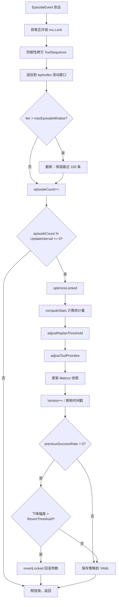
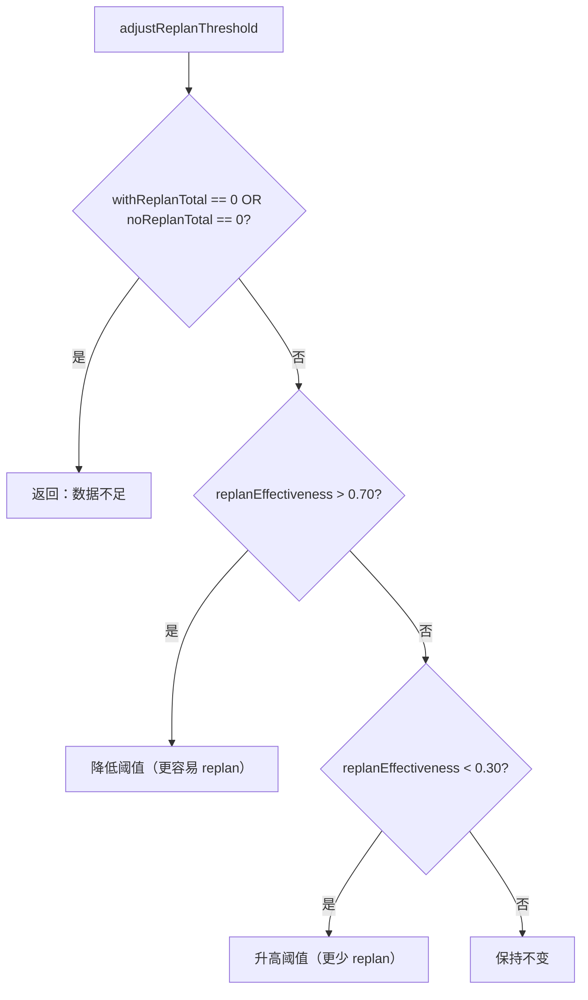
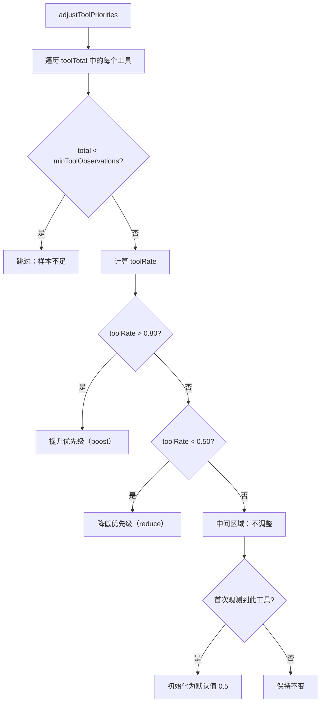
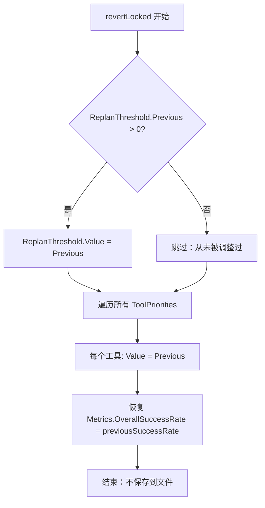
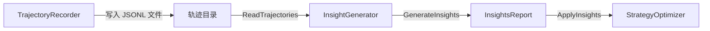
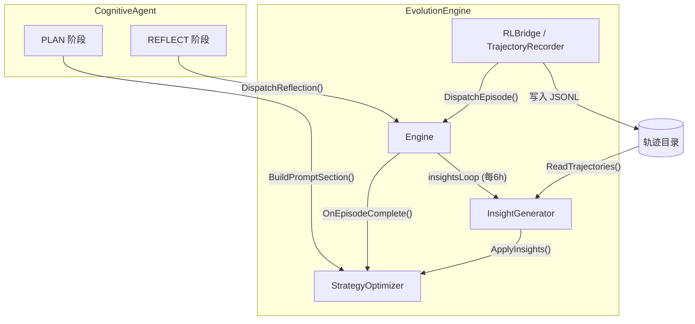

# StrategyOptimizer（策略优化器）详解

> 源码位置：`internal/evolution/optimizer.go`
> 所属模块：`github.com/Forest-Isle/IronClaw/internal/evolution`

---

## 目录

1. [概述](#1-概述)
2. [核心数据结构](#2-核心数据结构)
3. [完整执行流程](#3-完整执行流程)
4. [滚动窗口机制](#4-滚动窗口机制)
5. [统计量计算](#5-统计量计算)
6. [Replan 阈值调整](#6-replan-阈值调整)
7. [工具优先级调整](#7-工具优先级调整)
8. [自动回滚机制](#8-自动回滚机制)
9. [洞见反馈接口 (ApplyInsights)](#9-洞见反馈接口-applyinsights)
10. [Prompt 注入 (BuildPromptSection)](#10-prompt-注入-buildpromptsection)
11. [持久化机制](#11-持久化机制)
12. [并发安全模型](#12-并发安全模型)
13. [常量与边界值](#13-常量与边界值)
14. [配置参数](#14-配置参数)
15. [与其他组件的交互](#15-与其他组件的交互)
16. [关键源码注释](#16-关键源码注释)

---

## 1. 概述

StrategyOptimizer 是 IronClaw 自进化系统（Self-Evolution Engine）的 **Loop 3** 组件，负责根据历史 episode 的成功/失败统计数据，自动调优认知代理（CognitiveAgent）的运行时策略参数。

它实现了 `Hook` 接口，作为事件钩子注册到 `Engine` 中，监听 `EpisodeEvent`（RL episode 完成事件）。每积累一定数量的 episode 后，执行一轮优化周期，调整以下两类参数：

| 参数类别 | 含义 | 调整方向 |
|---------|------|---------|
| **Replan 阈值** (`ReplanThreshold`) | 控制认知代理何时触发重规划 | 根据 replan 有效性升降 |
| **工具优先级** (`ToolPriorities`) | 影响工具选择的偏好权重 | 根据各工具成功率升降 |

核心设计原则：
- **保守调整**：每个周期最多调整 `MaxAdjustmentPercent`（默认 10%）
- **自动回滚**：若成功率下降超过 `RevertThreshold`，立即回退到上一组参数
- **双通道输入**：既接受实时 episode 事件流，也接受 `InsightGenerator` 的周期性分析报告

---

## 2. 核心数据结构

### 2.1 Strategy（策略）

策略是优化器的核心输出产物，持久化为 YAML 文件。

```go
type Strategy struct {
    Version         int                      `yaml:"version"`
    UpdatedAt       time.Time                `yaml:"updated_at"`
    ReplanThreshold StrategyParam            `yaml:"replan_threshold"`
    ToolPriorities  map[string]StrategyParam `yaml:"tool_priorities"`
    Metrics         MetricsSnapshot          `yaml:"metrics"`
}
```

| 字段 | 类型 | 说明 |
|------|------|------|
| `Version` | `int` | 策略版本号，每次优化 +1，初始值为 1 |
| `UpdatedAt` | `time.Time` | 最近一次优化的时间戳 |
| `ReplanThreshold` | `StrategyParam` | Replan 阈值参数（控制重规划触发灵敏度） |
| `ToolPriorities` | `map[string]StrategyParam` | 工具名 → 优先级参数的映射 |
| `Metrics` | `MetricsSnapshot` | 最近一次优化时的指标快照 |

### 2.2 StrategyParam（策略参数）

每个可调参数都携带变更历史，以支持回滚和可解释性。

```go
type StrategyParam struct {
    Value    float64 `yaml:"value"`
    Previous float64 `yaml:"previous"`
    Reason   string  `yaml:"reason"`
}
```

| 字段 | 类型 | 说明 |
|------|------|------|
| `Value` | `float64` | 当前值 |
| `Previous` | `float64` | 上一次的值（用于回滚） |
| `Reason` | `string` | 人类可读的变更原因 |

### 2.3 MetricsSnapshot（指标快照）

```go
type MetricsSnapshot struct {
    OverallSuccessRate float64 `yaml:"overall_success_rate"`
    EpisodesAnalyzed   int     `yaml:"episodes_analyzed"`
}
```

| 字段 | 类型 | 说明 |
|------|------|------|
| `OverallSuccessRate` | `float64` | 当前滚动窗口内的总成功率 |
| `EpisodesAnalyzed` | `int` | 参与计算的 episode 总数 |

### 2.4 episodeRecord（Episode 记录）

优化器从 `EpisodeEvent` 中提取的精简记录，存储在内存滚动窗口中。

```go
type episodeRecord struct {
    Complexity  string
    Succeeded   bool
    TotalReward float64
    ReplanCount int
    ToolsUsed   []string
    Timestamp   time.Time
}
```

| 字段 | 类型 | 说明 |
|------|------|------|
| `Complexity` | `string` | 任务复杂度级别（如 `"low"`, `"medium"`, `"high"`） |
| `Succeeded` | `bool` | 该 episode 是否成功 |
| `TotalReward` | `float64` | RL 累积奖励 |
| `ReplanCount` | `int` | 重规划次数 |
| `ToolsUsed` | `[]string` | 使用的工具名称列表（防御性拷贝） |
| `Timestamp` | `time.Time` | 事件发生时间 |

### 2.5 optimizeStats（优化统计量）

`computeStats()` 遍历滚动窗口后生成的中间统计结构。

```go
type optimizeStats struct {
    overallSuccessRate  float64
    replanEffectiveness float64
    noReplanSuccessRate float64
    withReplanTotal     int
    noReplanTotal       int
    toolSuccess         map[string]int
    toolTotal           map[string]int
}
```

| 字段 | 类型 | 说明 |
|------|------|------|
| `overallSuccessRate` | `float64` | 全部 episode 的成功率 |
| `replanEffectiveness` | `float64` | 使用了 replan 的 episode 的成功率 |
| `noReplanSuccessRate` | `float64` | 未使用 replan 的 episode 的成功率 |
| `withReplanTotal` | `int` | 使用了 replan 的 episode 总数 |
| `noReplanTotal` | `int` | 未使用 replan 的 episode 总数 |
| `toolSuccess` | `map[string]int` | 每个工具参与的成功 episode 数 |
| `toolTotal` | `map[string]int` | 每个工具参与的 episode 总数 |

### 2.6 StrategyOptimizer（优化器本体）

```go
type StrategyOptimizer struct {
    cfg               OptimizerConfig
    episodes          []episodeRecord
    strategy          *Strategy
    episodeCount      int
    lastOptimizeCount int
    mu                sync.Mutex
}
```

| 字段 | 类型 | 说明 |
|------|------|------|
| `cfg` | `OptimizerConfig` | 配置项（不可变） |
| `episodes` | `[]episodeRecord` | 滚动窗口，最多 100 条 |
| `strategy` | `*Strategy` | 当前策略（指针，可整体替换） |
| `episodeCount` | `int` | 已接收的 episode 总数（只增不减） |
| `lastOptimizeCount` | `int` | 上次触发优化时的 episodeCount |
| `mu` | `sync.Mutex` | 互斥锁，保护所有可变状态 |

---

## 3. 完整执行流程

从 `EpisodeEvent` 到策略更新，经历以下完整流程：



**关键步骤说明：**

1. **事件接收** (`OnEpisodeComplete`)：Engine 通过 goroutine 异步调用，传入 `EpisodeEvent`
2. **防御性拷贝**：`ToolSequence` 切片被深拷贝，避免外部修改影响内部状态
3. **滚动窗口维护**：超出 100 条时，丢弃最老的记录
4. **触发判断**：仅在 `episodeCount` 是 `UpdateInterval` 的整数倍时触发优化
5. **参数调整**：依次调整 Replan 阈值和工具优先级
6. **回滚检查**：若成功率相对上一轮下降超过阈值，回滚所有参数变更
7. **持久化**：最终将策略写入 YAML 文件

---

## 4. 滚动窗口机制

优化器使用一个 **FIFO 滚动窗口** 管理 episode 记录，确保统计数据始终基于最近的运行情况。

### 工作原理

```
容量上限: maxEpisodeWindow = 100

                 ┌──────────────────────────────────────────────┐
episodes 切片:   │ ep_31 │ ep_32 │ ... │ ep_129 │ ep_130 │      │
                 └──────────────────────────────────────────────┘
                   ↑ 最老的记录                   ↑ 最新的记录
```

**截断逻辑：**

```go
if len(so.episodes) > maxEpisodeWindow {
    so.episodes = so.episodes[len(so.episodes)-maxEpisodeWindow:]
}
```

当切片长度超过 100 时，从尾部保留 100 条，丢弃头部最老的数据。这是一个 O(1) 的切片重定位操作（不涉及数据拷贝，Go 运行时后续 GC 回收旧内存）。

### 触发条件

```go
if so.cfg.UpdateInterval > 0 && so.episodeCount%so.cfg.UpdateInterval == 0 {
    so.optimizeLocked()
}
```

| 条件 | 说明 |
|------|------|
| `UpdateInterval > 0` | 设为 0 或负值时禁用自动优化 |
| `episodeCount % UpdateInterval == 0` | 每 N 个 episode 触发一次 |

**注意**：`episodeCount` 是累计计数器（只增不减），不受窗口截断影响。因此即使窗口内只有 100 条数据，触发优化的节奏仍然精确。

### 示例

假设 `UpdateInterval = 10`：

| episodeCount | 触发优化？ | 窗口内记录数 |
|:---:|:---:|:---:|
| 9 | 否 | 9 |
| 10 | **是** | 10 |
| 20 | **是** | 20 |
| 100 | **是** | 100 |
| 110 | **是** | 100（已截断） |

---

## 5. 统计量计算

`computeStats()` 遍历滚动窗口中的所有 episode，一次性计算全部统计量。

### 计算公式

**总体成功率：**

$$\text{overallSuccessRate} = \frac{\text{successCount}}{\text{len(episodes)}}$$

**Replan 有效性（使用了 replan 的 episode 中成功的比例）：**

$$\text{replanEffectiveness} = \frac{\text{withReplanSuccess}}{\text{withReplanTotal}} \quad (\text{仅当 withReplanTotal} > 0)$$

**无 Replan 成功率：**

$$\text{noReplanSuccessRate} = \frac{\text{noReplanSuccess}}{\text{noReplanTotal}} \quad (\text{仅当 noReplanTotal} > 0)$$

**每工具成功率（在 adjustToolPriorities 中使用）：**

$$\text{toolRate}_{t} = \frac{\text{toolSuccess}[t]}{\text{toolTotal}[t]}$$

### 分类规则

一个 episode 按以下规则分类：

```
ReplanCount > 0  →  归入 withReplan 组
ReplanCount == 0 →  归入 noReplan 组
```

工具统计以 **episode 为单位**——如果一个 episode 成功，则该 episode 中使用的所有工具均记一次成功。

### 遍历伪代码

```
对于每个 episode:
  if succeeded → successCount++
  
  if replanCount > 0:
    withReplanTotal++
    if succeeded → withReplanSuccess++
  else:
    noReplanTotal++
    if succeeded → noReplanSuccess++
  
  对于每个 tool in episode.ToolsUsed:
    toolTotal[tool]++
    if succeeded → toolSuccess[tool]++
```

---

## 6. Replan 阈值调整

Replan 阈值控制认知代理何时决定放弃当前计划并重新规划。阈值越低，重规划越容易触发。

### 调整逻辑



**前置条件**：必须同时存在使用了 replan 和未使用 replan 的 episode，否则无法进行对比，直接跳过。

### 调整公式

设 `adjFraction = MaxAdjustmentPercent / 100.0`（默认 `0.10`），`prev` 为当前阈值：

| 条件 | 公式 | 语义 |
|------|------|------|
| `replanEffectiveness > 0.70` | `newVal = clamp(prev × (1 - adjFraction), 0.01, 0.99)` | Replan 有效 → 降低阈值，鼓励更多 replan |
| `replanEffectiveness < 0.30` | `newVal = clamp(prev × (1 + adjFraction), 0.01, 0.99)` | Replan 无效 → 升高阈值，减少 replan |
| `0.30 ≤ effectiveness ≤ 0.70` | 不调整 | 效果中等，保持稳定 |

### clamp 函数

```go
func clamp(v, lo, hi float64) float64 {
    return math.Max(lo, math.Min(hi, v))
}
```

确保值始终在 `[minReplanThreshold, maxReplanThreshold]` 即 `[0.01, 0.99]` 范围内。

### 数值示例

**场景 1：Replan 高效**

```
初始状态：
  ReplanThreshold = 0.30
  MaxAdjustmentPercent = 10

统计结果：
  withReplanTotal = 15, withReplanSuccess = 12
  replanEffectiveness = 12/15 = 0.80 > 0.70 ✓

计算：
  adjFraction = 10/100 = 0.10
  newVal = 0.30 × (1 - 0.10) = 0.30 × 0.90 = 0.27
  clamp(0.27, 0.01, 0.99) = 0.27

结果：ReplanThreshold: 0.30 → 0.27
原因："replan effective (80.0% vs no-replan 60.0%)"
```

**场景 2：Replan 低效**

```
初始状态：
  ReplanThreshold = 0.30
  MaxAdjustmentPercent = 10

统计结果：
  withReplanTotal = 10, withReplanSuccess = 2
  replanEffectiveness = 2/10 = 0.20 < 0.30 ✓

计算：
  adjFraction = 10/100 = 0.10
  newVal = 0.30 × (1 + 0.10) = 0.30 × 1.10 = 0.33
  clamp(0.33, 0.01, 0.99) = 0.33

结果：ReplanThreshold: 0.30 → 0.33
原因："replan ineffective (20.0% success)"
```

**场景 3：边界压缩**

```
初始状态：
  ReplanThreshold = 0.98
  MaxAdjustmentPercent = 10

Replan 低效 → 尝试升高：
  newVal = 0.98 × 1.10 = 1.078
  clamp(1.078, 0.01, 0.99) = 0.99  ← 被上界截断

结果：ReplanThreshold: 0.98 → 0.99
```

---

## 7. 工具优先级调整

优化器为每个工具维护一个优先级值（`ToolPriorities`），根据该工具在近期 episode 中的成功率进行升降。

### 调整逻辑



### 调整公式

设 `adjFraction = MaxAdjustmentPercent / 100.0`，`prev` 为当前优先级值（新工具默认 `0.5`）：

| 条件 | 公式 | 语义 |
|------|------|------|
| `toolRate > 0.80` | `newVal = clamp(prev × (1 + adjFraction), 0.0, 1.0)` | 高成功率 → 提升优先级 |
| `toolRate < 0.50` | `newVal = clamp(prev × (1 - adjFraction), 0.0, 1.0)` | 低成功率 → 降低优先级 |
| `0.50 ≤ toolRate ≤ 0.80` | 不调整 | 表现正常 |

### 最小观测要求

```go
if total < minToolObservations {  // minToolObservations = 3
    continue
}
```

工具的 episode 参与次数不足 3 次时，不参与调整，避免小样本噪声。

### 数值示例

**场景：高成功率工具 `bash`**

```
统计：
  toolTotal["bash"] = 8, toolSuccess["bash"] = 7
  toolRate = 7/8 = 0.875 > 0.80 ✓

当前优先级：
  bash 不在 ToolPriorities 中 → prev = defaultToolPriority = 0.5

计算：
  adjFraction = 0.10
  newVal = 0.5 × (1 + 0.10) = 0.5 × 1.10 = 0.55
  clamp(0.55, 0.0, 1.0) = 0.55

结果：ToolPriorities["bash"] = {Value: 0.55, Previous: 0.50, Reason: "tool highly successful (87.5%)"}
```

**场景：低成功率工具 `http`**

```
统计：
  toolTotal["http"] = 6, toolSuccess["http"] = 2
  toolRate = 2/6 = 0.333 < 0.50 ✓

当前优先级：
  http 已存在，Value = 0.45

计算：
  adjFraction = 0.10
  newVal = 0.45 × (1 - 0.10) = 0.45 × 0.90 = 0.405
  clamp(0.405, 0.0, 1.0) = 0.405

结果：ToolPriorities["http"] = {Value: 0.405, Previous: 0.45, Reason: "tool underperforming (33.3%)"}
```

**场景：样本不足**

```
统计：
  toolTotal["rare_tool"] = 2 < minToolObservations(3)

结果：跳过，不做任何调整
```

---

## 8. 自动回滚机制

回滚机制是策略优化器的安全保障，防止错误的参数调整导致性能持续恶化。

### 触发条件

```go
if previousSuccessRate > 0 {
    decline := previousSuccessRate - stats.overallSuccessRate
    if decline > so.cfg.RevertThreshold {
        so.revertLocked(previousSuccessRate)
        return
    }
}
```

| 条件 | 说明 |
|------|------|
| `previousSuccessRate > 0` | 排除首次优化（无历史基线） |
| `decline > RevertThreshold` | 成功率下降幅度超过阈值（默认 0.15 即 15%） |

### Previous 字段追踪

每个 `StrategyParam` 都保存 `Previous` 值。在参数调整时，当前值被存入 `Previous`：

```
调整前: {Value: 0.30, Previous: 0.25, Reason: "..."}
调整后: {Value: 0.27, Previous: 0.30, Reason: "replan effective ..."}
                       ↑ 旧的 Value 被存入 Previous
```

### 回滚过程

`revertLocked()` 逐步执行以下操作：



**关键细节：**

1. **Replan 阈值**：仅当 `Previous > 0` 时回滚（`Previous == 0` 表示该参数从未被调整过）
2. **工具优先级**：所有工具无条件回滚到 `Previous` 值
3. **成功率恢复**：将 `Metrics.OverallSuccessRate` 恢复为上一轮的值
4. **不持久化**：回滚后直接 `return`，跳过保存步骤（保留磁盘上上一次成功的策略文件）

### 数值示例

```
上一轮优化后的策略：
  ReplanThreshold = {Value: 0.27, Previous: 0.30}
  ToolPriorities["bash"] = {Value: 0.55, Previous: 0.50}
  Metrics.OverallSuccessRate = 0.85

本轮统计：
  overallSuccessRate = 0.65
  decline = 0.85 - 0.65 = 0.20 > RevertThreshold(0.15) → 触发回滚

回滚后：
  ReplanThreshold = {Value: 0.30, Previous: 0.30, Reason: "reverted due to success rate decline"}
  ToolPriorities["bash"] = {Value: 0.50, Previous: 0.50, Reason: "reverted due to success rate decline"}
  Metrics.OverallSuccessRate = 0.85  ← 恢复上一轮的值
```

---

## 9. 洞见反馈接口 (ApplyInsights)

`ApplyInsights` 方法接收来自 `InsightGenerator` 的分析报告（`InsightsReport`），将历史轨迹数据中挖掘出的模式反馈到策略参数中。

### 调用链路



Engine 每 6 小时自动运行一次洞见周期（`insightsLoop`），读取最近 7 天的轨迹记录，生成 `InsightsReport`，然后调用 `ApplyInsights`。

### 前置检查

```go
if report == nil || report.TotalEpisodes == 0 {
    return 0
}
```

空报告或无 episode 数据时直接返回 0。

### 路径一：工具优先级调整

遍历 `report.TopTools`，应用与 `adjustToolPriorities` 相同的阈值逻辑：

| 条件 | 操作 |
|------|------|
| `ti.Uses < minToolObservations (3)` | 跳过 |
| `ti.SuccessRate > 0.80` | boost: `prev × (1 + adjFraction)` |
| `ti.SuccessRate < 0.50` | reduce: `prev × (1 - adjFraction)` |
| 其他 | 跳过 |

Reason 字段前缀为 `"insights: "` 以区分来源。

### 路径二：Replan 阈值调整

仅在 `TotalEpisodes >= 5` 时生效（需要足够样本）：

| 条件 | 公式 | 语义 |
|------|------|------|
| `AvgReplanCount > 1.5` 且 `SuccessRate < 0.50` | `prev × (1 + adjFraction)` | 频繁 replan + 低成功率 → 升高阈值 |
| `AvgReplanCount < 0.5` 且 `SuccessRate > 0.80` | `prev × (1 - adjFraction × 0.5)` | 极少 replan + 高成功率 → 小幅降低阈值 |

注意第二种情况使用的是 `adjFraction × 0.5`（半幅调整），因为在高成功率下不需要激进变更。

### 返回值与副作用

- **返回值**：实际执行的调整数量（`applied`）
- **副作用**：若 `applied > 0`，自动递增 `Version`、更新时间戳、持久化到文件

### 示例

```
InsightsReport:
  TotalEpisodes = 50
  SuccessRate = 0.40
  AvgReplanCount = 2.3
  TopTools:
    - {Name: "bash", Uses: 30, SuccessRate: 0.90}   → boost
    - {Name: "http", Uses: 15, SuccessRate: 0.35}   → reduce
    - {Name: "rare", Uses: 2, SuccessRate: 1.0}     → 跳过（样本不足）

处理结果：
  1. bash: 0.50 → 0.55 (insights: high success, 90% over 30 uses)
  2. http: 0.50 → 0.45 (insights: low success, 35% over 15 uses)
  3. ReplanThreshold: 0.30 → 0.33 (insights: high replan 2.3 + low success 40%)

  applied = 3, Version += 1
```

---

## 10. Prompt 注入 (BuildPromptSection)

`BuildPromptSection` 将当前策略转化为人类可读的文本片段，注入到认知代理 PLAN 阶段的 prompt 中，使 LLM 能够感知到优化器的建议。

### Version 守卫

```go
if so.strategy.Version <= 1 {
    return ""
}
```

`Version == 1` 表示初始状态，从未执行过优化。此时返回空字符串，不注入任何内容。

### 输出格式

```
STRATEGY HINTS (from self-evolution):
- Replan threshold: 0.27 (replan effective (80.0% vs no-replan 60.0%))
- Tool priority adjustments:
  - bash: 0.55 (preferred, tool highly successful (87.5%))
  - http: 0.35 (less preferred, insights: low success (35% over 15 uses))
- Historical success rate: 78% (60 episodes)
```

### 工具标签分类

```go
label := "neutral"
if param.Value > defaultToolPriority+0.1 {  // > 0.6
    label = "preferred"
} else if param.Value < defaultToolPriority-0.1 {  // < 0.4
    label = "less preferred"
}
```

| 优先级范围 | 标签 | 含义 |
|-----------|------|------|
| `> 0.6` | `preferred` | 推荐优先使用 |
| `0.4 ~ 0.6` | `neutral` | 中立（不输出） |
| `< 0.4` | `less preferred` | 建议减少使用 |

**注意**：值等于 `defaultToolPriority`（0.5）的工具不会出现在输出中。

### 完整输出示例

```
STRATEGY HINTS (from self-evolution):
- Replan threshold: 0.27 (replan effective (80.0% vs no-replan 60.0%))
- Tool priority adjustments:
  - bash: 0.65 (preferred, tool highly successful (92.0%))
  - browser: 0.35 (less preferred, tool underperforming (40.0%))
- Historical success rate: 82% (100 episodes)
```

---

## 11. 持久化机制

### 存储格式

策略以 YAML 格式持久化，路径默认为 `~/.IronClaw/evolution/strategy.yaml`。

```yaml
version: 5
updated_at: 2026-04-14T10:30:00Z
replan_threshold:
  value: 0.27
  previous: 0.30
  reason: "replan effective (80.0% vs no-replan 60.0%)"
tool_priorities:
  bash:
    value: 0.55
    previous: 0.50
    reason: "tool highly successful (87.5%)"
  http:
    value: 0.405
    previous: 0.45
    reason: "tool underperforming (33.3%)"
metrics:
  overall_success_rate: 0.78
  episodes_analyzed: 60
```

### 保存时机

策略在以下时刻被保存：

| 时机 | 方法 | 说明 |
|------|------|------|
| 优化周期完成（未触发回滚） | `optimizeLocked` → `saveStrategyLocked` | 自动保存 |
| `ApplyInsights` 产生了调整 | `ApplyInsights` → `saveStrategyLocked` | 自动保存 |
| Engine 关闭时 | `Engine.SaveState` → `SaveStrategy` | 主动保存 |

**回滚时不保存**：这是刻意设计——磁盘上保留的是回滚前（上一次成功的）策略版本。

### 保存实现

```go
func (so *StrategyOptimizer) saveStrategyLocked(path string) error {
    dir := filepath.Dir(path)
    if err := os.MkdirAll(dir, 0o755); err != nil { ... }
    data, err := yaml.Marshal(so.strategy)
    if err != nil { ... }
    return os.WriteFile(path, data, 0o644)
}
```

- 自动创建父目录（`MkdirAll`）
- 使用 `gopkg.in/yaml.v3` 序列化
- 保存失败仅记录日志，不中断流程（best-effort）

### 加载实现

```go
func (so *StrategyOptimizer) LoadStrategy(path string) error {
    data, err := os.ReadFile(path)
    loaded := Strategy{}
    yaml.Unmarshal(data, &loaded)
    so.strategy = &loaded
    return nil
}
```

加载后直接替换内存中的 `strategy` 指针。通常在 Engine 启动时调用，恢复上次保存的策略状态。

---

## 12. 并发安全模型

StrategyOptimizer 使用单一的 `sync.Mutex` 保护所有可变状态。

### 锁保护范围

```
mu.Lock 保护的字段:
├── episodes       (滚动窗口)
├── strategy       (策略指针及其指向的数据)
├── episodeCount   (累计计数器)
└── lastOptimizeCount (上次优化时的计数)
```

### 方法的锁行为

| 方法 | 锁行为 | 说明 |
|------|--------|------|
| `OnEpisodeComplete` | 自行加锁 | 被 Engine goroutine 异步调用 |
| `OnReflectionComplete` | 无锁（no-op） | 空实现 |
| `OnToolExecuted` | 无锁（no-op） | 空实现 |
| `optimizeLocked` | **调用者持锁** | 由 `OnEpisodeComplete` 在持锁状态下调用 |
| `computeStats` | **调用者持锁** | 由 `optimizeLocked` 调用 |
| `adjustReplanThreshold` | **调用者持锁** | 由 `optimizeLocked` 调用 |
| `adjustToolPriorities` | **调用者持锁** | 由 `optimizeLocked` 调用 |
| `revertLocked` | **调用者持锁** | 由 `optimizeLocked` 调用 |
| `saveStrategyLocked` | **调用者持锁** | 包含文件 I/O |
| `SaveStrategy` | 自行加锁 | 公开的线程安全接口 |
| `LoadStrategy` | 自行加锁 | 公开的线程安全接口 |
| `GetStrategy` | 自行加锁 | 返回深拷贝 |
| `BuildPromptSection` | 自行加锁 | 被 CognitiveAgent 在 PLAN 阶段调用 |
| `ApplyInsights` | 自行加锁 | 被 Engine 的 insightsLoop 调用 |

### 设计要点

1. **内部方法以 `Locked` 后缀命名**（如 `optimizeLocked`、`saveStrategyLocked`、`revertLocked`），明确表示调用者必须已持有锁
2. **`GetStrategy` 返回深拷贝**：拷贝 `Strategy` 值和 `ToolPriorities` map，避免外部代码无锁访问共享状态
3. **文件 I/O 在锁内执行**：`saveStrategyLocked` 在持锁状态下写文件。由于优化周期间隔较大（默认每 10 个 episode），锁持有时间的延长不会造成瓶颈

---

## 13. 常量与边界值

```go
const (
    maxEpisodeWindow             = 100   // 滚动窗口最大容量
    defaultReplanThreshold       = 0.3   // Replan 阈值初始值
    defaultToolPriority          = 0.5   // 工具优先级初始值

    minReplanThreshold           = 0.01  // Replan 阈值下界
    maxReplanThreshold           = 0.99  // Replan 阈值上界
    minToolPriority              = 0.0   // 工具优先级下界
    maxToolPriority              = 1.0   // 工具优先级上界

    replanEffectiveThreshold     = 0.70  // Replan 有效性高阈值
    replanIneffectiveThreshold   = 0.30  // Replan 有效性低阈值
    toolBoostThreshold           = 0.80  // 工具提升阈值
    toolReduceThreshold          = 0.50  // 工具降低阈值

    minToolObservations          = 3     // 工具最小观测次数
)
```

### 常量关系图

```
工具成功率分区:
  0.0 ─────── 0.50 ─────── 0.80 ─────── 1.0
  │  reduce  │   不调整   │   boost   │

Replan 有效性分区:
  0.0 ─────── 0.30 ─────── 0.70 ─────── 1.0
  │  升高阈值  │   不调整   │  降低阈值  │

Replan 阈值取值范围:
  0.01 ════════════════════════════════ 0.99
    ↑ 最小值                      最大值 ↑

工具优先级取值范围:
  0.0 ═════════════════════════════════ 1.0
    ↑ 最小值                      最大值 ↑
```

---

## 14. 配置参数

配置通过 `OptimizerConfig` 结构体传入，对应 YAML 配置文件中的 `agent.evolution.optimizer` 节。

```go
type OptimizerConfig struct {
    Enabled              bool    `yaml:"enabled"`
    UpdateInterval       int     `yaml:"update_interval"`
    MaxAdjustmentPercent float64 `yaml:"max_adjustment_percent"`
    RevertThreshold      float64 `yaml:"revert_threshold"`
    StrategyFile         string  `yaml:"strategy_file"`
}
```

| 参数 | 类型 | 默认值 | 说明 |
|------|------|--------|------|
| `Enabled` | `bool` | `true` | 是否启用策略优化器 |
| `UpdateInterval` | `int` | `10` | 每 N 个 episode 触发一次优化周期 |
| `MaxAdjustmentPercent` | `float64` | `10` | 每次优化周期中参数的最大调整百分比 |
| `RevertThreshold` | `float64` | `0.15` | 成功率下降超过此值时触发回滚（0.15 = 15%） |
| `StrategyFile` | `string` | `"strategy.yaml"` | 策略文件路径（相对于 `~/.IronClaw/evolution/`） |

### YAML 配置示例

```yaml
agent:
  evolution:
    optimizer:
      enabled: true
      update_interval: 10
      max_adjustment_percent: 10
      revert_threshold: 0.15
      strategy_file: strategy.yaml
```

### 调优建议

| 场景 | UpdateInterval | MaxAdjustmentPercent | RevertThreshold |
|------|:-:|:-:|:-:|
| 保守（生产环境） | 20 | 5 | 0.10 |
| 默认（平衡） | 10 | 10 | 0.15 |
| 激进（开发/实验） | 5 | 20 | 0.25 |

---

## 15. 与其他组件的交互

### 交互全景图



### 与 Engine 的交互

| 交互点 | 方向 | 说明 |
|--------|------|------|
| `RegisterHook` | Engine → Optimizer | 启动时注册为 Hook |
| `DispatchEpisode` | Engine → Optimizer | 异步分发 `EpisodeEvent` |
| `StrategyOptimizerHook()` | Engine ← Optimizer | Engine 获取 Optimizer 引用 |
| `SaveState` | Engine → Optimizer | 关闭时调用 `SaveStrategy` |
| `insightsLoop` | Engine → Optimizer | 每 6 小时调用 `ApplyInsights` |

### 与 InsightGenerator 的交互

Engine 的 `insightsLoop` 每 6 小时执行：
1. 调用 `ReadTrajectories` 读取近 7 天的轨迹数据
2. 调用 `GenerateInsights` 生成 `InsightsReport`
3. 调用 `so.ApplyInsights(report)` 将洞见注入策略

最少需要 5 条轨迹记录才会生成报告。

### 与 CognitiveAgent 的交互

CognitiveAgent 在 PLAN 阶段调用 `BuildPromptSection()` 获取策略提示文本，将其拼接到系统 prompt 中，影响 LLM 的规划决策。

---

## 16. 关键源码注释

### Hook 接口实现

```go
var _ Hook = (*StrategyOptimizer)(nil)  // 编译期检查接口实现
```

StrategyOptimizer 实现了 `Hook` 接口的三个方法，其中 `OnReflectionComplete` 和 `OnToolExecuted` 是空操作（no-op）——优化器只关心 episode 级别的聚合数据。

### 防御性拷贝

```go
tools := make([]string, len(event.ToolSequence))
copy(tools, event.ToolSequence)
```

`EpisodeEvent.ToolSequence` 是外部传入的切片，直接引用可能导致数据竞争。此处创建独立副本确保内部数据与外部解耦。

### 滚动窗口截断

```go
if len(so.episodes) > maxEpisodeWindow {
    so.episodes = so.episodes[len(so.episodes)-maxEpisodeWindow:]
}
```

利用 Go 的切片机制实现零拷贝截断。新的切片头指向原底层数组的后半段，前半段在下一次 GC 周期被回收。

### 回滚的不对称设计

在 `revertLocked` 中，Replan 阈值的回滚有额外判断 `if rt.Previous > 0`，而工具优先级无条件回滚。这是因为：
- `Previous == 0` 对 ReplanThreshold 表示从未被调整过（初始构造时 `Previous` 为零值），回滚到 0 会使阈值失效
- 工具优先级的 `Previous` 初始值为 `defaultToolPriority (0.5)` 或之前的合法值，回滚到任何记录值都是安全的

### ApplyInsights 的半幅调整

```go
newVal := clamp(prev*(1-adjFraction*0.5), minReplanThreshold, maxReplanThreshold)
```

当系统处于「低 replan + 高成功率」状态时，使用半幅调整（`adjFraction * 0.5`），因为此时系统表现良好，不需要激进改变。

### BuildPromptSection 的过滤逻辑

```go
if param.Value != defaultToolPriority {
```

仅输出偏离默认值的工具，避免在 prompt 中注入过多无意义信息。结合 `preferred` / `less preferred` 标签，为 LLM 提供清晰的偏好信号。

---

> 本文档基于 `internal/evolution/optimizer.go` 源码编写，覆盖了 StrategyOptimizer 的全部公开与内部行为。如需了解自进化系统的整体架构，请参阅 [SELF_EVOLUTION_DEEP_DIVE.md](../../SELF_EVOLUTION_DEEP_DIVE.md)。
