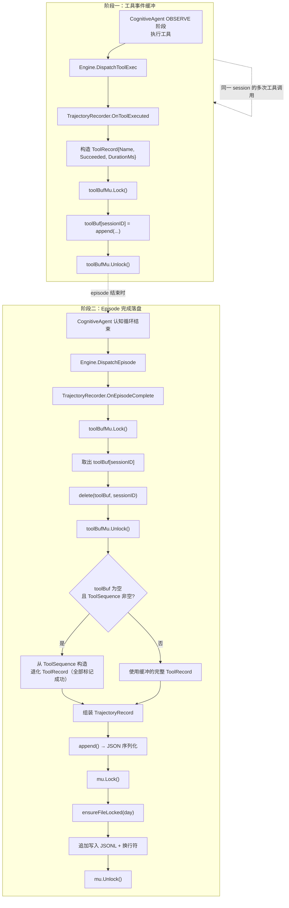
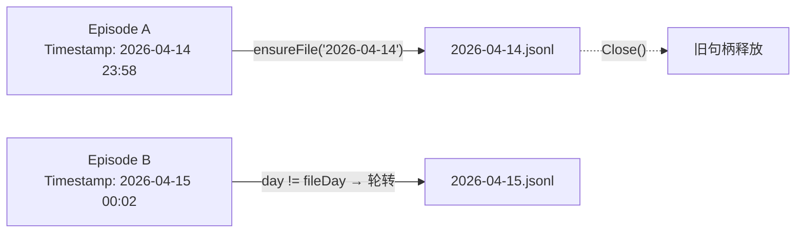
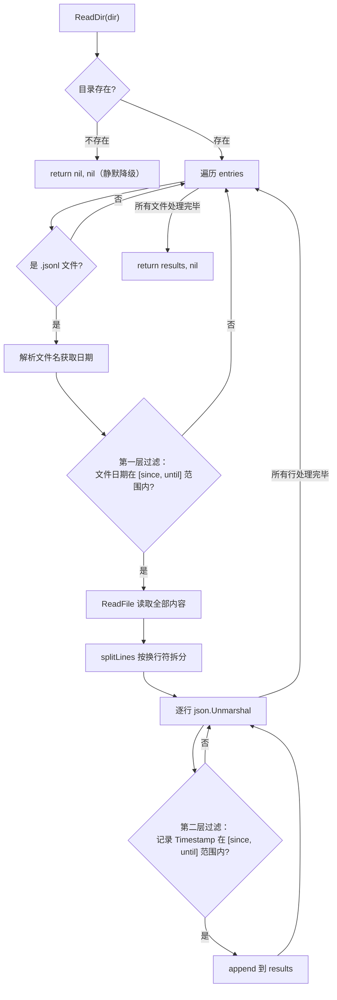
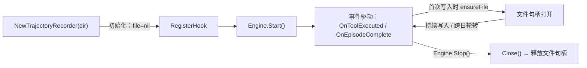
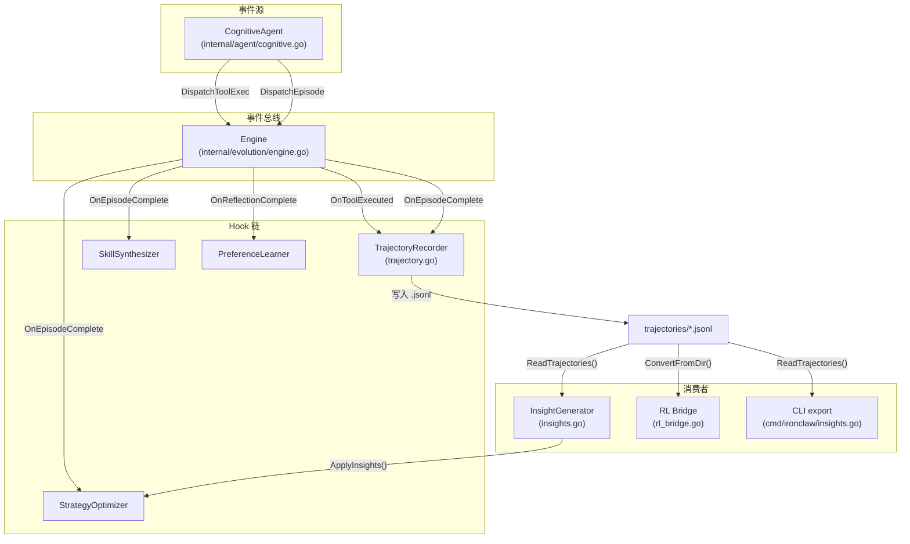

# TrajectoryRecorder（轨迹记录器）详解

> 源文件：`internal/evolution/trajectory.go`
> 所属包：`package evolution`

---

## 1. 概述

TrajectoryRecorder 是 IronClaw 自进化系统中的**轨迹持久化组件**，负责将认知代理（CognitiveAgent）每一次完整的认知循环（episode）序列化为 JSONL 格式并写入磁盘。它是所有 Hook 中**唯一同时响应 `OnToolExecuted` 和 `OnEpisodeComplete` 两个事件**的实现——其他 Hook（如 SkillSynthesizer、StrategyOptimizer）只关注反思或 episode 事件，而 TrajectoryRecorder 需要在 episode 完成之前就持续收集工具调用细节。

在自进化闭环中，TrajectoryRecorder 处于**数据采集层**，是 InsightGenerator 和 RL Bridge 的上游数据源：

```
CognitiveAgent ──DispatchToolExec──► Engine ──► TrajectoryRecorder.OnToolExecuted()   [缓冲]
CognitiveAgent ──DispatchEpisode──► Engine ──► TrajectoryRecorder.OnEpisodeComplete() [落盘]
                                                        │
                                                        ▼
                                               ~/.IronClaw/evolution/trajectories/2026-04-14.jsonl
                                                        │
                                        ┌───────────────┼───────────────┐
                                        ▼               ▼               ▼
                                 InsightGenerator   RL Bridge      CLI export
```

### Hook 接口实现

TrajectoryRecorder 实现了 `Hook` 接口的三个方法：

| 方法 | 行为 |
|------|------|
| `OnToolExecuted` | 将工具执行记录缓冲到 `toolBuf` |
| `OnReflectionComplete` | **空操作**——episode 事件已包含完整信息 |
| `OnEpisodeComplete` | 刷出缓冲区，组装完整轨迹记录并追加写入 JSONL 文件 |

```go
var _ Hook = (*TrajectoryRecorder)(nil)
```

---

## 2. 核心数据结构

### 2.1 TrajectoryRecorder

```go
type TrajectoryRecorder struct {
    dir     string               // 轨迹文件存储目录的绝对路径
    mu      sync.Mutex           // 保护文件句柄的互斥锁
    file    *os.File             // 当前打开的 JSONL 文件句柄
    fileDay string               // 当前文件对应的日期 "2006-01-02"

    toolBuf   map[string][]ToolRecord  // 按 session_id 积累的工具记录
    toolBufMu sync.Mutex               // 保护 toolBuf 的互斥锁
}
```

**关键设计**：使用两把独立的互斥锁分别保护文件 I/O 和内存缓冲区，避免写文件时阻塞高频的工具事件缓冲。

### 2.2 TrajectoryRecord

一条完整的轨迹记录，对应 JSONL 文件中的一行：

```go
type TrajectoryRecord struct {
    SessionID    string          `json:"session_id"`
    Goal         string          `json:"goal"`
    Complexity   string          `json:"complexity"`
    Tools        []ToolRecord    `json:"tools"`
    Reflection   ReflectionBrief `json:"reflection"`
    UserFeedback float64         `json:"user_feedback"`
    ReplanCount  int             `json:"replan_count"`
    DurationMs   int64           `json:"duration_ms"`
    Timestamp    time.Time       `json:"timestamp"`
}
```

| 字段 | 类型 | 说明 |
|------|------|------|
| `SessionID` | `string` | 会话唯一标识，关联同一用户对话 |
| `Goal` | `string` | 认知代理解析出的用户目标（`state.Goal.Raw`） |
| `Complexity` | `string` | 目标复杂度等级（`"simple"` / `"moderate"` / `"complex"`） |
| `Tools` | `[]ToolRecord` | 本次 episode 中所有工具调用的有序列表 |
| `Reflection` | `ReflectionBrief` | 反思摘要（含置信度/奖励、成功标志、经验教训） |
| `UserFeedback` | `float64` | 用户反馈评分，范围 `[-1, 1]`，0 表示未收集 |
| `ReplanCount` | `int` | 重新规划次数，反映执行稳定性 |
| `DurationMs` | `int64` | episode 总耗时（毫秒） |
| `Timestamp` | `time.Time` | episode 完成时间戳 |

### 2.3 ToolRecord

```go
type ToolRecord struct {
    Name       string `json:"name"`       // 工具名称（如 "bash", "file", "http"）
    Succeeded  bool   `json:"succeeded"`  // 执行是否成功
    DurationMs int64  `json:"duration_ms"` // 执行耗时（毫秒）
}
```

### 2.4 ReflectionBrief

```go
type ReflectionBrief struct {
    Confidence float64  `json:"confidence"`       // 实际存储的是 TotalReward！
    Succeeded  bool     `json:"succeeded"`         // episode 是否成功
    Lessons    []string `json:"lessons,omitempty"` // 经验教训列表
}
```

> **重要**：`Confidence` 字段名具有误导性——详见[第 9 节](#9-重要实现细节confidence-与-totalreward-的映射)。

---

## 3. 完整执行流程

TrajectoryRecorder 的工作分为两个阶段：**工具事件缓冲**和 **episode 完成落盘**。



### 阶段一：OnToolExecuted — 工具事件缓冲

每当 CognitiveAgent 的 OBSERVE 阶段执行一个工具后，Engine 通过 `DispatchToolExec` 异步通知所有 Hook。TrajectoryRecorder 在此回调中：

1. 从 `ToolExecEvent` 提取 `Name`、`Succeeded`、`DurationMs` 构造 `ToolRecord`
2. 加锁 `toolBufMu`，按 `SessionID` 追加到 `toolBuf` map
3. 解锁

**注意**：`ToolExecEvent.Denied` 字段在此处被忽略，不记录到 `ToolRecord` 中。

### 阶段二：OnEpisodeComplete — 刷出与落盘

当认知循环结束时，CognitiveAgent 调用 `Engine.DispatchEpisode`。TrajectoryRecorder 在此回调中：

1. 加锁 `toolBufMu`，取出并清除该 session 的缓冲工具记录
2. 如果缓冲为空但 `EpisodeEvent.ToolSequence` 非空，使用退化路径构造 ToolRecord
3. 组装完整的 `TrajectoryRecord`
4. 调用 `append()` 完成 JSON 序列化和文件写入

---

## 4. 工具缓冲机制

### 4.1 缓冲区结构

```go
toolBuf   map[string][]ToolRecord  // key = SessionID
toolBufMu sync.Mutex
```

`toolBuf` 是一个以 `SessionID` 为键的 map，值为该 session 内按时序积累的 `ToolRecord` 切片。每个 session 的工具调用会被依次追加，直到 `OnEpisodeComplete` 时一次性取出并清除。

### 4.2 逐次积累

```go
func (tr *TrajectoryRecorder) OnToolExecuted(_ context.Context, event ToolExecEvent) {
    rec := ToolRecord{
        Name:       event.ToolName,
        Succeeded:  event.Succeeded,
        DurationMs: event.DurationMs,
    }
    tr.toolBufMu.Lock()
    tr.toolBuf[event.SessionID] = append(tr.toolBuf[event.SessionID], rec)
    tr.toolBufMu.Unlock()
}
```

每次工具执行完成都会触发一次缓冲追加。一个典型的 episode 可能积累 3-10 条 ToolRecord。

### 4.3 ToolSequence 退化回退

当 `OnEpisodeComplete` 时发现缓冲区为空（可能因为事件到达顺序异常，或 simple 模式下未触发 `DispatchToolExec`），会使用 `EpisodeEvent.ToolSequence` 作为降级数据源：

```go
if len(tools) == 0 && len(event.ToolSequence) > 0 {
    for _, name := range event.ToolSequence {
        tools = append(tools, ToolRecord{Name: name, Succeeded: true})
    }
}
```

退化路径的局限性：
- **全部标记为成功**（`Succeeded: true`）——无法反映实际失败
- **缺少 DurationMs**——默认值为 0
- 仅有工具名称列表，丢失了细粒度执行信息

---

## 5. JSONL 写入流程

`append()` 方法完成从内存记录到磁盘文件的完整写入流程：

```go
func (tr *TrajectoryRecorder) append(rec TrajectoryRecord) error {
    // 1. JSON 序列化
    data, err := json.Marshal(rec)
    if err != nil {
        return fmt.Errorf("marshal trajectory: %w", err)
    }

    // 2. 加文件锁
    tr.mu.Lock()
    defer tr.mu.Unlock()

    // 3. 确保文件句柄对应正确日期
    day := rec.Timestamp.Format("2006-01-02")
    if err := tr.ensureFileLocked(day); err != nil {
        return err
    }

    // 4. 追加换行符形成完整的 JSONL 行
    data = append(data, '\n')

    // 5. 写入文件
    _, err = tr.file.Write(data)
    return err
}
```

写入步骤详解：

| 步骤 | 操作 | 说明 |
|------|------|------|
| 1 | `json.Marshal(rec)` | 在锁外完成序列化，减少持锁时间 |
| 2 | `tr.mu.Lock()` | 获取文件互斥锁 |
| 3 | `ensureFileLocked(day)` | 懒加载/轮转文件句柄（见第 6 节） |
| 4 | `append(data, '\n')` | 追加换行符，保证每条记录独占一行 |
| 5 | `tr.file.Write(data)` | 原子追加写入（`O_APPEND` 模式） |

**设计亮点**：JSON 序列化在加锁之前完成，避免了在持有 `mu` 期间进行 CPU 密集的编码操作。

---

## 6. 文件轮转机制

### 6.1 按日轮转

每条记录根据其 `Timestamp` 决定写入哪个文件。文件名格式为 `YYYY-MM-DD.jsonl`，即**每天一个文件**。

```go
func (tr *TrajectoryRecorder) ensureFileLocked(day string) error {
    // 复用：如果当前文件对应的日期匹配，直接返回
    if tr.file != nil && tr.fileDay == day {
        return nil
    }
    // 轮转：关闭旧文件
    if tr.file != nil {
        _ = tr.file.Close()
        tr.file = nil
    }

    // 惰性创建目录
    if err := os.MkdirAll(tr.dir, 0o755); err != nil {
        return fmt.Errorf("create trajectories dir: %w", err)
    }

    // 打开（或创建）新的日期文件
    path := filepath.Join(tr.dir, day+".jsonl")
    f, err := os.OpenFile(path, os.O_APPEND|os.O_CREATE|os.O_WRONLY, 0o644)
    if err != nil {
        return fmt.Errorf("open trajectory file: %w", err)
    }

    tr.file = f
    tr.fileDay = day
    return nil
}
```

### 6.2 特性总结

| 特性 | 实现 |
|------|------|
| **惰性创建** | 目录和文件在首次写入时才创建（`MkdirAll` + `O_CREATE`） |
| **句柄复用** | 同一天内的多次写入复用同一个 `*os.File`，避免重复 open/close |
| **跨日轮转** | 当 `day != tr.fileDay` 时关闭旧文件、打开新文件 |
| **追加模式** | `O_APPEND` 保证即使多进程写入也不会覆盖（虽然当前设计是单进程） |
| **错误隔离** | 旧文件关闭失败通过 `_` 忽略，不阻塞新文件的打开 |

### 6.3 跨日场景



---

## 7. 数据读取（ReadTrajectories）

`ReadTrajectories` 是一个包级别的工具函数，供 InsightGenerator、RL Bridge 和 CLI 命令使用。

```go
func ReadTrajectories(dir string, since, until time.Time) ([]TrajectoryRecord, error)
```

### 7.1 读取流程



### 7.2 两级时间过滤

ReadTrajectories 采用**两级过滤**策略以兼顾效率和精确度：

| 过滤级别 | 粒度 | 目的 |
|----------|------|------|
| **第一级：文件级** | 按天 | 跳过不在时间范围内的整个文件，避免不必要的 I/O |
| **第二级：记录级** | 精确到时间戳 | 处理边界情况——同一天的文件中可能有不在范围内的记录 |

第一级过滤的边界处理：

```go
day.Before(since.Truncate(24*time.Hour))  // since 截断到当天零点
day.After(until)                           // until 保持精确
```

`since` 截断到零点确保边界日文件不会被错误跳过。例如，`since = 2026-04-14 10:00` 时，`2026-04-14.jsonl` 仍会被读取（因为该文件中可能包含 10:00 之后的记录）。

### 7.3 错误容忍

ReadTrajectories 对非致命错误采取宽容策略：

| 错误场景 | 处理方式 |
|----------|----------|
| 目录不存在 | `return nil, nil`（静默降级） |
| 文件名无法解析为日期 | `continue`（跳过） |
| 文件读取失败 | 记录 warn 日志，`continue` |
| JSON 行解析失败 | 记录 debug 日志，`continue` |

这种设计保证了**部分损坏的数据文件不会导致整体读取失败**。

---

## 8. JSONL 记录格式

每个 `.jsonl` 文件中，一行对应一条 `TrajectoryRecord`：

```json
{
  "session_id": "sess_abc123",
  "goal": "帮我在项目中添加一个 HTTP 健康检查端点",
  "complexity": "moderate",
  "tools": [
    {"name": "bash", "succeeded": true, "duration_ms": 320},
    {"name": "file", "succeeded": true, "duration_ms": 45},
    {"name": "bash", "succeeded": false, "duration_ms": 1200},
    {"name": "bash", "succeeded": true, "duration_ms": 580}
  ],
  "reflection": {
    "confidence": 0.85,
    "succeeded": true
  },
  "user_feedback": 0.5,
  "replan_count": 1,
  "duration_ms": 4500,
  "timestamp": "2026-04-14T15:30:00.000Z"
}
```

**字段说明补充**：

- `tools` 数组保持了工具调用的**时序顺序**，同一个工具可能出现多次
- `reflection.confidence` 实际存储的是 `TotalReward`（见第 9 节）
- `reflection.lessons` 在当前实现中始终为空（`OnEpisodeComplete` 未填充该字段）
- `user_feedback` 为 `0` 时表示未收集到用户反馈

---

## 9. 重要实现细节：Confidence 与 TotalReward 的映射

这是源码中一个容易引起混淆的设计点。在 `OnEpisodeComplete` 中，`ReflectionBrief.Confidence` 字段实际被赋值为 `EpisodeEvent.TotalReward`：

```go
Reflection: ReflectionBrief{
    Confidence: event.TotalReward,  // ← 这里！
    Succeeded:  event.Succeeded,
},
```

### 两者的本质区别

| | Confidence（反思置信度） | TotalReward（episode 总奖励） |
|--|------------------------|------------------------------|
| **来源** | LLM 在 REFLECT 阶段的自评估 | `computeSimpleEpisodeReward()` 计算 |
| **语义** | "我对这次回答有多大把握" | 综合工具成功率、用户反馈、重规划次数的量化评分 |
| **范围** | 通常 0.0 ~ 1.0 | 可能超出 [0, 1] 取决于奖励函数设计 |

### 为何如此设计

`EpisodeEvent` 由 CognitiveAgent 在认知循环的末尾生成，此时已经完成了奖励计算（`computeSimpleEpisodeReward`），但 `EpisodeEvent` 结构体**没有单独的 Confidence 字段**。TrajectoryRecorder 复用了 `ReflectionBrief` 结构来存储 episode 级别的成功信息，其 `Confidence` 字段就成了 `TotalReward` 的实际载体。

### 对下游消费者的影响

- **InsightGenerator**：通过 `rec.Reflection.Succeeded` 判断成功/失败，不直接使用 `Confidence` 值，因此**不受影响**
- **RL Bridge**（`ConvertFromDir`）：从 `TrajectoryRecord` 转换时需要注意该字段的真实语义
- **CLI export**：以 `confidence` 为 JSON 键输出，阅读报告时应理解为 reward 而非 confidence

---

## 10. 并发安全模型

TrajectoryRecorder 使用**两把独立的互斥锁**保护不同的共享资源：

```
┌─────────────────────────────────────────────────────┐
│                 TrajectoryRecorder                   │
│                                                     │
│  toolBufMu (sync.Mutex)         mu (sync.Mutex)    │
│  ├── toolBuf map                ├── file *os.File   │
│  │                              ├── fileDay string  │
│  │                              │                   │
│  │  [高频：每次工具调用]          │  [低频：每次 episode] │
│  └──────────────────            └───────────────────│
└─────────────────────────────────────────────────────┘
```

### 10.1 锁的分工

| 锁 | 保护的资源 | 操作频率 | 持锁时间 |
|----|-----------|---------|---------|
| `toolBufMu` | `toolBuf` map | 高（每次工具执行） | 极短（map 追加操作） |
| `mu` | `file`、`fileDay` | 低（每个 episode 一次） | 较长（包含文件 I/O） |

### 10.2 锁的使用顺序

在 `OnEpisodeComplete` 中，两把锁**不会同时持有**：

```
1. toolBufMu.Lock()    → 取出并删除缓冲数据 → toolBufMu.Unlock()
2. (组装 TrajectoryRecord — 无锁)
3. mu.Lock()           → ensureFile + Write  → mu.Unlock()
```

这避免了死锁风险。先释放 `toolBufMu` 再获取 `mu` 的顺序也意味着：在 episode 写入文件期间，新的工具事件仍然可以被缓冲到 `toolBuf` 中，不会被阻塞。

### 10.3 Engine 层的并发保证

Engine 通过 `safeDispatch` 在独立的 goroutine 中调用每个 Hook，并提供：
- **超时控制**：`context.WithTimeout`（默认 10 秒）
- **panic 恢复**：`recover()` 防止单个 Hook 崩溃影响其他 Hook
- **WaitGroup**：保证 `Stop()` 时等待所有 in-flight 的 Hook 完成

```go
go e.safeDispatch(hook.Name(), func(ctx context.Context) {
    hook.OnToolExecuted(ctx, event)
})
```

---

## 11. 资源管理

### 11.1 Close() 方法

```go
func (tr *TrajectoryRecorder) Close() error {
    tr.mu.Lock()
    defer tr.mu.Unlock()
    if tr.file != nil {
        err := tr.file.Close()
        tr.file = nil
        return err
    }
    return nil
}
```

`Close()` 释放当前打开的文件句柄，并将 `file` 置为 `nil` 防止后续误用。

### 11.2 Engine.Stop() 中的自动关闭

Engine 在 `Stop()` 时会检查每个 Hook 是否实现了 `Close() error` 接口（鸭子类型），如果实现了则自动调用：

```go
func (e *Engine) Stop() {
    e.cancel()
    e.wg.Wait()
    // ...
    for _, h := range e.hooks {
        if c, ok := h.(interface{ Close() error }); ok {
            if err := c.Close(); err != nil {
                slog.Warn("evolution: hook close failed", "hook", h.Name(), "err", err)
            }
        }
    }
}
```

这意味着 TrajectoryRecorder **不需要调用方显式关闭**——只要 Engine 正常 Stop，文件句柄就会被释放。

### 11.3 生命周期总结



---

## 12. 文件命名与目录结构

### 12.1 目录路径

```
~/.IronClaw/evolution/trajectories/
```

由 `Gateway.resolveEvolutionTrajDir()` 解析：

```go
func (gw *Gateway) resolveEvolutionTrajDir() (string, error) {
    base, err := gw.ironclawHome()  // ~/.IronClaw/
    if err != nil { return "", err }
    return filepath.Join(base, "evolution", "trajectories"), nil
}
```

### 12.2 文件布局

```
~/.IronClaw/
└── evolution/
    └── trajectories/
        ├── 2026-04-10.jsonl    ← 每天一个文件
        ├── 2026-04-11.jsonl
        ├── 2026-04-12.jsonl
        ├── 2026-04-13.jsonl
        └── 2026-04-14.jsonl    ← 当天活跃文件（句柄保持打开）
```

### 12.3 命名规则

| 属性 | 值 |
|------|-----|
| 文件名格式 | `YYYY-MM-DD.jsonl` |
| 日期来源 | `TrajectoryRecord.Timestamp`（即 `EpisodeEvent.Timestamp`） |
| 目录权限 | `0o755`（惰性创建） |
| 文件权限 | `0o644` |
| 打开标志 | `O_APPEND \| O_CREATE \| O_WRONLY` |

---

## 13. 与其他组件的交互

### 13.1 交互关系图



### 13.2 上游：CognitiveAgent

CognitiveAgent 在 `dispatchEvolutionEvents()` 方法中生成事件（`internal/agent/cognitive.go`）：

```go
// 先 dispatch episode 事件
ca.evoEngine.DispatchEpisode(evolution.EpisodeEvent{
    SessionID:    state.SessionID,
    // ...
    TotalReward:  totalReward,
    ToolSequence: toolsUsed,
    // ...
})

// 再 dispatch 各工具执行事件
for _, obs := range obsResult.Observations {
    ca.evoEngine.DispatchToolExec(evolution.ToolExecEvent{
        SessionID:  state.SessionID,
        ToolName:   obs.ToolName,
        Succeeded:  !obs.Denied && obs.Error == "",
        // ...
    })
}
```

**注意事件顺序**：CognitiveAgent **先发送 `DispatchEpisode`，后发送 `DispatchToolExec`**。由于 Engine 是异步分发（goroutine），实际到达 TrajectoryRecorder 的顺序不确定。这正是 `ToolSequence` 退化回退机制存在的原因——如果 `OnEpisodeComplete` 先于所有 `OnToolExecuted` 执行，缓冲区将为空，此时使用 `ToolSequence` 保底。

### 13.3 下游消费者

| 消费者 | 调用方式 | 用途 |
|--------|---------|------|
| **Engine.insightsLoop** | `ReadTrajectories(dir, 7天前, now)` → `GenerateInsights()` | 每 6 小时生成洞察报告，反馈给 StrategyOptimizer |
| **RL Bridge** | `ConvertFromDir(dir, since)` → `ReadTrajectories()` | 将轨迹转换为 RL 经验数据，warm-start 回放缓冲区 |
| **CLI** | `ironclaw insights` 命令 → `ReadTrajectories()` | 用户手动查看轨迹统计和洞察报告 |

### 13.4 Gateway 注册

TrajectoryRecorder 在 Gateway 的认知模式初始化流程中注册：

```go
// internal/gateway/init_cognitive.go
if trajDir, err := gw.resolveEvolutionTrajDir(); err != nil {
    slog.Warn("gateway: evolution: trajectory dir unavailable, recorder disabled", "err", err)
} else {
    gw.evoEngine.RegisterHook(evolution.NewTrajectoryRecorder(trajDir))
    gw.evoEngine.SetTrajectoryDir(trajDir)  // 同时设置给 insightsLoop
}
```

`trajDir` 同时传递给 `SetTrajectoryDir`，使 Engine 的 `insightsLoop` 能够通过 `ReadTrajectories` 读取同一目录下的数据。

---

## 14. 关键源码注释

### 14.1 接口约束验证

```go
var _ Hook = (*TrajectoryRecorder)(nil)
```

编译期验证 `TrajectoryRecorder` 完整实现了 `Hook` 接口，缺少任何方法将导致编译错误。

### 14.2 OnReflectionComplete 为何是空操作

```go
func (tr *TrajectoryRecorder) OnReflectionComplete(_ context.Context, _ ReflectionEvent) {}
```

TrajectoryRecorder 选择在 `OnEpisodeComplete`（而非 `OnReflectionComplete`）时写入，因为 `EpisodeEvent` 携带了更完整的数据：它包含了经过 RL 奖励计算的 `TotalReward`、完整的 `ToolSequence`、以及 `DurationMs`，而 `ReflectionEvent` 仅包含 LLM 的自我反思结果。

### 14.3 splitLines 实现

```go
func splitLines(data []byte) [][]byte {
    var lines [][]byte
    for len(data) > 0 {
        idx := -1
        for i, b := range data {
            if b == '\n' { idx = i; break }
        }
        if idx < 0 {
            if len(data) > 0 { lines = append(lines, data) }
            break
        }
        if idx > 0 { lines = append(lines, data[:idx]) }
        data = data[idx+1:]
    }
    return lines
}
```

手写的行分割函数，相比 `bytes.Split` 的优势：
- **不产生空行**：跳过 `idx == 0` 的情况（连续换行符）
- **处理无尾部换行的最后一行**：`idx < 0` 分支捕获文件末尾无 `\n` 的行
- **零拷贝**：返回的 `[]byte` 切片指向原始 `data` 的子切片，不分配新内存

### 14.4 错误处理策略

| 场景 | 策略 | 代码位置 |
|------|------|---------|
| JSON 序列化失败 | 返回 error，由调用方记录 warn 日志 | `append()` |
| 目录创建失败 | 返回 error，episode 数据丢失 | `ensureFileLocked()` |
| 文件打开失败 | 返回 error，episode 数据丢失 | `ensureFileLocked()` |
| 旧文件关闭失败 | 忽略（`_ = tr.file.Close()`） | `ensureFileLocked()` |
| 写入失败 | 返回 error，由 `OnEpisodeComplete` 记录 warn 日志 | `append()` |

所有错误最终在 `OnEpisodeComplete` 中通过 `slog.Warn` 输出，不会向上传播到 Engine 或 CognitiveAgent——**轨迹写入失败不影响认知循环的正常运行**。
